# Análisis exploratorio

> "Exploratory data analysis can never be the whole story, but nothing
> else can serve as the foundation stone --as the first step."
>
> --- John Tukey


## El papel de la exploración en el análisis de datos {.unnumbered}

El estándar científico para contestar preguntas o tomar decisiones es
uno que se basa en el análisis de datos. Es decir, en primer lugar se
deben reunir todos los datos que puedan contener o sugerir alguna guía
para entender mejor la pregunta o la decisión a la que nos enfrentamos.
Esta recopilación de datos ---que pueden ser cualitativos,
cuantitativos, o una mezcla de los dos--- debe entonces ser analizada
para extraer información relevante para nuestro problema.

En análisis de datos existen dos distintos tipos de trabajo:

-   El trabajo **exploratorio** o de **detective**: ¿cuáles son los
    aspectos importantes de estos datos? ¿qué indicaciones generales
    muestran los datos? ¿qué tareas de análisis debemos empezar
    haciendo? ¿cuáles son los caminos generales para formular con
    precisión y contestar algunas preguntas que nos interesen?

-   El trabajo **inferencial**, **confirmatorio**, o de **juez**: ¿cómo
    evaluar el peso de la evidencia de los descubrimientos del paso
    anterior? ¿qué tan bien soportadas están las respuestas y
    conclusiones por nuestro conjunto de datos?

## Preguntas y datos {-}

Cuando observamos un conjunto de datos, independientemente de su tamaño, el paso inicial más importante es entender bajo qué proceso se generan los datos.

A grandes rasgos, cuanto más sepamos de este proceso, mejor podemos contestar preguntas de interés.
En muchos casos, tendremos que hacer algunos supuestos de cómo se generan estos datos para dar respuestas (condicionales a esos supuestos).

## Algunos conceptos básicos {.unnumbered}

Empezamos explicando algunas ideas que no serán útiles más adelante. El primer concepto se refiere a entender cómo se distribuyen los datos a los largo de su escala de medición. Comenzamos con un ejemplo: los siguientes datos fueron registrados en un restaurante durante cuatro días consecutivos.


```{.r .fold-hide}
library(tidyverse)
library(patchwork) # organizar gráficas
library(gt) # formatear tablas

source("R/funciones_auxiliares.R")
# usamos los datos tips del paquete reshape2
propinas <- read_csv("./data/propinas.csv")
```

Y vemos una muestra


``` r
slice_sample(propinas, n = 10) |> gt()
```

```{=html}
<div id="izeakwckeu" style="padding-left:0px;padding-right:0px;padding-top:10px;padding-bottom:10px;overflow-x:auto;overflow-y:auto;width:auto;height:auto;">
<style>#izeakwckeu table {
  font-family: system-ui, 'Segoe UI', Roboto, Helvetica, Arial, sans-serif, 'Apple Color Emoji', 'Segoe UI Emoji', 'Segoe UI Symbol', 'Noto Color Emoji';
  -webkit-font-smoothing: antialiased;
  -moz-osx-font-smoothing: grayscale;
}

#izeakwckeu thead, #izeakwckeu tbody, #izeakwckeu tfoot, #izeakwckeu tr, #izeakwckeu td, #izeakwckeu th {
  border-style: none;
}

#izeakwckeu p {
  margin: 0;
  padding: 0;
}

#izeakwckeu .gt_table {
  display: table;
  border-collapse: collapse;
  line-height: normal;
  margin-left: auto;
  margin-right: auto;
  color: #333333;
  font-size: 16px;
  font-weight: normal;
  font-style: normal;
  background-color: #FFFFFF;
  width: auto;
  border-top-style: solid;
  border-top-width: 2px;
  border-top-color: #A8A8A8;
  border-right-style: none;
  border-right-width: 2px;
  border-right-color: #D3D3D3;
  border-bottom-style: solid;
  border-bottom-width: 2px;
  border-bottom-color: #A8A8A8;
  border-left-style: none;
  border-left-width: 2px;
  border-left-color: #D3D3D3;
}

#izeakwckeu .gt_caption {
  padding-top: 4px;
  padding-bottom: 4px;
}

#izeakwckeu .gt_title {
  color: #333333;
  font-size: 125%;
  font-weight: initial;
  padding-top: 4px;
  padding-bottom: 4px;
  padding-left: 5px;
  padding-right: 5px;
  border-bottom-color: #FFFFFF;
  border-bottom-width: 0;
}

#izeakwckeu .gt_subtitle {
  color: #333333;
  font-size: 85%;
  font-weight: initial;
  padding-top: 3px;
  padding-bottom: 5px;
  padding-left: 5px;
  padding-right: 5px;
  border-top-color: #FFFFFF;
  border-top-width: 0;
}

#izeakwckeu .gt_heading {
  background-color: #FFFFFF;
  text-align: center;
  border-bottom-color: #FFFFFF;
  border-left-style: none;
  border-left-width: 1px;
  border-left-color: #D3D3D3;
  border-right-style: none;
  border-right-width: 1px;
  border-right-color: #D3D3D3;
}

#izeakwckeu .gt_bottom_border {
  border-bottom-style: solid;
  border-bottom-width: 2px;
  border-bottom-color: #D3D3D3;
}

#izeakwckeu .gt_col_headings {
  border-top-style: solid;
  border-top-width: 2px;
  border-top-color: #D3D3D3;
  border-bottom-style: solid;
  border-bottom-width: 2px;
  border-bottom-color: #D3D3D3;
  border-left-style: none;
  border-left-width: 1px;
  border-left-color: #D3D3D3;
  border-right-style: none;
  border-right-width: 1px;
  border-right-color: #D3D3D3;
}

#izeakwckeu .gt_col_heading {
  color: #333333;
  background-color: #FFFFFF;
  font-size: 100%;
  font-weight: normal;
  text-transform: inherit;
  border-left-style: none;
  border-left-width: 1px;
  border-left-color: #D3D3D3;
  border-right-style: none;
  border-right-width: 1px;
  border-right-color: #D3D3D3;
  vertical-align: bottom;
  padding-top: 5px;
  padding-bottom: 6px;
  padding-left: 5px;
  padding-right: 5px;
  overflow-x: hidden;
}

#izeakwckeu .gt_column_spanner_outer {
  color: #333333;
  background-color: #FFFFFF;
  font-size: 100%;
  font-weight: normal;
  text-transform: inherit;
  padding-top: 0;
  padding-bottom: 0;
  padding-left: 4px;
  padding-right: 4px;
}

#izeakwckeu .gt_column_spanner_outer:first-child {
  padding-left: 0;
}

#izeakwckeu .gt_column_spanner_outer:last-child {
  padding-right: 0;
}

#izeakwckeu .gt_column_spanner {
  border-bottom-style: solid;
  border-bottom-width: 2px;
  border-bottom-color: #D3D3D3;
  vertical-align: bottom;
  padding-top: 5px;
  padding-bottom: 5px;
  overflow-x: hidden;
  display: inline-block;
  width: 100%;
}

#izeakwckeu .gt_spanner_row {
  border-bottom-style: hidden;
}

#izeakwckeu .gt_group_heading {
  padding-top: 8px;
  padding-bottom: 8px;
  padding-left: 5px;
  padding-right: 5px;
  color: #333333;
  background-color: #FFFFFF;
  font-size: 100%;
  font-weight: initial;
  text-transform: inherit;
  border-top-style: solid;
  border-top-width: 2px;
  border-top-color: #D3D3D3;
  border-bottom-style: solid;
  border-bottom-width: 2px;
  border-bottom-color: #D3D3D3;
  border-left-style: none;
  border-left-width: 1px;
  border-left-color: #D3D3D3;
  border-right-style: none;
  border-right-width: 1px;
  border-right-color: #D3D3D3;
  vertical-align: middle;
  text-align: left;
}

#izeakwckeu .gt_empty_group_heading {
  padding: 0.5px;
  color: #333333;
  background-color: #FFFFFF;
  font-size: 100%;
  font-weight: initial;
  border-top-style: solid;
  border-top-width: 2px;
  border-top-color: #D3D3D3;
  border-bottom-style: solid;
  border-bottom-width: 2px;
  border-bottom-color: #D3D3D3;
  vertical-align: middle;
}

#izeakwckeu .gt_from_md > :first-child {
  margin-top: 0;
}

#izeakwckeu .gt_from_md > :last-child {
  margin-bottom: 0;
}

#izeakwckeu .gt_row {
  padding-top: 8px;
  padding-bottom: 8px;
  padding-left: 5px;
  padding-right: 5px;
  margin: 10px;
  border-top-style: solid;
  border-top-width: 1px;
  border-top-color: #D3D3D3;
  border-left-style: none;
  border-left-width: 1px;
  border-left-color: #D3D3D3;
  border-right-style: none;
  border-right-width: 1px;
  border-right-color: #D3D3D3;
  vertical-align: middle;
  overflow-x: hidden;
}

#izeakwckeu .gt_stub {
  color: #333333;
  background-color: #FFFFFF;
  font-size: 100%;
  font-weight: initial;
  text-transform: inherit;
  border-right-style: solid;
  border-right-width: 2px;
  border-right-color: #D3D3D3;
  padding-left: 5px;
  padding-right: 5px;
}

#izeakwckeu .gt_stub_row_group {
  color: #333333;
  background-color: #FFFFFF;
  font-size: 100%;
  font-weight: initial;
  text-transform: inherit;
  border-right-style: solid;
  border-right-width: 2px;
  border-right-color: #D3D3D3;
  padding-left: 5px;
  padding-right: 5px;
  vertical-align: top;
}

#izeakwckeu .gt_row_group_first td {
  border-top-width: 2px;
}

#izeakwckeu .gt_row_group_first th {
  border-top-width: 2px;
}

#izeakwckeu .gt_summary_row {
  color: #333333;
  background-color: #FFFFFF;
  text-transform: inherit;
  padding-top: 8px;
  padding-bottom: 8px;
  padding-left: 5px;
  padding-right: 5px;
}

#izeakwckeu .gt_first_summary_row {
  border-top-style: solid;
  border-top-color: #D3D3D3;
}

#izeakwckeu .gt_first_summary_row.thick {
  border-top-width: 2px;
}

#izeakwckeu .gt_last_summary_row {
  padding-top: 8px;
  padding-bottom: 8px;
  padding-left: 5px;
  padding-right: 5px;
  border-bottom-style: solid;
  border-bottom-width: 2px;
  border-bottom-color: #D3D3D3;
}

#izeakwckeu .gt_grand_summary_row {
  color: #333333;
  background-color: #FFFFFF;
  text-transform: inherit;
  padding-top: 8px;
  padding-bottom: 8px;
  padding-left: 5px;
  padding-right: 5px;
}

#izeakwckeu .gt_first_grand_summary_row {
  padding-top: 8px;
  padding-bottom: 8px;
  padding-left: 5px;
  padding-right: 5px;
  border-top-style: double;
  border-top-width: 6px;
  border-top-color: #D3D3D3;
}

#izeakwckeu .gt_last_grand_summary_row_top {
  padding-top: 8px;
  padding-bottom: 8px;
  padding-left: 5px;
  padding-right: 5px;
  border-bottom-style: double;
  border-bottom-width: 6px;
  border-bottom-color: #D3D3D3;
}

#izeakwckeu .gt_striped {
  background-color: rgba(128, 128, 128, 0.05);
}

#izeakwckeu .gt_table_body {
  border-top-style: solid;
  border-top-width: 2px;
  border-top-color: #D3D3D3;
  border-bottom-style: solid;
  border-bottom-width: 2px;
  border-bottom-color: #D3D3D3;
}

#izeakwckeu .gt_footnotes {
  color: #333333;
  background-color: #FFFFFF;
  border-bottom-style: none;
  border-bottom-width: 2px;
  border-bottom-color: #D3D3D3;
  border-left-style: none;
  border-left-width: 2px;
  border-left-color: #D3D3D3;
  border-right-style: none;
  border-right-width: 2px;
  border-right-color: #D3D3D3;
}

#izeakwckeu .gt_footnote {
  margin: 0px;
  font-size: 90%;
  padding-top: 4px;
  padding-bottom: 4px;
  padding-left: 5px;
  padding-right: 5px;
}

#izeakwckeu .gt_sourcenotes {
  color: #333333;
  background-color: #FFFFFF;
  border-bottom-style: none;
  border-bottom-width: 2px;
  border-bottom-color: #D3D3D3;
  border-left-style: none;
  border-left-width: 2px;
  border-left-color: #D3D3D3;
  border-right-style: none;
  border-right-width: 2px;
  border-right-color: #D3D3D3;
}

#izeakwckeu .gt_sourcenote {
  font-size: 90%;
  padding-top: 4px;
  padding-bottom: 4px;
  padding-left: 5px;
  padding-right: 5px;
}

#izeakwckeu .gt_left {
  text-align: left;
}

#izeakwckeu .gt_center {
  text-align: center;
}

#izeakwckeu .gt_right {
  text-align: right;
  font-variant-numeric: tabular-nums;
}

#izeakwckeu .gt_font_normal {
  font-weight: normal;
}

#izeakwckeu .gt_font_bold {
  font-weight: bold;
}

#izeakwckeu .gt_font_italic {
  font-style: italic;
}

#izeakwckeu .gt_super {
  font-size: 65%;
}

#izeakwckeu .gt_footnote_marks {
  font-size: 75%;
  vertical-align: 0.4em;
  position: initial;
}

#izeakwckeu .gt_asterisk {
  font-size: 100%;
  vertical-align: 0;
}

#izeakwckeu .gt_indent_1 {
  text-indent: 5px;
}

#izeakwckeu .gt_indent_2 {
  text-indent: 10px;
}

#izeakwckeu .gt_indent_3 {
  text-indent: 15px;
}

#izeakwckeu .gt_indent_4 {
  text-indent: 20px;
}

#izeakwckeu .gt_indent_5 {
  text-indent: 25px;
}

#izeakwckeu .katex-display {
  display: inline-flex !important;
  margin-bottom: 0.75em !important;
}

#izeakwckeu div.Reactable > div.rt-table > div.rt-thead > div.rt-tr.rt-tr-group-header > div.rt-th-group:after {
  height: 0px !important;
}
</style>
<table class="gt_table" data-quarto-disable-processing="false" data-quarto-bootstrap="false">
  <thead>
    <tr class="gt_col_headings">
      <th class="gt_col_heading gt_columns_bottom_border gt_right" rowspan="1" colspan="1" scope="col" id="cuenta_total">cuenta_total</th>
      <th class="gt_col_heading gt_columns_bottom_border gt_right" rowspan="1" colspan="1" scope="col" id="propina">propina</th>
      <th class="gt_col_heading gt_columns_bottom_border gt_left" rowspan="1" colspan="1" scope="col" id="fumador">fumador</th>
      <th class="gt_col_heading gt_columns_bottom_border gt_left" rowspan="1" colspan="1" scope="col" id="dia">dia</th>
      <th class="gt_col_heading gt_columns_bottom_border gt_left" rowspan="1" colspan="1" scope="col" id="momento">momento</th>
      <th class="gt_col_heading gt_columns_bottom_border gt_right" rowspan="1" colspan="1" scope="col" id="num_personas">num_personas</th>
    </tr>
  </thead>
  <tbody class="gt_table_body">
    <tr><td headers="cuenta_total" class="gt_row gt_right">15.36</td>
<td headers="propina" class="gt_row gt_right">1.64</td>
<td headers="fumador" class="gt_row gt_left">Si</td>
<td headers="dia" class="gt_row gt_left">Sab</td>
<td headers="momento" class="gt_row gt_left">Cena</td>
<td headers="num_personas" class="gt_row gt_right">2</td></tr>
    <tr><td headers="cuenta_total" class="gt_row gt_right">16.29</td>
<td headers="propina" class="gt_row gt_right">3.71</td>
<td headers="fumador" class="gt_row gt_left">No</td>
<td headers="dia" class="gt_row gt_left">Dom</td>
<td headers="momento" class="gt_row gt_left">Cena</td>
<td headers="num_personas" class="gt_row gt_right">3</td></tr>
    <tr><td headers="cuenta_total" class="gt_row gt_right">13.42</td>
<td headers="propina" class="gt_row gt_right">1.68</td>
<td headers="fumador" class="gt_row gt_left">No</td>
<td headers="dia" class="gt_row gt_left">Jue</td>
<td headers="momento" class="gt_row gt_left">Comida</td>
<td headers="num_personas" class="gt_row gt_right">2</td></tr>
    <tr><td headers="cuenta_total" class="gt_row gt_right">18.64</td>
<td headers="propina" class="gt_row gt_right">1.36</td>
<td headers="fumador" class="gt_row gt_left">No</td>
<td headers="dia" class="gt_row gt_left">Jue</td>
<td headers="momento" class="gt_row gt_left">Comida</td>
<td headers="num_personas" class="gt_row gt_right">3</td></tr>
    <tr><td headers="cuenta_total" class="gt_row gt_right">24.01</td>
<td headers="propina" class="gt_row gt_right">2.00</td>
<td headers="fumador" class="gt_row gt_left">Si</td>
<td headers="dia" class="gt_row gt_left">Sab</td>
<td headers="momento" class="gt_row gt_left">Cena</td>
<td headers="num_personas" class="gt_row gt_right">4</td></tr>
    <tr><td headers="cuenta_total" class="gt_row gt_right">10.34</td>
<td headers="propina" class="gt_row gt_right">1.66</td>
<td headers="fumador" class="gt_row gt_left">No</td>
<td headers="dia" class="gt_row gt_left">Dom</td>
<td headers="momento" class="gt_row gt_left">Cena</td>
<td headers="num_personas" class="gt_row gt_right">3</td></tr>
    <tr><td headers="cuenta_total" class="gt_row gt_right">17.89</td>
<td headers="propina" class="gt_row gt_right">2.00</td>
<td headers="fumador" class="gt_row gt_left">Si</td>
<td headers="dia" class="gt_row gt_left">Dom</td>
<td headers="momento" class="gt_row gt_left">Cena</td>
<td headers="num_personas" class="gt_row gt_right">2</td></tr>
    <tr><td headers="cuenta_total" class="gt_row gt_right">15.81</td>
<td headers="propina" class="gt_row gt_right">3.16</td>
<td headers="fumador" class="gt_row gt_left">Si</td>
<td headers="dia" class="gt_row gt_left">Sab</td>
<td headers="momento" class="gt_row gt_left">Cena</td>
<td headers="num_personas" class="gt_row gt_right">2</td></tr>
    <tr><td headers="cuenta_total" class="gt_row gt_right">13.27</td>
<td headers="propina" class="gt_row gt_right">2.50</td>
<td headers="fumador" class="gt_row gt_left">Si</td>
<td headers="dia" class="gt_row gt_left">Sab</td>
<td headers="momento" class="gt_row gt_left">Cena</td>
<td headers="num_personas" class="gt_row gt_right">2</td></tr>
    <tr><td headers="cuenta_total" class="gt_row gt_right">21.01</td>
<td headers="propina" class="gt_row gt_right">3.50</td>
<td headers="fumador" class="gt_row gt_left">No</td>
<td headers="dia" class="gt_row gt_left">Dom</td>
<td headers="momento" class="gt_row gt_left">Cena</td>
<td headers="num_personas" class="gt_row gt_right">3</td></tr>
  </tbody>
  
  
</table>
</div>
```

Aquí la unidad de observación es una cuenta particular. Tenemos tres
mediciones numéricas de cada cuenta: cúanto fue la cuenta total, la
propina, y el número de personas asociadas a la cuenta. Los datos están
separados según se fumó o no en la mesa, y temporalmente en dos partes:
el día (Jueves, Viernes, Sábado o Domingo), cada uno separado por Cena y
Comida.

<div class="mathblock">
<p>Denotamos por <span class="math inline">\(x\)</span> el valor de
medición de una <em>unidad de observación.</em> Usualmente utilizamos
sub-índices para identificar entre diferentes <em>puntos de datos</em>
(observaciones), por ejemplo, <span class="math inline">\(x_n\)</span>
para la <span class="math inline">\(n-\)</span>ésima observación. De tal
forma que una colección de <span class="math inline">\(N\)</span>
observaciones la escribimos como <span
class="math display">\[\begin{align}
\{x_1, \ldots, x_N\}.
\end{align}\]</span></p>
</div>

El primer tipo de comparaciones que nos interesa hacer es para una
medición: ¿Varían mucho o poco los datos de un tipo de medición? ¿Cuáles
son valores típicos o centrales? ¿Existen valores atípicos?

Supongamos entonces que consideramos simplemente la variable de
`cuenta_total`. Podemos comenzar por **ordenar los datos**, y ver cuáles
datos están en los extremos y cuáles están en los lugares centrales:


``` r
propinas <- propinas |>
  mutate(orden_cuenta = rank(cuenta_total, ties.method = "first"),
         f = (orden_cuenta - 0.5) / n())
cuenta <- propinas |> 
  select(orden_cuenta, f, cuenta_total) |> 
  arrange(f)
bind_rows(head(cuenta), tail(cuenta)) |> 
  gt() |> fmt_number(columns = f, decimals = 3)
```

```{=html}
<div id="jcsevkocrw" style="padding-left:0px;padding-right:0px;padding-top:10px;padding-bottom:10px;overflow-x:auto;overflow-y:auto;width:auto;height:auto;">
<style>#jcsevkocrw table {
  font-family: system-ui, 'Segoe UI', Roboto, Helvetica, Arial, sans-serif, 'Apple Color Emoji', 'Segoe UI Emoji', 'Segoe UI Symbol', 'Noto Color Emoji';
  -webkit-font-smoothing: antialiased;
  -moz-osx-font-smoothing: grayscale;
}

#jcsevkocrw thead, #jcsevkocrw tbody, #jcsevkocrw tfoot, #jcsevkocrw tr, #jcsevkocrw td, #jcsevkocrw th {
  border-style: none;
}

#jcsevkocrw p {
  margin: 0;
  padding: 0;
}

#jcsevkocrw .gt_table {
  display: table;
  border-collapse: collapse;
  line-height: normal;
  margin-left: auto;
  margin-right: auto;
  color: #333333;
  font-size: 16px;
  font-weight: normal;
  font-style: normal;
  background-color: #FFFFFF;
  width: auto;
  border-top-style: solid;
  border-top-width: 2px;
  border-top-color: #A8A8A8;
  border-right-style: none;
  border-right-width: 2px;
  border-right-color: #D3D3D3;
  border-bottom-style: solid;
  border-bottom-width: 2px;
  border-bottom-color: #A8A8A8;
  border-left-style: none;
  border-left-width: 2px;
  border-left-color: #D3D3D3;
}

#jcsevkocrw .gt_caption {
  padding-top: 4px;
  padding-bottom: 4px;
}

#jcsevkocrw .gt_title {
  color: #333333;
  font-size: 125%;
  font-weight: initial;
  padding-top: 4px;
  padding-bottom: 4px;
  padding-left: 5px;
  padding-right: 5px;
  border-bottom-color: #FFFFFF;
  border-bottom-width: 0;
}

#jcsevkocrw .gt_subtitle {
  color: #333333;
  font-size: 85%;
  font-weight: initial;
  padding-top: 3px;
  padding-bottom: 5px;
  padding-left: 5px;
  padding-right: 5px;
  border-top-color: #FFFFFF;
  border-top-width: 0;
}

#jcsevkocrw .gt_heading {
  background-color: #FFFFFF;
  text-align: center;
  border-bottom-color: #FFFFFF;
  border-left-style: none;
  border-left-width: 1px;
  border-left-color: #D3D3D3;
  border-right-style: none;
  border-right-width: 1px;
  border-right-color: #D3D3D3;
}

#jcsevkocrw .gt_bottom_border {
  border-bottom-style: solid;
  border-bottom-width: 2px;
  border-bottom-color: #D3D3D3;
}

#jcsevkocrw .gt_col_headings {
  border-top-style: solid;
  border-top-width: 2px;
  border-top-color: #D3D3D3;
  border-bottom-style: solid;
  border-bottom-width: 2px;
  border-bottom-color: #D3D3D3;
  border-left-style: none;
  border-left-width: 1px;
  border-left-color: #D3D3D3;
  border-right-style: none;
  border-right-width: 1px;
  border-right-color: #D3D3D3;
}

#jcsevkocrw .gt_col_heading {
  color: #333333;
  background-color: #FFFFFF;
  font-size: 100%;
  font-weight: normal;
  text-transform: inherit;
  border-left-style: none;
  border-left-width: 1px;
  border-left-color: #D3D3D3;
  border-right-style: none;
  border-right-width: 1px;
  border-right-color: #D3D3D3;
  vertical-align: bottom;
  padding-top: 5px;
  padding-bottom: 6px;
  padding-left: 5px;
  padding-right: 5px;
  overflow-x: hidden;
}

#jcsevkocrw .gt_column_spanner_outer {
  color: #333333;
  background-color: #FFFFFF;
  font-size: 100%;
  font-weight: normal;
  text-transform: inherit;
  padding-top: 0;
  padding-bottom: 0;
  padding-left: 4px;
  padding-right: 4px;
}

#jcsevkocrw .gt_column_spanner_outer:first-child {
  padding-left: 0;
}

#jcsevkocrw .gt_column_spanner_outer:last-child {
  padding-right: 0;
}

#jcsevkocrw .gt_column_spanner {
  border-bottom-style: solid;
  border-bottom-width: 2px;
  border-bottom-color: #D3D3D3;
  vertical-align: bottom;
  padding-top: 5px;
  padding-bottom: 5px;
  overflow-x: hidden;
  display: inline-block;
  width: 100%;
}

#jcsevkocrw .gt_spanner_row {
  border-bottom-style: hidden;
}

#jcsevkocrw .gt_group_heading {
  padding-top: 8px;
  padding-bottom: 8px;
  padding-left: 5px;
  padding-right: 5px;
  color: #333333;
  background-color: #FFFFFF;
  font-size: 100%;
  font-weight: initial;
  text-transform: inherit;
  border-top-style: solid;
  border-top-width: 2px;
  border-top-color: #D3D3D3;
  border-bottom-style: solid;
  border-bottom-width: 2px;
  border-bottom-color: #D3D3D3;
  border-left-style: none;
  border-left-width: 1px;
  border-left-color: #D3D3D3;
  border-right-style: none;
  border-right-width: 1px;
  border-right-color: #D3D3D3;
  vertical-align: middle;
  text-align: left;
}

#jcsevkocrw .gt_empty_group_heading {
  padding: 0.5px;
  color: #333333;
  background-color: #FFFFFF;
  font-size: 100%;
  font-weight: initial;
  border-top-style: solid;
  border-top-width: 2px;
  border-top-color: #D3D3D3;
  border-bottom-style: solid;
  border-bottom-width: 2px;
  border-bottom-color: #D3D3D3;
  vertical-align: middle;
}

#jcsevkocrw .gt_from_md > :first-child {
  margin-top: 0;
}

#jcsevkocrw .gt_from_md > :last-child {
  margin-bottom: 0;
}

#jcsevkocrw .gt_row {
  padding-top: 8px;
  padding-bottom: 8px;
  padding-left: 5px;
  padding-right: 5px;
  margin: 10px;
  border-top-style: solid;
  border-top-width: 1px;
  border-top-color: #D3D3D3;
  border-left-style: none;
  border-left-width: 1px;
  border-left-color: #D3D3D3;
  border-right-style: none;
  border-right-width: 1px;
  border-right-color: #D3D3D3;
  vertical-align: middle;
  overflow-x: hidden;
}

#jcsevkocrw .gt_stub {
  color: #333333;
  background-color: #FFFFFF;
  font-size: 100%;
  font-weight: initial;
  text-transform: inherit;
  border-right-style: solid;
  border-right-width: 2px;
  border-right-color: #D3D3D3;
  padding-left: 5px;
  padding-right: 5px;
}

#jcsevkocrw .gt_stub_row_group {
  color: #333333;
  background-color: #FFFFFF;
  font-size: 100%;
  font-weight: initial;
  text-transform: inherit;
  border-right-style: solid;
  border-right-width: 2px;
  border-right-color: #D3D3D3;
  padding-left: 5px;
  padding-right: 5px;
  vertical-align: top;
}

#jcsevkocrw .gt_row_group_first td {
  border-top-width: 2px;
}

#jcsevkocrw .gt_row_group_first th {
  border-top-width: 2px;
}

#jcsevkocrw .gt_summary_row {
  color: #333333;
  background-color: #FFFFFF;
  text-transform: inherit;
  padding-top: 8px;
  padding-bottom: 8px;
  padding-left: 5px;
  padding-right: 5px;
}

#jcsevkocrw .gt_first_summary_row {
  border-top-style: solid;
  border-top-color: #D3D3D3;
}

#jcsevkocrw .gt_first_summary_row.thick {
  border-top-width: 2px;
}

#jcsevkocrw .gt_last_summary_row {
  padding-top: 8px;
  padding-bottom: 8px;
  padding-left: 5px;
  padding-right: 5px;
  border-bottom-style: solid;
  border-bottom-width: 2px;
  border-bottom-color: #D3D3D3;
}

#jcsevkocrw .gt_grand_summary_row {
  color: #333333;
  background-color: #FFFFFF;
  text-transform: inherit;
  padding-top: 8px;
  padding-bottom: 8px;
  padding-left: 5px;
  padding-right: 5px;
}

#jcsevkocrw .gt_first_grand_summary_row {
  padding-top: 8px;
  padding-bottom: 8px;
  padding-left: 5px;
  padding-right: 5px;
  border-top-style: double;
  border-top-width: 6px;
  border-top-color: #D3D3D3;
}

#jcsevkocrw .gt_last_grand_summary_row_top {
  padding-top: 8px;
  padding-bottom: 8px;
  padding-left: 5px;
  padding-right: 5px;
  border-bottom-style: double;
  border-bottom-width: 6px;
  border-bottom-color: #D3D3D3;
}

#jcsevkocrw .gt_striped {
  background-color: rgba(128, 128, 128, 0.05);
}

#jcsevkocrw .gt_table_body {
  border-top-style: solid;
  border-top-width: 2px;
  border-top-color: #D3D3D3;
  border-bottom-style: solid;
  border-bottom-width: 2px;
  border-bottom-color: #D3D3D3;
}

#jcsevkocrw .gt_footnotes {
  color: #333333;
  background-color: #FFFFFF;
  border-bottom-style: none;
  border-bottom-width: 2px;
  border-bottom-color: #D3D3D3;
  border-left-style: none;
  border-left-width: 2px;
  border-left-color: #D3D3D3;
  border-right-style: none;
  border-right-width: 2px;
  border-right-color: #D3D3D3;
}

#jcsevkocrw .gt_footnote {
  margin: 0px;
  font-size: 90%;
  padding-top: 4px;
  padding-bottom: 4px;
  padding-left: 5px;
  padding-right: 5px;
}

#jcsevkocrw .gt_sourcenotes {
  color: #333333;
  background-color: #FFFFFF;
  border-bottom-style: none;
  border-bottom-width: 2px;
  border-bottom-color: #D3D3D3;
  border-left-style: none;
  border-left-width: 2px;
  border-left-color: #D3D3D3;
  border-right-style: none;
  border-right-width: 2px;
  border-right-color: #D3D3D3;
}

#jcsevkocrw .gt_sourcenote {
  font-size: 90%;
  padding-top: 4px;
  padding-bottom: 4px;
  padding-left: 5px;
  padding-right: 5px;
}

#jcsevkocrw .gt_left {
  text-align: left;
}

#jcsevkocrw .gt_center {
  text-align: center;
}

#jcsevkocrw .gt_right {
  text-align: right;
  font-variant-numeric: tabular-nums;
}

#jcsevkocrw .gt_font_normal {
  font-weight: normal;
}

#jcsevkocrw .gt_font_bold {
  font-weight: bold;
}

#jcsevkocrw .gt_font_italic {
  font-style: italic;
}

#jcsevkocrw .gt_super {
  font-size: 65%;
}

#jcsevkocrw .gt_footnote_marks {
  font-size: 75%;
  vertical-align: 0.4em;
  position: initial;
}

#jcsevkocrw .gt_asterisk {
  font-size: 100%;
  vertical-align: 0;
}

#jcsevkocrw .gt_indent_1 {
  text-indent: 5px;
}

#jcsevkocrw .gt_indent_2 {
  text-indent: 10px;
}

#jcsevkocrw .gt_indent_3 {
  text-indent: 15px;
}

#jcsevkocrw .gt_indent_4 {
  text-indent: 20px;
}

#jcsevkocrw .gt_indent_5 {
  text-indent: 25px;
}

#jcsevkocrw .katex-display {
  display: inline-flex !important;
  margin-bottom: 0.75em !important;
}

#jcsevkocrw div.Reactable > div.rt-table > div.rt-thead > div.rt-tr.rt-tr-group-header > div.rt-th-group:after {
  height: 0px !important;
}
</style>
<table class="gt_table" data-quarto-disable-processing="false" data-quarto-bootstrap="false">
  <thead>
    <tr class="gt_col_headings">
      <th class="gt_col_heading gt_columns_bottom_border gt_right" rowspan="1" colspan="1" scope="col" id="orden_cuenta">orden_cuenta</th>
      <th class="gt_col_heading gt_columns_bottom_border gt_right" rowspan="1" colspan="1" scope="col" id="f">f</th>
      <th class="gt_col_heading gt_columns_bottom_border gt_right" rowspan="1" colspan="1" scope="col" id="cuenta_total">cuenta_total</th>
    </tr>
  </thead>
  <tbody class="gt_table_body">
    <tr><td headers="orden_cuenta" class="gt_row gt_right">1</td>
<td headers="f" class="gt_row gt_right">0.002</td>
<td headers="cuenta_total" class="gt_row gt_right">3.07</td></tr>
    <tr><td headers="orden_cuenta" class="gt_row gt_right">2</td>
<td headers="f" class="gt_row gt_right">0.006</td>
<td headers="cuenta_total" class="gt_row gt_right">5.75</td></tr>
    <tr><td headers="orden_cuenta" class="gt_row gt_right">3</td>
<td headers="f" class="gt_row gt_right">0.010</td>
<td headers="cuenta_total" class="gt_row gt_right">7.25</td></tr>
    <tr><td headers="orden_cuenta" class="gt_row gt_right">4</td>
<td headers="f" class="gt_row gt_right">0.014</td>
<td headers="cuenta_total" class="gt_row gt_right">7.25</td></tr>
    <tr><td headers="orden_cuenta" class="gt_row gt_right">5</td>
<td headers="f" class="gt_row gt_right">0.018</td>
<td headers="cuenta_total" class="gt_row gt_right">7.51</td></tr>
    <tr><td headers="orden_cuenta" class="gt_row gt_right">6</td>
<td headers="f" class="gt_row gt_right">0.023</td>
<td headers="cuenta_total" class="gt_row gt_right">7.56</td></tr>
    <tr><td headers="orden_cuenta" class="gt_row gt_right">239</td>
<td headers="f" class="gt_row gt_right">0.977</td>
<td headers="cuenta_total" class="gt_row gt_right">44.30</td></tr>
    <tr><td headers="orden_cuenta" class="gt_row gt_right">240</td>
<td headers="f" class="gt_row gt_right">0.982</td>
<td headers="cuenta_total" class="gt_row gt_right">45.35</td></tr>
    <tr><td headers="orden_cuenta" class="gt_row gt_right">241</td>
<td headers="f" class="gt_row gt_right">0.986</td>
<td headers="cuenta_total" class="gt_row gt_right">48.17</td></tr>
    <tr><td headers="orden_cuenta" class="gt_row gt_right">242</td>
<td headers="f" class="gt_row gt_right">0.990</td>
<td headers="cuenta_total" class="gt_row gt_right">48.27</td></tr>
    <tr><td headers="orden_cuenta" class="gt_row gt_right">243</td>
<td headers="f" class="gt_row gt_right">0.994</td>
<td headers="cuenta_total" class="gt_row gt_right">48.33</td></tr>
    <tr><td headers="orden_cuenta" class="gt_row gt_right">244</td>
<td headers="f" class="gt_row gt_right">0.998</td>
<td headers="cuenta_total" class="gt_row gt_right">50.81</td></tr>
  </tbody>
  
  
</table>
</div>
```

También podemos graficar los datos en orden, interpolando valores
consecutivos.


A esta función le llamamos la **función de cuantiles** para la variable
`cuenta_total`. Nos sirve para comparar directamente los distintos
valores que observamos los datos según el orden que ocupan. En
particular, podemos estudiar la **dispersión y valores centrales** de
los datos observados:

-   El **rango** de datos va de unos 3 dólares hasta 50 dólares
-   Los **valores centrales**, por ejemplo el 50% de los valores más
    centrales, están entre unos 13 y 25 dólares.
-   El valor que divide en dos mitades iguales a los datos es de
    alrededor de 18 dólares.

<div class="mathblock">
<p>El <strong>cuantil</strong> <span class="math inline">\(f\)</span>,
que denotamos por <span class="math inline">\(q(f)\)</span> es valor a
lo largo de la escala de medición de los datos tal que aproximadamente
una fracción <span class="math inline">\(f\)</span> de los datos son
menores o iguales a <span class="math inline">\(q(f)\)</span>.</p>
<ul>
<li>Al cuantil <span class="math inline">\(f=0.5\)</span> le llamamos la
mediana.<br />
</li>
<li>A los cuantiles <span class="math inline">\(f=0.25\)</span> y <span
class="math inline">\(f=0.75\)</span> les llamamos cuartiles inferior y
superior.</li>
</ul>
</div>

En nuestro ejemplo:

-   Los **valores centrales** ---del cuantil 0.25 al 0.75, por decir un
    ejemplo--- están entre unos 13 y 25 dólares. Estos dos cuantiles se
    llaman **cuartil inferior** y **cuartil superior** respectivamente
-   El cuantil 0.5 (o también conocido como **mediana**) está alrededor
    de 18 dólares.

Éste último puede ser utilizado para dar un valor *central* de la
distribución de valores para `cuenta_total`. Asimismo podemos dar
resúmenes más refinados si es necesario. Por ejemplo, podemos reportar
que:

-   El cuantil 0.95 es de unos 35 dólares --- sólo 5% de las cuentas son
    de más de 35 dólares
-   El cuantil 0.05 es de unos 8 dólares --- sólo 5% de las cuentas son
    de 8 dólares o menos.

Finalmente, la forma de la gráfica se interpreta usando su pendiente
(tasa de cambio) haciendo comparaciones en diferentes partes de la
gráfica:

-   La distribución de valores tiene asimetría: el 10% de las cuentas
    más altas tiene considerablemente más dispersión que el 10% de las
    cuentas más bajas.

-   Entre los cuantiles 0.2 y 0.7 es donde existe *mayor* densidad de
    datos: la pendiente (tasa de cambio) es baja, lo que significa que
    al avanzar en los valores observados, los cuantiles (el porcentaje
    de casos) aumenta rápidamente.

-   Cuando la pendiente alta, quiere decir que los datos tienen más
    dispersión local o están más separados.

**Observación**: Hay varias maneras de definir los cuantiles (ver
[@cleveland93]): Supongamos que queremos definir $q(f)$, y denotamos los
datos ordenados como $x_{(1)}, x_{(2)}, \ldots, x_{(N)}$, de forma que
$x_{(1)}$ es el dato más chico y $x_{(N)}$ es el dato más grande. Para
cada $x_{(i)}$ definimos\
$$f_i = i / N$$ entonces definimos el cuantil $q(f_i)=x_{(i)}$. Para
cualquier $f$ entre 0 y 1, podemos definir $q(f)$ como sigue: si $f$
está entre $f_i$ y $f_{i+1}$ interpolamos linealmente los valores
correspondientes $x_{(i)}$ y $x_{(i+1)}$.

En la práctica, es más conveniente usar $f_i= \frac{i - 0.5}{N}$. La
gráfica de cuantiles no cambia mucho comparado con la difinición
anterior, y esto nos permitirá comparar de mejor manera con
distribuciones teóricas que no tienen definido su cuantil 0 y el 1, pues
tienen soporte en los números reales (como la distribución normal, por
ejemplo).

------------------------------------------------------------------------

Asociada a la función de cuantiles $q$ tenemos la **distribución
acumulada empírica de los datos**, que es aproximadamente inversa de la
función de cuantiles, y se define como:

$$\hat{F}(x) = i/N$$ si $x_{(i)} \leq x < x_{(i+1)}$.

Nótese que
$\hat{F}(q(f_i)) = i/N = f_i$ (demuéstralo).


``` r
acum_cuenta <- ecdf(cuenta$cuenta_total)
cuenta <- cuenta |>
  mutate(dea_cuenta_total = acum_cuenta(cuenta_total))
g_acum <- ggplot(cuenta, aes(x = cuenta_total, y = dea_cuenta_total)) +
  geom_point() +
  labs(subtitle = "Distribución acum empírica de cuenta total", x = "")
g_cuantiles + g_acum
```


La función de distribución acumulada empírica es otra forma de graficar la dispersión de los datos. En su gráfica vemos que proporción de los datos que son iguales o están por debajo de cada valor en el eje horizontal.

Nota:

* En análisis de datos, es más frecuente utilizar la función de cuantiles pues existen versiones más generales que son útiles, por ejemplo, para evaluar ajuste de modelos probabilísticos

* En la teoría, generalmente es más común utilizar la fda empírica, que tiene una única definición que veremos coincide con definiciones teóricas.


### Histogramas {.unnumbered}

En algunos casos, es más natural hacer un **histograma**, donde
dividimos el rango de la variable en cubetas o intervalos (en este caso
de igual longitud), y graficamos por medio de barras cuántos datos caen
en cada cubeta:


Es una gráfica más popular, pero perdemos cierto nivel de detalle, y
distintas particiones resaltan distintos aspectos de los datos.

<div class="ejercicio">
<p>¿Cómo se ve la gráfica de cuantiles de las propinas? ¿Cómo crees que
esta gráfica se compara con distintos histogramas?</p>
</div>


``` r
g_1 <- ggplot(propinas, aes(sample = propina)) +
  geom_qq(distribution = stats::qunif) + 
  labs(x = "f", y = "propina")
g_1
```

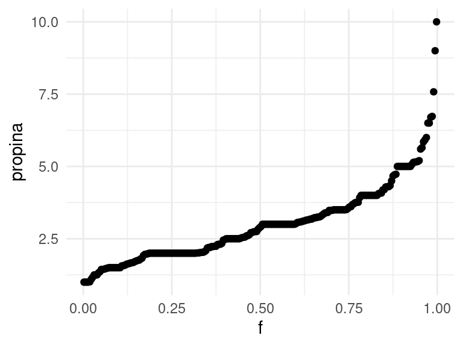

Finalmente, una gráfica más compacta que resume la gráfica de cuantiles
o el histograma es el **diagrama de caja y brazos**. Mostramos dos
versiones, la clásica de Tukey (T) y otra versión menos común de
Spear/Tufte (ST):


``` r
library(ggthemes)
cuartiles <- quantile(cuenta$cuenta_total)
cuartiles |> round(2)
```

```
##    0%   25%   50%   75%  100% 
##  3.07 13.35 17.80 24.13 50.81
```

``` r
g_1 <- ggplot(cuenta, aes(x = f, y = cuenta_total)) +
  labs(subtitle = "Gráfica de cuantiles: Cuenta total") +
  geom_hline(yintercept = cuartiles[2:4], colour = "gray") +
  geom_point(alpha = 0.5) + 
  geom_line()

g_2 <- ggplot(cuenta, aes(x = factor("ST", levels = "ST"), y = cuenta_total)) +
  geom_tufteboxplot() +
  labs(subtitle = "", x = "", y = "")
g_3 <- ggplot(cuenta, aes(x = factor("T"), y = cuenta_total)) +
  geom_boxplot() +
  labs(subtitle = "", x = "", y = "")
g_4 <- ggplot(cuenta, aes(x = factor("P"), y = cuenta_total)) +
  geom_jitter(height = 0, width =0.2, alpha = 0.5) +
  labs(subtitle = "", x = "", y = "")
g_5 <- ggplot(cuenta, aes(x = factor("V"), y = cuenta_total)) +
  geom_violin() +
  labs(subtitle = "", x = "", y = "")
g_1 + g_2 + g_3 + g_4 +
  plot_layout(widths = c(8, 2, 2, 2))
```

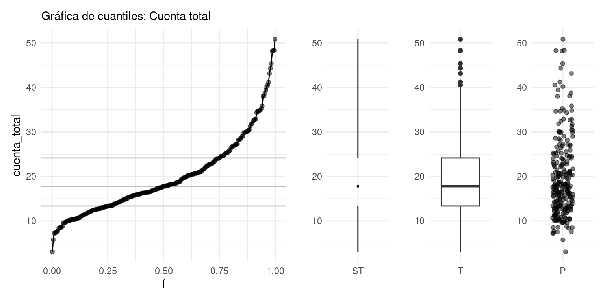


El diagrama de abajo explica los elementos de la versión típica del
diagrama de caja y brazos (*boxplot*). *RIC* se refiere al **Rango
Intercuantílico**, definido por la diferencia entre los cuantiles 25% y
75%.


Figura: [Jumanbar / CC
BY-SA](https://creativecommons.org/licenses/by-sa/3.0)


**Ventajas en el análisis inicial**

En un principio del análisis, estos resúmenes (cuantiles) pueden ser más
útiles que utilizar medias y varianzas, por ejemplo. La razón es que los
cuantiles:

-   Son cantidades más fácilmente interpretables
-   Los cuantiles centrales son más resistentes a valores atípicos que
    medias o varianzas
-   Permiten identificar valores extremos
-   Es fácil comparar cuantiles de distintos bonches de datos en la
    misma escala

**Nota:** Existen diferentes definiciones para calcular cuantiles de una muestra de 
datos, puedes leer más en [este artículo](https://www.amherst.edu/media/view/129116/original/Sample+Quantiles.pdf).

### Media y desviación estándar {.unnumbered}

Las medidas más comunes de localización y dispersión para un conjunto de
datos son la media muestral y la [desviación estándar
muestral](https://es.wikipedia.org/wiki/Desviación_t%C3%ADpica).

En general, no son muy apropiadas para iniciar el análisis exploratorio,
pues:

-   Son medidas más difíciles de interpretar y explicar que los
    cuantiles. En este sentido, son medidas especializadas. Por ejemplo,
    compara una explicación intuitiva de la mediana contra una
    explicación intuitiva de la media.
-   No son resistentes a valores atípicos. Su falta de resistencia los
    vuelve poco útiles en las primeras etapas de limpieza y descripción
    y en resúmenes deficientes para distribuciones irregulares (con
    colas largas por ejemplo).

<div class="mathblock">
<p>La media, o promedio, se denota por <span class="math inline">\(\bar
x\)</span> y se define como <span class="math display">\[\begin{align}
\bar x = \frac1N \sum_{n = 1}^N x_n.
\end{align}\]</span> La desviación estándar muestral se define como
<span class="math display">\[\begin{align}
\text{std}(x) = \sqrt{\frac1{N-1} \sum_{n = 1}^N (x_n - \bar x)^2}.
\end{align}\]</span></p>
</div>

**Observación**: Si $N$ no es muy chica, no importa mucho si dividimos
por $N$ o por $N-1$ en la fórmula de la desviación estándar. La razón de
que típicamente se usa $N-1$ la veremos más adelante, en la parte de
estimación.

Por otro lado, ventajas de estas medidas de centralidad y dispersión
son:

-   La media y desviación estándar son computacionalmente convenientes. Por lo tanto regresaremos a estas medidas una vez que estudiemos modelos de probabilidad básicos.

-   En muchas ocasiones conviene usar estas medidas pues permite hacer
    comparaciones históricas o tradicionales ---pues análisis anteriores
    pudieran estar basados en éstas.
    


<div class="ejercicio">
<ol style="list-style-type: decimal">
<li><p>Considera el caso de tener <span class="math inline">\(N\)</span>
observaciones y asume que ya tienes calculado el promedio para dichas
observaciones. Este promedio lo denotaremos por <span
class="math inline">\(\bar x_N\)</span>. Ahora, considera que has
obtenido <span class="math inline">\(M\)</span> observaciones más.
Escribe una fórmula recursiva para la media del conjunto total de datos
<span class="math inline">\(\bar x_{N+M}\)</span> en función de lo que
ya tenías precalculado <span class="math inline">\(\bar
x_N.\)</span></p></li>
<li><p>¿En qué situaciones esta propiedad puede ser
conveniente?</p></li>
</ol>
</div>

## Ejemplos {.unnumbered}

### Precios de casas {.unnumbered}

En este ejemplo consideremos los [datos de precios de ventas de la
ciudad de Ames,
Iowa](https://www.kaggle.com/prevek18/ames-housing-dataset). En
particular nos interesa entender la variación del precio de las casas.


Por este motivo calculamos los cuantiles que corresponden al 25%, 50% y
75% (**cuartiles**), así como el mínimo y máximo de los precios de las
casas:


``` r
quantile(casas |> pull(precio_miles))
```

```
##    0%   25%   50%   75%  100% 
##  37.9 132.0 165.0 215.0 755.0
```

<div class="ejercicio">
<p>Comprueba que el mínimo y máximo están asociados a los cuantiles 0% y
100%, respectivamente.</p>
</div>

Una posible comparación es considerar los precios y sus variación en
función de zona de la ciudad en que se encuentra una vivienda. Podemos
usar diagramas de caja y brazos para hacer una **comparación burda** de
los precios en distintas zonas de la ciudad:


``` r
ggplot(casas, aes(x = nombre_zona, y = precio_miles)) +
  geom_boxplot() +
  coord_flip()
```


La primera pregunta que nos hacemos es cómo pueden variar las
características de las casas dentro de cada zona. Para esto, podemos
considerar el área de las casas. En lugar de graficar el precio,
graficamos el precio por metro cuadrado, por ejemplo:


``` r
ggplot(casas, aes(x = nombre_zona, y = precio_m2)) +
  geom_boxplot() +
  coord_flip()
```

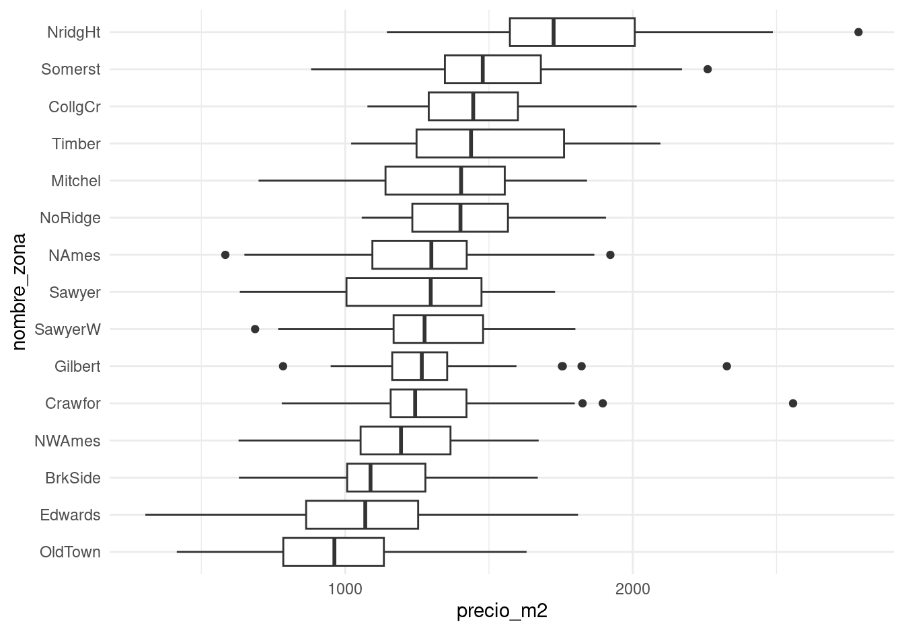

Podemos cuantificar la variación que observamos de zona a zona y la
variación que hay dentro de cada una de las zonas. Una primera
aproximación es observar las variación del precio al calcular la mediana
dentro de cada zona, y después cuantificar por medio de cuantiles cómo
varía la mediana entre zonas:


``` r
casas |>
  group_by(nombre_zona) |>
  summarise(mediana_zona = median(precio_m2), .groups = "drop") |>
  arrange(mediana_zona) |> 
  pull(mediana_zona) |>
  quantile() |>
  round()
```

```
##   0%  25%  50%  75% 100% 
##  963 1219 1298 1420 1725
```

Por otro lado, las variaciones con respecto a las medianas **dentro** de
cada zona, por grupo, se resume como:


``` r
quantile(casas |> 
           group_by(nombre_zona) |> 
           mutate(residual = precio_m2 - median(precio_m2)) |>
           pull(residual)) |>
  round()
```

```
##   0%  25%  50%  75% 100% 
## -765 -166    0  172 1314
```

Nótese que este último paso tiene sentido pues la variación dentro de
las zonas, en términos de precio por metro cuadrado, es similar. Esto no
lo podríamos haber hecho de manera efectiva si se hubiera utilizado el
precio de las casas sin ajustar por su tamaño.

Podemos resumir este primer análisis con un par de gráficas de cuantiles
(@cleveland93):


``` r
mediana <- median(casas$precio_m2)
resumen <- casas |>
  select(nombre_zona, precio_m2) |> 
  group_by(nombre_zona) |>
  mutate(mediana_zona = median(precio_m2)) |>
  mutate(residual = precio_m2 - mediana_zona) |>
  ungroup() |>
  mutate(mediana_zona = mediana_zona - mediana) |>
  select(nombre_zona, mediana_zona, residual) |>
  pivot_longer(mediana_zona:residual, names_to = "tipo", values_to = "valor")
ggplot(resumen, aes(sample = valor)) +
  geom_qq(distribution = stats::qunif) +
  facet_wrap(~ tipo) +
  ylab("Precio por m2") + xlab("f") +
  labs(subtitle = "Precio por m2 por zona",
       caption = paste0("Mediana total de ", round(mediana)))
```


Vemos que la mayor parte de la variación del precio por metro cuadrado
ocurre dentro de cada zona, una vez que controlamos por el tamaño de las
casas. La variación dentro de cada zona es aproximadamente simétrica,
aunque la cola derecha es ligeramente más larga con algunos valores
extremos.

Podemos seguir con otro indicador importante: la calificación de calidad
de los terminados de las casas. Como primer intento podríamos hacer:


Lo que indica que las calificaciones de calidad están distribuidas de
manera muy distinta a lo largo de las zonas, y que probablemente no va
ser simple desentrañar qué variación del precio se debe a la zona y cuál
se debe a la calidad.

### Prueba Enlace {.unnumbered}

Consideremos la prueba Enlace (2011) de matemáticas para primarias. Una
primera pregunta que alguien podría hacerse es: ¿cuáles escuelas son
mejores en este rubro, las privadas o las públicas?


``` r
enlace_tbl <- enlace |> group_by(tipo) |>
  summarise(n_escuelas = n(),
            cuantiles = list(cuantil(mate_6, c(0.05, 0.25, 0.5, 0.75, 0.95)))) |>
  unnest(cols = cuantiles) |> mutate(valor = round(valor))
enlace_tbl |>
  spread(cuantil, valor) |>
  gt()
```

```{=html}
<div id="sykxxonvyi" style="padding-left:0px;padding-right:0px;padding-top:10px;padding-bottom:10px;overflow-x:auto;overflow-y:auto;width:auto;height:auto;">
<style>#sykxxonvyi table {
  font-family: system-ui, 'Segoe UI', Roboto, Helvetica, Arial, sans-serif, 'Apple Color Emoji', 'Segoe UI Emoji', 'Segoe UI Symbol', 'Noto Color Emoji';
  -webkit-font-smoothing: antialiased;
  -moz-osx-font-smoothing: grayscale;
}

#sykxxonvyi thead, #sykxxonvyi tbody, #sykxxonvyi tfoot, #sykxxonvyi tr, #sykxxonvyi td, #sykxxonvyi th {
  border-style: none;
}

#sykxxonvyi p {
  margin: 0;
  padding: 0;
}

#sykxxonvyi .gt_table {
  display: table;
  border-collapse: collapse;
  line-height: normal;
  margin-left: auto;
  margin-right: auto;
  color: #333333;
  font-size: 16px;
  font-weight: normal;
  font-style: normal;
  background-color: #FFFFFF;
  width: auto;
  border-top-style: solid;
  border-top-width: 2px;
  border-top-color: #A8A8A8;
  border-right-style: none;
  border-right-width: 2px;
  border-right-color: #D3D3D3;
  border-bottom-style: solid;
  border-bottom-width: 2px;
  border-bottom-color: #A8A8A8;
  border-left-style: none;
  border-left-width: 2px;
  border-left-color: #D3D3D3;
}

#sykxxonvyi .gt_caption {
  padding-top: 4px;
  padding-bottom: 4px;
}

#sykxxonvyi .gt_title {
  color: #333333;
  font-size: 125%;
  font-weight: initial;
  padding-top: 4px;
  padding-bottom: 4px;
  padding-left: 5px;
  padding-right: 5px;
  border-bottom-color: #FFFFFF;
  border-bottom-width: 0;
}

#sykxxonvyi .gt_subtitle {
  color: #333333;
  font-size: 85%;
  font-weight: initial;
  padding-top: 3px;
  padding-bottom: 5px;
  padding-left: 5px;
  padding-right: 5px;
  border-top-color: #FFFFFF;
  border-top-width: 0;
}

#sykxxonvyi .gt_heading {
  background-color: #FFFFFF;
  text-align: center;
  border-bottom-color: #FFFFFF;
  border-left-style: none;
  border-left-width: 1px;
  border-left-color: #D3D3D3;
  border-right-style: none;
  border-right-width: 1px;
  border-right-color: #D3D3D3;
}

#sykxxonvyi .gt_bottom_border {
  border-bottom-style: solid;
  border-bottom-width: 2px;
  border-bottom-color: #D3D3D3;
}

#sykxxonvyi .gt_col_headings {
  border-top-style: solid;
  border-top-width: 2px;
  border-top-color: #D3D3D3;
  border-bottom-style: solid;
  border-bottom-width: 2px;
  border-bottom-color: #D3D3D3;
  border-left-style: none;
  border-left-width: 1px;
  border-left-color: #D3D3D3;
  border-right-style: none;
  border-right-width: 1px;
  border-right-color: #D3D3D3;
}

#sykxxonvyi .gt_col_heading {
  color: #333333;
  background-color: #FFFFFF;
  font-size: 100%;
  font-weight: normal;
  text-transform: inherit;
  border-left-style: none;
  border-left-width: 1px;
  border-left-color: #D3D3D3;
  border-right-style: none;
  border-right-width: 1px;
  border-right-color: #D3D3D3;
  vertical-align: bottom;
  padding-top: 5px;
  padding-bottom: 6px;
  padding-left: 5px;
  padding-right: 5px;
  overflow-x: hidden;
}

#sykxxonvyi .gt_column_spanner_outer {
  color: #333333;
  background-color: #FFFFFF;
  font-size: 100%;
  font-weight: normal;
  text-transform: inherit;
  padding-top: 0;
  padding-bottom: 0;
  padding-left: 4px;
  padding-right: 4px;
}

#sykxxonvyi .gt_column_spanner_outer:first-child {
  padding-left: 0;
}

#sykxxonvyi .gt_column_spanner_outer:last-child {
  padding-right: 0;
}

#sykxxonvyi .gt_column_spanner {
  border-bottom-style: solid;
  border-bottom-width: 2px;
  border-bottom-color: #D3D3D3;
  vertical-align: bottom;
  padding-top: 5px;
  padding-bottom: 5px;
  overflow-x: hidden;
  display: inline-block;
  width: 100%;
}

#sykxxonvyi .gt_spanner_row {
  border-bottom-style: hidden;
}

#sykxxonvyi .gt_group_heading {
  padding-top: 8px;
  padding-bottom: 8px;
  padding-left: 5px;
  padding-right: 5px;
  color: #333333;
  background-color: #FFFFFF;
  font-size: 100%;
  font-weight: initial;
  text-transform: inherit;
  border-top-style: solid;
  border-top-width: 2px;
  border-top-color: #D3D3D3;
  border-bottom-style: solid;
  border-bottom-width: 2px;
  border-bottom-color: #D3D3D3;
  border-left-style: none;
  border-left-width: 1px;
  border-left-color: #D3D3D3;
  border-right-style: none;
  border-right-width: 1px;
  border-right-color: #D3D3D3;
  vertical-align: middle;
  text-align: left;
}

#sykxxonvyi .gt_empty_group_heading {
  padding: 0.5px;
  color: #333333;
  background-color: #FFFFFF;
  font-size: 100%;
  font-weight: initial;
  border-top-style: solid;
  border-top-width: 2px;
  border-top-color: #D3D3D3;
  border-bottom-style: solid;
  border-bottom-width: 2px;
  border-bottom-color: #D3D3D3;
  vertical-align: middle;
}

#sykxxonvyi .gt_from_md > :first-child {
  margin-top: 0;
}

#sykxxonvyi .gt_from_md > :last-child {
  margin-bottom: 0;
}

#sykxxonvyi .gt_row {
  padding-top: 8px;
  padding-bottom: 8px;
  padding-left: 5px;
  padding-right: 5px;
  margin: 10px;
  border-top-style: solid;
  border-top-width: 1px;
  border-top-color: #D3D3D3;
  border-left-style: none;
  border-left-width: 1px;
  border-left-color: #D3D3D3;
  border-right-style: none;
  border-right-width: 1px;
  border-right-color: #D3D3D3;
  vertical-align: middle;
  overflow-x: hidden;
}

#sykxxonvyi .gt_stub {
  color: #333333;
  background-color: #FFFFFF;
  font-size: 100%;
  font-weight: initial;
  text-transform: inherit;
  border-right-style: solid;
  border-right-width: 2px;
  border-right-color: #D3D3D3;
  padding-left: 5px;
  padding-right: 5px;
}

#sykxxonvyi .gt_stub_row_group {
  color: #333333;
  background-color: #FFFFFF;
  font-size: 100%;
  font-weight: initial;
  text-transform: inherit;
  border-right-style: solid;
  border-right-width: 2px;
  border-right-color: #D3D3D3;
  padding-left: 5px;
  padding-right: 5px;
  vertical-align: top;
}

#sykxxonvyi .gt_row_group_first td {
  border-top-width: 2px;
}

#sykxxonvyi .gt_row_group_first th {
  border-top-width: 2px;
}

#sykxxonvyi .gt_summary_row {
  color: #333333;
  background-color: #FFFFFF;
  text-transform: inherit;
  padding-top: 8px;
  padding-bottom: 8px;
  padding-left: 5px;
  padding-right: 5px;
}

#sykxxonvyi .gt_first_summary_row {
  border-top-style: solid;
  border-top-color: #D3D3D3;
}

#sykxxonvyi .gt_first_summary_row.thick {
  border-top-width: 2px;
}

#sykxxonvyi .gt_last_summary_row {
  padding-top: 8px;
  padding-bottom: 8px;
  padding-left: 5px;
  padding-right: 5px;
  border-bottom-style: solid;
  border-bottom-width: 2px;
  border-bottom-color: #D3D3D3;
}

#sykxxonvyi .gt_grand_summary_row {
  color: #333333;
  background-color: #FFFFFF;
  text-transform: inherit;
  padding-top: 8px;
  padding-bottom: 8px;
  padding-left: 5px;
  padding-right: 5px;
}

#sykxxonvyi .gt_first_grand_summary_row {
  padding-top: 8px;
  padding-bottom: 8px;
  padding-left: 5px;
  padding-right: 5px;
  border-top-style: double;
  border-top-width: 6px;
  border-top-color: #D3D3D3;
}

#sykxxonvyi .gt_last_grand_summary_row_top {
  padding-top: 8px;
  padding-bottom: 8px;
  padding-left: 5px;
  padding-right: 5px;
  border-bottom-style: double;
  border-bottom-width: 6px;
  border-bottom-color: #D3D3D3;
}

#sykxxonvyi .gt_striped {
  background-color: rgba(128, 128, 128, 0.05);
}

#sykxxonvyi .gt_table_body {
  border-top-style: solid;
  border-top-width: 2px;
  border-top-color: #D3D3D3;
  border-bottom-style: solid;
  border-bottom-width: 2px;
  border-bottom-color: #D3D3D3;
}

#sykxxonvyi .gt_footnotes {
  color: #333333;
  background-color: #FFFFFF;
  border-bottom-style: none;
  border-bottom-width: 2px;
  border-bottom-color: #D3D3D3;
  border-left-style: none;
  border-left-width: 2px;
  border-left-color: #D3D3D3;
  border-right-style: none;
  border-right-width: 2px;
  border-right-color: #D3D3D3;
}

#sykxxonvyi .gt_footnote {
  margin: 0px;
  font-size: 90%;
  padding-top: 4px;
  padding-bottom: 4px;
  padding-left: 5px;
  padding-right: 5px;
}

#sykxxonvyi .gt_sourcenotes {
  color: #333333;
  background-color: #FFFFFF;
  border-bottom-style: none;
  border-bottom-width: 2px;
  border-bottom-color: #D3D3D3;
  border-left-style: none;
  border-left-width: 2px;
  border-left-color: #D3D3D3;
  border-right-style: none;
  border-right-width: 2px;
  border-right-color: #D3D3D3;
}

#sykxxonvyi .gt_sourcenote {
  font-size: 90%;
  padding-top: 4px;
  padding-bottom: 4px;
  padding-left: 5px;
  padding-right: 5px;
}

#sykxxonvyi .gt_left {
  text-align: left;
}

#sykxxonvyi .gt_center {
  text-align: center;
}

#sykxxonvyi .gt_right {
  text-align: right;
  font-variant-numeric: tabular-nums;
}

#sykxxonvyi .gt_font_normal {
  font-weight: normal;
}

#sykxxonvyi .gt_font_bold {
  font-weight: bold;
}

#sykxxonvyi .gt_font_italic {
  font-style: italic;
}

#sykxxonvyi .gt_super {
  font-size: 65%;
}

#sykxxonvyi .gt_footnote_marks {
  font-size: 75%;
  vertical-align: 0.4em;
  position: initial;
}

#sykxxonvyi .gt_asterisk {
  font-size: 100%;
  vertical-align: 0;
}

#sykxxonvyi .gt_indent_1 {
  text-indent: 5px;
}

#sykxxonvyi .gt_indent_2 {
  text-indent: 10px;
}

#sykxxonvyi .gt_indent_3 {
  text-indent: 15px;
}

#sykxxonvyi .gt_indent_4 {
  text-indent: 20px;
}

#sykxxonvyi .gt_indent_5 {
  text-indent: 25px;
}

#sykxxonvyi .katex-display {
  display: inline-flex !important;
  margin-bottom: 0.75em !important;
}

#sykxxonvyi div.Reactable > div.rt-table > div.rt-thead > div.rt-tr.rt-tr-group-header > div.rt-th-group:after {
  height: 0px !important;
}
</style>
<table class="gt_table" data-quarto-disable-processing="false" data-quarto-bootstrap="false">
  <thead>
    <tr class="gt_col_headings">
      <th class="gt_col_heading gt_columns_bottom_border gt_center" rowspan="1" colspan="1" scope="col" id="tipo">tipo</th>
      <th class="gt_col_heading gt_columns_bottom_border gt_right" rowspan="1" colspan="1" scope="col" id="n_escuelas">n_escuelas</th>
      <th class="gt_col_heading gt_columns_bottom_border gt_right" rowspan="1" colspan="1" scope="col" id="0.05">0.05</th>
      <th class="gt_col_heading gt_columns_bottom_border gt_right" rowspan="1" colspan="1" scope="col" id="0.25">0.25</th>
      <th class="gt_col_heading gt_columns_bottom_border gt_right" rowspan="1" colspan="1" scope="col" id="0.5">0.5</th>
      <th class="gt_col_heading gt_columns_bottom_border gt_right" rowspan="1" colspan="1" scope="col" id="0.75">0.75</th>
      <th class="gt_col_heading gt_columns_bottom_border gt_right" rowspan="1" colspan="1" scope="col" id="0.95">0.95</th>
    </tr>
  </thead>
  <tbody class="gt_table_body">
    <tr><td headers="tipo" class="gt_row gt_center">Indígena/Conafe</td>
<td headers="n_escuelas" class="gt_row gt_right">13599</td>
<td headers="0.05" class="gt_row gt_right">304</td>
<td headers="0.25" class="gt_row gt_right">358</td>
<td headers="0.5" class="gt_row gt_right">412</td>
<td headers="0.75" class="gt_row gt_right">478</td>
<td headers="0.95" class="gt_row gt_right">588</td></tr>
    <tr><td headers="tipo" class="gt_row gt_center">General</td>
<td headers="n_escuelas" class="gt_row gt_right">60166</td>
<td headers="0.05" class="gt_row gt_right">380</td>
<td headers="0.25" class="gt_row gt_right">454</td>
<td headers="0.5" class="gt_row gt_right">502</td>
<td headers="0.75" class="gt_row gt_right">548</td>
<td headers="0.95" class="gt_row gt_right">631</td></tr>
    <tr><td headers="tipo" class="gt_row gt_center">Particular</td>
<td headers="n_escuelas" class="gt_row gt_right">6816</td>
<td headers="0.05" class="gt_row gt_right">479</td>
<td headers="0.25" class="gt_row gt_right">551</td>
<td headers="0.5" class="gt_row gt_right">593</td>
<td headers="0.75" class="gt_row gt_right">634</td>
<td headers="0.95" class="gt_row gt_right">703</td></tr>
  </tbody>
  
  
</table>
</div>
```

Para un análisis exploratorio podemos utilizar distintas gráficas. Por
ejemplo, podemos utilizar nuevamente las gráficas de caja y brazos, así
como graficar los percentiles. Nótese que en la gráfica 1 se utilizan
los cuantiles 0.05, 0.25, 0.5, 0.75 y 0.95:


```
## Warning: Using `size` aesthetic for lines was deprecated in ggplot2 3.4.0.
## ℹ Please use `linewidth` instead.
## This warning is displayed once every 8 hours.
## Call `lifecycle::last_lifecycle_warnings()` to see where this warning was
## generated.
```

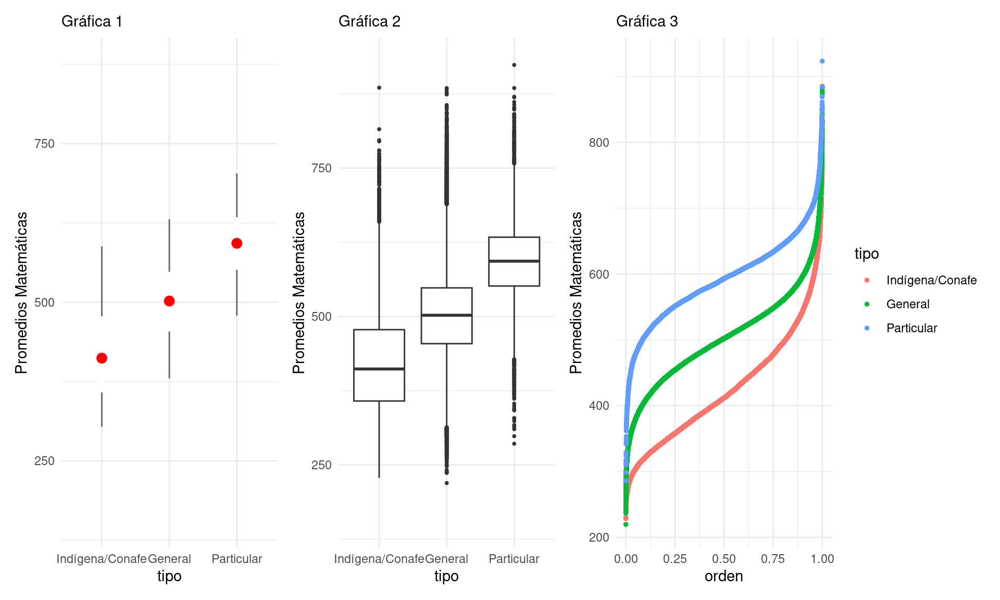

Se puede discutir qué tan apropiada es cada gráfica con el objetivo de
realizar comparaciones. Sin duda, graficar más cuantiles es más útil
para hacer comparaciones. Por ejemplo, en la Gráfica 1 podemos ver que
la mediana de las escuelas generales está cercana al cuantil 5% de las
escuelas particulares. Por otro lado, el diagrama de caja y brazos
muestra también valores "atípicos".

Antes de contestar prematuramente la pregunta: ¿cuáles son las mejores
escuelas? busquemos mejorar la interpretabilidad de nuestras
comparaciones. Podemos comenzar por agregar, por ejemplo, el nivel del
marginación del municipio donde se encuentra la escuela.


Para este objetivo, podemos usar páneles (pequeños múltiplos útiles para
hacer comparaciones) y graficar:

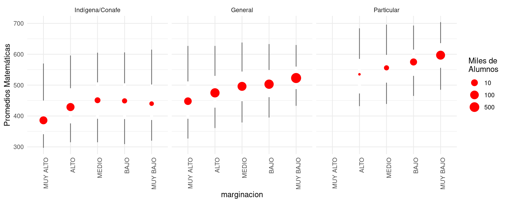

Esta gráfica pone en contexto la pregunta inicial, y permite evidenciar
la dificultad de contestarla. En particular:

1.  Señala que la pregunta no sólo debe concentarse en el tipo de
    "sistema": pública, privada, etc. Por ejemplo, las escuelas públicas
    en zonas de marginación baja no tienen una distribución de
    calificaciones muy distinta a las privadas en zonas de marginación
    alta.
2.  El contexto de la escuela es importante.
3.  Debemos de pensar qué factores --por ejemplo, el entorno familiar de
    los estudiantes-- puede resultar en comparaciones que favorecen a
    las escuelas privadas. Un ejemplo de esto es considerar si los
    estudiantes tienen que trabajar o no. A su vez, esto puede o no ser
    reflejo de la calidad del sistema educativo.
4.  Si esto es cierto, entonces la pregunta inicial es demasiado vaga y
    mal planteada. Quizá deberíamos intentar entender cuánto "aporta"
    cada escuela a cada estudiante, como medida de qué tan buena es cada
    escuela.

### Estados y calificaciones en SAT {.unnumbered}

¿Cómo se relaciona el gasto por alumno, a nivel estatal, con sus
resultados académicos? Hay trabajo considerable en definir estos
términos, pero supongamos que tenemos el [siguiente conjunto de
datos](http://jse.amstat.org/datasets/sat.txt) [@Guber], que son datos
oficiales agregados por `estado` de Estados Unidos. Consideremos el
subconjunto de variables `sat`, que es la calificación promedio de los
alumnos en cada estado (para 1997) y `expend`, que es el gasto en miles
de dólares por estudiante en (1994-1995).


``` r
sat <- read_csv("data/sat.csv")
sat_tbl <- sat |> select(state, expend, sat) |>
  gather(variable, valor, expend:sat) |>
  group_by(variable) |>
  summarise(cuantiles = list(cuantil(valor))) |>
  unnest(cols = c(cuantiles)) |>
  mutate(valor = round(valor, 1)) |>
  spread(cuantil, valor)
sat_tbl |> gt()
```

```{=html}
<div id="trvhlcrcph" style="padding-left:0px;padding-right:0px;padding-top:10px;padding-bottom:10px;overflow-x:auto;overflow-y:auto;width:auto;height:auto;">
<style>#trvhlcrcph table {
  font-family: system-ui, 'Segoe UI', Roboto, Helvetica, Arial, sans-serif, 'Apple Color Emoji', 'Segoe UI Emoji', 'Segoe UI Symbol', 'Noto Color Emoji';
  -webkit-font-smoothing: antialiased;
  -moz-osx-font-smoothing: grayscale;
}

#trvhlcrcph thead, #trvhlcrcph tbody, #trvhlcrcph tfoot, #trvhlcrcph tr, #trvhlcrcph td, #trvhlcrcph th {
  border-style: none;
}

#trvhlcrcph p {
  margin: 0;
  padding: 0;
}

#trvhlcrcph .gt_table {
  display: table;
  border-collapse: collapse;
  line-height: normal;
  margin-left: auto;
  margin-right: auto;
  color: #333333;
  font-size: 16px;
  font-weight: normal;
  font-style: normal;
  background-color: #FFFFFF;
  width: auto;
  border-top-style: solid;
  border-top-width: 2px;
  border-top-color: #A8A8A8;
  border-right-style: none;
  border-right-width: 2px;
  border-right-color: #D3D3D3;
  border-bottom-style: solid;
  border-bottom-width: 2px;
  border-bottom-color: #A8A8A8;
  border-left-style: none;
  border-left-width: 2px;
  border-left-color: #D3D3D3;
}

#trvhlcrcph .gt_caption {
  padding-top: 4px;
  padding-bottom: 4px;
}

#trvhlcrcph .gt_title {
  color: #333333;
  font-size: 125%;
  font-weight: initial;
  padding-top: 4px;
  padding-bottom: 4px;
  padding-left: 5px;
  padding-right: 5px;
  border-bottom-color: #FFFFFF;
  border-bottom-width: 0;
}

#trvhlcrcph .gt_subtitle {
  color: #333333;
  font-size: 85%;
  font-weight: initial;
  padding-top: 3px;
  padding-bottom: 5px;
  padding-left: 5px;
  padding-right: 5px;
  border-top-color: #FFFFFF;
  border-top-width: 0;
}

#trvhlcrcph .gt_heading {
  background-color: #FFFFFF;
  text-align: center;
  border-bottom-color: #FFFFFF;
  border-left-style: none;
  border-left-width: 1px;
  border-left-color: #D3D3D3;
  border-right-style: none;
  border-right-width: 1px;
  border-right-color: #D3D3D3;
}

#trvhlcrcph .gt_bottom_border {
  border-bottom-style: solid;
  border-bottom-width: 2px;
  border-bottom-color: #D3D3D3;
}

#trvhlcrcph .gt_col_headings {
  border-top-style: solid;
  border-top-width: 2px;
  border-top-color: #D3D3D3;
  border-bottom-style: solid;
  border-bottom-width: 2px;
  border-bottom-color: #D3D3D3;
  border-left-style: none;
  border-left-width: 1px;
  border-left-color: #D3D3D3;
  border-right-style: none;
  border-right-width: 1px;
  border-right-color: #D3D3D3;
}

#trvhlcrcph .gt_col_heading {
  color: #333333;
  background-color: #FFFFFF;
  font-size: 100%;
  font-weight: normal;
  text-transform: inherit;
  border-left-style: none;
  border-left-width: 1px;
  border-left-color: #D3D3D3;
  border-right-style: none;
  border-right-width: 1px;
  border-right-color: #D3D3D3;
  vertical-align: bottom;
  padding-top: 5px;
  padding-bottom: 6px;
  padding-left: 5px;
  padding-right: 5px;
  overflow-x: hidden;
}

#trvhlcrcph .gt_column_spanner_outer {
  color: #333333;
  background-color: #FFFFFF;
  font-size: 100%;
  font-weight: normal;
  text-transform: inherit;
  padding-top: 0;
  padding-bottom: 0;
  padding-left: 4px;
  padding-right: 4px;
}

#trvhlcrcph .gt_column_spanner_outer:first-child {
  padding-left: 0;
}

#trvhlcrcph .gt_column_spanner_outer:last-child {
  padding-right: 0;
}

#trvhlcrcph .gt_column_spanner {
  border-bottom-style: solid;
  border-bottom-width: 2px;
  border-bottom-color: #D3D3D3;
  vertical-align: bottom;
  padding-top: 5px;
  padding-bottom: 5px;
  overflow-x: hidden;
  display: inline-block;
  width: 100%;
}

#trvhlcrcph .gt_spanner_row {
  border-bottom-style: hidden;
}

#trvhlcrcph .gt_group_heading {
  padding-top: 8px;
  padding-bottom: 8px;
  padding-left: 5px;
  padding-right: 5px;
  color: #333333;
  background-color: #FFFFFF;
  font-size: 100%;
  font-weight: initial;
  text-transform: inherit;
  border-top-style: solid;
  border-top-width: 2px;
  border-top-color: #D3D3D3;
  border-bottom-style: solid;
  border-bottom-width: 2px;
  border-bottom-color: #D3D3D3;
  border-left-style: none;
  border-left-width: 1px;
  border-left-color: #D3D3D3;
  border-right-style: none;
  border-right-width: 1px;
  border-right-color: #D3D3D3;
  vertical-align: middle;
  text-align: left;
}

#trvhlcrcph .gt_empty_group_heading {
  padding: 0.5px;
  color: #333333;
  background-color: #FFFFFF;
  font-size: 100%;
  font-weight: initial;
  border-top-style: solid;
  border-top-width: 2px;
  border-top-color: #D3D3D3;
  border-bottom-style: solid;
  border-bottom-width: 2px;
  border-bottom-color: #D3D3D3;
  vertical-align: middle;
}

#trvhlcrcph .gt_from_md > :first-child {
  margin-top: 0;
}

#trvhlcrcph .gt_from_md > :last-child {
  margin-bottom: 0;
}

#trvhlcrcph .gt_row {
  padding-top: 8px;
  padding-bottom: 8px;
  padding-left: 5px;
  padding-right: 5px;
  margin: 10px;
  border-top-style: solid;
  border-top-width: 1px;
  border-top-color: #D3D3D3;
  border-left-style: none;
  border-left-width: 1px;
  border-left-color: #D3D3D3;
  border-right-style: none;
  border-right-width: 1px;
  border-right-color: #D3D3D3;
  vertical-align: middle;
  overflow-x: hidden;
}

#trvhlcrcph .gt_stub {
  color: #333333;
  background-color: #FFFFFF;
  font-size: 100%;
  font-weight: initial;
  text-transform: inherit;
  border-right-style: solid;
  border-right-width: 2px;
  border-right-color: #D3D3D3;
  padding-left: 5px;
  padding-right: 5px;
}

#trvhlcrcph .gt_stub_row_group {
  color: #333333;
  background-color: #FFFFFF;
  font-size: 100%;
  font-weight: initial;
  text-transform: inherit;
  border-right-style: solid;
  border-right-width: 2px;
  border-right-color: #D3D3D3;
  padding-left: 5px;
  padding-right: 5px;
  vertical-align: top;
}

#trvhlcrcph .gt_row_group_first td {
  border-top-width: 2px;
}

#trvhlcrcph .gt_row_group_first th {
  border-top-width: 2px;
}

#trvhlcrcph .gt_summary_row {
  color: #333333;
  background-color: #FFFFFF;
  text-transform: inherit;
  padding-top: 8px;
  padding-bottom: 8px;
  padding-left: 5px;
  padding-right: 5px;
}

#trvhlcrcph .gt_first_summary_row {
  border-top-style: solid;
  border-top-color: #D3D3D3;
}

#trvhlcrcph .gt_first_summary_row.thick {
  border-top-width: 2px;
}

#trvhlcrcph .gt_last_summary_row {
  padding-top: 8px;
  padding-bottom: 8px;
  padding-left: 5px;
  padding-right: 5px;
  border-bottom-style: solid;
  border-bottom-width: 2px;
  border-bottom-color: #D3D3D3;
}

#trvhlcrcph .gt_grand_summary_row {
  color: #333333;
  background-color: #FFFFFF;
  text-transform: inherit;
  padding-top: 8px;
  padding-bottom: 8px;
  padding-left: 5px;
  padding-right: 5px;
}

#trvhlcrcph .gt_first_grand_summary_row {
  padding-top: 8px;
  padding-bottom: 8px;
  padding-left: 5px;
  padding-right: 5px;
  border-top-style: double;
  border-top-width: 6px;
  border-top-color: #D3D3D3;
}

#trvhlcrcph .gt_last_grand_summary_row_top {
  padding-top: 8px;
  padding-bottom: 8px;
  padding-left: 5px;
  padding-right: 5px;
  border-bottom-style: double;
  border-bottom-width: 6px;
  border-bottom-color: #D3D3D3;
}

#trvhlcrcph .gt_striped {
  background-color: rgba(128, 128, 128, 0.05);
}

#trvhlcrcph .gt_table_body {
  border-top-style: solid;
  border-top-width: 2px;
  border-top-color: #D3D3D3;
  border-bottom-style: solid;
  border-bottom-width: 2px;
  border-bottom-color: #D3D3D3;
}

#trvhlcrcph .gt_footnotes {
  color: #333333;
  background-color: #FFFFFF;
  border-bottom-style: none;
  border-bottom-width: 2px;
  border-bottom-color: #D3D3D3;
  border-left-style: none;
  border-left-width: 2px;
  border-left-color: #D3D3D3;
  border-right-style: none;
  border-right-width: 2px;
  border-right-color: #D3D3D3;
}

#trvhlcrcph .gt_footnote {
  margin: 0px;
  font-size: 90%;
  padding-top: 4px;
  padding-bottom: 4px;
  padding-left: 5px;
  padding-right: 5px;
}

#trvhlcrcph .gt_sourcenotes {
  color: #333333;
  background-color: #FFFFFF;
  border-bottom-style: none;
  border-bottom-width: 2px;
  border-bottom-color: #D3D3D3;
  border-left-style: none;
  border-left-width: 2px;
  border-left-color: #D3D3D3;
  border-right-style: none;
  border-right-width: 2px;
  border-right-color: #D3D3D3;
}

#trvhlcrcph .gt_sourcenote {
  font-size: 90%;
  padding-top: 4px;
  padding-bottom: 4px;
  padding-left: 5px;
  padding-right: 5px;
}

#trvhlcrcph .gt_left {
  text-align: left;
}

#trvhlcrcph .gt_center {
  text-align: center;
}

#trvhlcrcph .gt_right {
  text-align: right;
  font-variant-numeric: tabular-nums;
}

#trvhlcrcph .gt_font_normal {
  font-weight: normal;
}

#trvhlcrcph .gt_font_bold {
  font-weight: bold;
}

#trvhlcrcph .gt_font_italic {
  font-style: italic;
}

#trvhlcrcph .gt_super {
  font-size: 65%;
}

#trvhlcrcph .gt_footnote_marks {
  font-size: 75%;
  vertical-align: 0.4em;
  position: initial;
}

#trvhlcrcph .gt_asterisk {
  font-size: 100%;
  vertical-align: 0;
}

#trvhlcrcph .gt_indent_1 {
  text-indent: 5px;
}

#trvhlcrcph .gt_indent_2 {
  text-indent: 10px;
}

#trvhlcrcph .gt_indent_3 {
  text-indent: 15px;
}

#trvhlcrcph .gt_indent_4 {
  text-indent: 20px;
}

#trvhlcrcph .gt_indent_5 {
  text-indent: 25px;
}

#trvhlcrcph .katex-display {
  display: inline-flex !important;
  margin-bottom: 0.75em !important;
}

#trvhlcrcph div.Reactable > div.rt-table > div.rt-thead > div.rt-tr.rt-tr-group-header > div.rt-th-group:after {
  height: 0px !important;
}
</style>
<table class="gt_table" data-quarto-disable-processing="false" data-quarto-bootstrap="false">
  <thead>
    <tr class="gt_col_headings">
      <th class="gt_col_heading gt_columns_bottom_border gt_left" rowspan="1" colspan="1" scope="col" id="variable">variable</th>
      <th class="gt_col_heading gt_columns_bottom_border gt_right" rowspan="1" colspan="1" scope="col" id="0">0</th>
      <th class="gt_col_heading gt_columns_bottom_border gt_right" rowspan="1" colspan="1" scope="col" id="0.25">0.25</th>
      <th class="gt_col_heading gt_columns_bottom_border gt_right" rowspan="1" colspan="1" scope="col" id="0.5">0.5</th>
      <th class="gt_col_heading gt_columns_bottom_border gt_right" rowspan="1" colspan="1" scope="col" id="0.75">0.75</th>
      <th class="gt_col_heading gt_columns_bottom_border gt_right" rowspan="1" colspan="1" scope="col" id="1">1</th>
    </tr>
  </thead>
  <tbody class="gt_table_body">
    <tr><td headers="variable" class="gt_row gt_left">expend</td>
<td headers="0" class="gt_row gt_right">3.7</td>
<td headers="0.25" class="gt_row gt_right">4.9</td>
<td headers="0.5" class="gt_row gt_right">5.8</td>
<td headers="0.75" class="gt_row gt_right">6.4</td>
<td headers="1" class="gt_row gt_right">9.8</td></tr>
    <tr><td headers="variable" class="gt_row gt_left">sat</td>
<td headers="0" class="gt_row gt_right">844.0</td>
<td headers="0.25" class="gt_row gt_right">897.2</td>
<td headers="0.5" class="gt_row gt_right">945.5</td>
<td headers="0.75" class="gt_row gt_right">1032.0</td>
<td headers="1" class="gt_row gt_right">1107.0</td></tr>
  </tbody>
  
  
</table>
</div>
```

Esta variación es considerable para promedios del SAT: el percentil 75
es alrededor de 1050 puntos, mientras que el percentil 25 corresponde a
alrededor de 800. Igualmente, hay diferencias considerables de gasto por
alumno (miles de dólares) a lo largo de los estados.

Ahora hacemos nuestro primer ejercico de comparación: ¿Cómo se ven las
calificaciones para estados en distintos niveles de gasto? Podemos usar
una gráfica de dispersión:


``` r
library(ggrepel)
ggplot(sat, aes(x = expend, y = sat, label = state)) +
  geom_point(colour = "red", size = 2) + 
  geom_text_repel(colour = "gray50") +
  xlab("Gasto por alumno (miles de dólares)") +
  ylab("Calificación promedio en SAT")
```

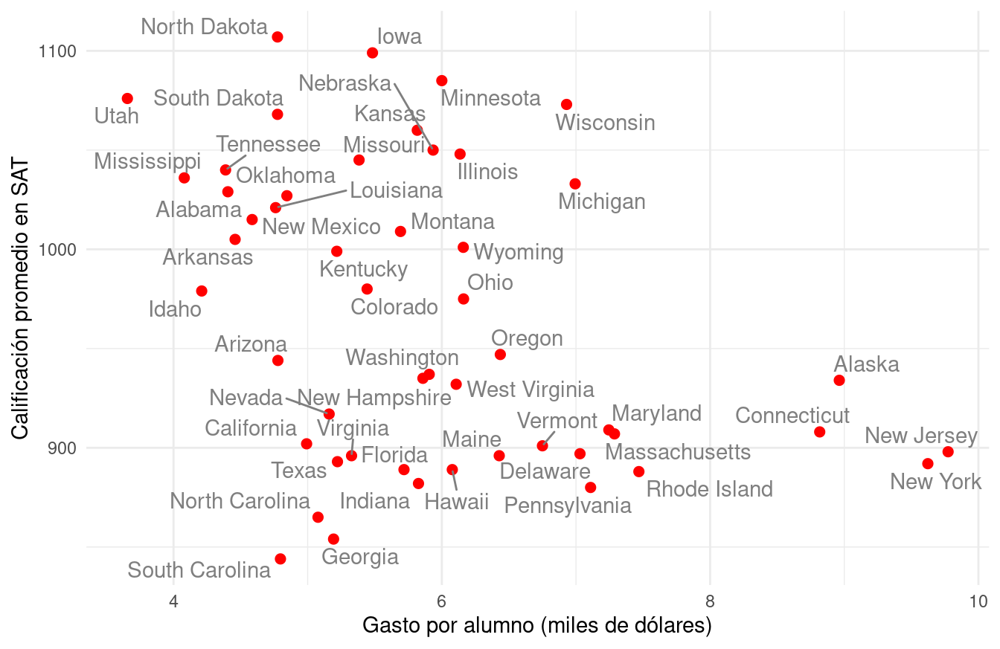

Estas comparaciones no son de alta calidad, solo estamos usando 2
variables ---que son muy pocas--- y no hay mucho que podamos decir en
cuanto explicación. Sin duda nos hace falta una imagen más completa.
Necesitaríamos entender la correlación que existe entre las demás
características de nuestras unidades de estudio.

**Las unidades que estamos comparando pueden diferir fuertemente en
otras propiedades importantes (o dimensiones), lo cual no permite
interpretar la gráfica de manera sencilla.**

Una variable que tenemos es el porcentaje de alumnos de cada estado que
toma el SAT. Podemos agregar como sigue:


``` r
ggplot(sat, aes(x = expend, y = math, label=state, colour = frac)) +
  geom_point() + geom_text_repel() +
  xlab("Gasto por alumno (miles de dólares)") +
  ylab("Calificación promedio en SAT")
```

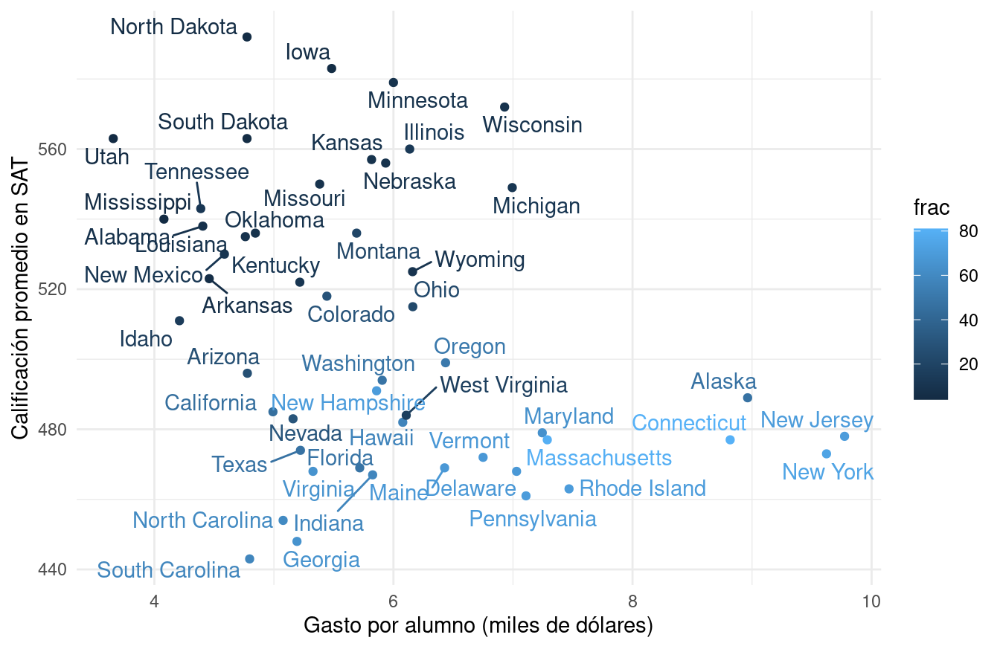

Esto nos permite entender por qué nuestra comparación inicial es
relativamente pobre. Los estados con mejores resultados promedio en el
SAT son aquellos donde una fracción relativamente baja de los
estudiantes toma el examen. La diferencia es considerable.

En este punto podemos hacer varias cosas. Una primera idea es intentar
comparar estados más similares en cuanto a la población de alumnos que
asiste. Podríamos hacer grupos como sigue:


``` r
set.seed(991)
k_medias_sat <- kmeans(sat |> select(frac), centers = 4,  nstart = 100, iter.max = 100)
sat$clase <- k_medias_sat$cluster
sat <- sat |> group_by(clase) |>
  mutate(clase_media = round(mean(frac))) |>
  ungroup() |>
  mutate(clase_media = factor(clase_media))
sat <- sat |>
  mutate(rank_p = rank(frac, ties= "first") / length(frac))
ggplot(sat, aes(x = rank_p, y = frac, label = state, colour = clase_media)) +
  geom_point(size = 2)
```


Estos resultados indican que es más probable que buenos alumnos decidan
hacer el SAT. Lo interesante es que esto ocurre de manera diferente en
cada estado. Por ejemplo, en algunos estados era más común otro examen:
el ACT.

Si hacemos *clusters* de estados según el % de alumnos, empezamos a ver
otra historia. Para esto, ajustemos rectas de mínimos cuadrados como
referencia:

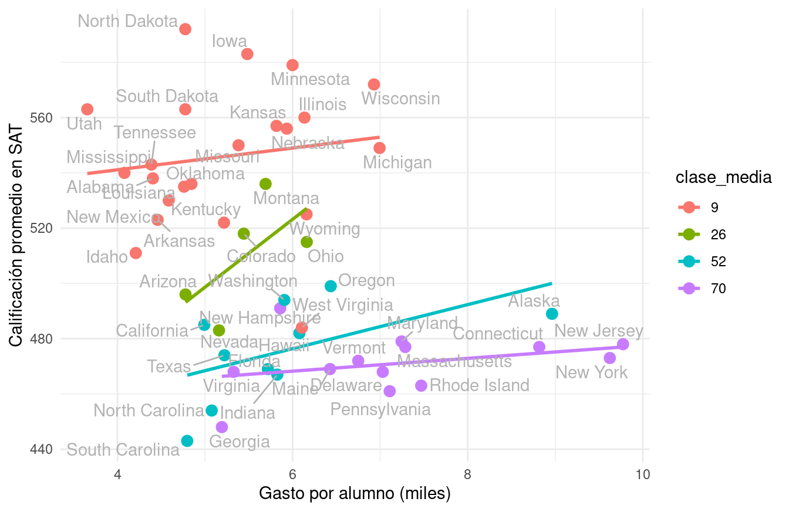

Esto da una imagen muy diferente a la que originalmente planteamos. Nota
que dependiendo de cómo categorizamos, esta gráfica puede variar (puedes
intentar con más o menos grupos, por ejemplo).

### Tablas de conteos {.unnumbered}

Consideremos los siguientes datos de tomadores de té (del paquete
FactoMineR [@factominer]):


``` r
tea <- read_csv("data/tea.csv")
# nombres y códigos
te <- tea |> select(how, price, sugar) |>
  rename(presentacion = how, precio = price, azucar = sugar) |>
  mutate(
    presentacion = fct_recode(presentacion,
                              suelto = "unpackaged", bolsas = "tea bag", mixto = "tea bag+unpackaged"),
    precio = fct_recode(precio,
                        marca = "p_branded", variable = "p_variable", barato = "p_cheap",
                        marca_propia = "p_private label", desconocido = "p_unknown", fino = "p_upscale"),
    azucar = fct_recode(azucar,
                        sin_azúcar = "No.sugar", con_azúcar = "sugar"))
```


``` r
sample_n(te, 10)
```

```
## # A tibble: 10 × 3
##    presentacion precio   azucar    
##    <fct>        <fct>    <fct>     
##  1 bolsas       marca    sin_azúcar
##  2 bolsas       variable sin_azúcar
##  3 bolsas       marca    con_azúcar
##  4 bolsas       fino     con_azúcar
##  5 mixto        variable con_azúcar
##  6 mixto        fino     con_azúcar
##  7 bolsas       marca    sin_azúcar
##  8 bolsas       fino     sin_azúcar
##  9 mixto        variable con_azúcar
## 10 mixto        variable sin_azúcar
```

Nos interesa ver qué personas compran té suelto, y de qué tipo.
Empezamos por ver las proporciones que compran té según su empaque (en
bolsita o suelto):


``` r
precio <- te |>
  count(precio) |>
  mutate(prop = round(100 * n / sum(n))) |>
  select(-n)
tipo <- te |>
  count(presentacion) |>
  mutate(pct = round(100 * n / sum(n)))
tipo |> gt()
```

```{=html}
<div id="wiljiluquk" style="padding-left:0px;padding-right:0px;padding-top:10px;padding-bottom:10px;overflow-x:auto;overflow-y:auto;width:auto;height:auto;">
<style>#wiljiluquk table {
  font-family: system-ui, 'Segoe UI', Roboto, Helvetica, Arial, sans-serif, 'Apple Color Emoji', 'Segoe UI Emoji', 'Segoe UI Symbol', 'Noto Color Emoji';
  -webkit-font-smoothing: antialiased;
  -moz-osx-font-smoothing: grayscale;
}

#wiljiluquk thead, #wiljiluquk tbody, #wiljiluquk tfoot, #wiljiluquk tr, #wiljiluquk td, #wiljiluquk th {
  border-style: none;
}

#wiljiluquk p {
  margin: 0;
  padding: 0;
}

#wiljiluquk .gt_table {
  display: table;
  border-collapse: collapse;
  line-height: normal;
  margin-left: auto;
  margin-right: auto;
  color: #333333;
  font-size: 16px;
  font-weight: normal;
  font-style: normal;
  background-color: #FFFFFF;
  width: auto;
  border-top-style: solid;
  border-top-width: 2px;
  border-top-color: #A8A8A8;
  border-right-style: none;
  border-right-width: 2px;
  border-right-color: #D3D3D3;
  border-bottom-style: solid;
  border-bottom-width: 2px;
  border-bottom-color: #A8A8A8;
  border-left-style: none;
  border-left-width: 2px;
  border-left-color: #D3D3D3;
}

#wiljiluquk .gt_caption {
  padding-top: 4px;
  padding-bottom: 4px;
}

#wiljiluquk .gt_title {
  color: #333333;
  font-size: 125%;
  font-weight: initial;
  padding-top: 4px;
  padding-bottom: 4px;
  padding-left: 5px;
  padding-right: 5px;
  border-bottom-color: #FFFFFF;
  border-bottom-width: 0;
}

#wiljiluquk .gt_subtitle {
  color: #333333;
  font-size: 85%;
  font-weight: initial;
  padding-top: 3px;
  padding-bottom: 5px;
  padding-left: 5px;
  padding-right: 5px;
  border-top-color: #FFFFFF;
  border-top-width: 0;
}

#wiljiluquk .gt_heading {
  background-color: #FFFFFF;
  text-align: center;
  border-bottom-color: #FFFFFF;
  border-left-style: none;
  border-left-width: 1px;
  border-left-color: #D3D3D3;
  border-right-style: none;
  border-right-width: 1px;
  border-right-color: #D3D3D3;
}

#wiljiluquk .gt_bottom_border {
  border-bottom-style: solid;
  border-bottom-width: 2px;
  border-bottom-color: #D3D3D3;
}

#wiljiluquk .gt_col_headings {
  border-top-style: solid;
  border-top-width: 2px;
  border-top-color: #D3D3D3;
  border-bottom-style: solid;
  border-bottom-width: 2px;
  border-bottom-color: #D3D3D3;
  border-left-style: none;
  border-left-width: 1px;
  border-left-color: #D3D3D3;
  border-right-style: none;
  border-right-width: 1px;
  border-right-color: #D3D3D3;
}

#wiljiluquk .gt_col_heading {
  color: #333333;
  background-color: #FFFFFF;
  font-size: 100%;
  font-weight: normal;
  text-transform: inherit;
  border-left-style: none;
  border-left-width: 1px;
  border-left-color: #D3D3D3;
  border-right-style: none;
  border-right-width: 1px;
  border-right-color: #D3D3D3;
  vertical-align: bottom;
  padding-top: 5px;
  padding-bottom: 6px;
  padding-left: 5px;
  padding-right: 5px;
  overflow-x: hidden;
}

#wiljiluquk .gt_column_spanner_outer {
  color: #333333;
  background-color: #FFFFFF;
  font-size: 100%;
  font-weight: normal;
  text-transform: inherit;
  padding-top: 0;
  padding-bottom: 0;
  padding-left: 4px;
  padding-right: 4px;
}

#wiljiluquk .gt_column_spanner_outer:first-child {
  padding-left: 0;
}

#wiljiluquk .gt_column_spanner_outer:last-child {
  padding-right: 0;
}

#wiljiluquk .gt_column_spanner {
  border-bottom-style: solid;
  border-bottom-width: 2px;
  border-bottom-color: #D3D3D3;
  vertical-align: bottom;
  padding-top: 5px;
  padding-bottom: 5px;
  overflow-x: hidden;
  display: inline-block;
  width: 100%;
}

#wiljiluquk .gt_spanner_row {
  border-bottom-style: hidden;
}

#wiljiluquk .gt_group_heading {
  padding-top: 8px;
  padding-bottom: 8px;
  padding-left: 5px;
  padding-right: 5px;
  color: #333333;
  background-color: #FFFFFF;
  font-size: 100%;
  font-weight: initial;
  text-transform: inherit;
  border-top-style: solid;
  border-top-width: 2px;
  border-top-color: #D3D3D3;
  border-bottom-style: solid;
  border-bottom-width: 2px;
  border-bottom-color: #D3D3D3;
  border-left-style: none;
  border-left-width: 1px;
  border-left-color: #D3D3D3;
  border-right-style: none;
  border-right-width: 1px;
  border-right-color: #D3D3D3;
  vertical-align: middle;
  text-align: left;
}

#wiljiluquk .gt_empty_group_heading {
  padding: 0.5px;
  color: #333333;
  background-color: #FFFFFF;
  font-size: 100%;
  font-weight: initial;
  border-top-style: solid;
  border-top-width: 2px;
  border-top-color: #D3D3D3;
  border-bottom-style: solid;
  border-bottom-width: 2px;
  border-bottom-color: #D3D3D3;
  vertical-align: middle;
}

#wiljiluquk .gt_from_md > :first-child {
  margin-top: 0;
}

#wiljiluquk .gt_from_md > :last-child {
  margin-bottom: 0;
}

#wiljiluquk .gt_row {
  padding-top: 8px;
  padding-bottom: 8px;
  padding-left: 5px;
  padding-right: 5px;
  margin: 10px;
  border-top-style: solid;
  border-top-width: 1px;
  border-top-color: #D3D3D3;
  border-left-style: none;
  border-left-width: 1px;
  border-left-color: #D3D3D3;
  border-right-style: none;
  border-right-width: 1px;
  border-right-color: #D3D3D3;
  vertical-align: middle;
  overflow-x: hidden;
}

#wiljiluquk .gt_stub {
  color: #333333;
  background-color: #FFFFFF;
  font-size: 100%;
  font-weight: initial;
  text-transform: inherit;
  border-right-style: solid;
  border-right-width: 2px;
  border-right-color: #D3D3D3;
  padding-left: 5px;
  padding-right: 5px;
}

#wiljiluquk .gt_stub_row_group {
  color: #333333;
  background-color: #FFFFFF;
  font-size: 100%;
  font-weight: initial;
  text-transform: inherit;
  border-right-style: solid;
  border-right-width: 2px;
  border-right-color: #D3D3D3;
  padding-left: 5px;
  padding-right: 5px;
  vertical-align: top;
}

#wiljiluquk .gt_row_group_first td {
  border-top-width: 2px;
}

#wiljiluquk .gt_row_group_first th {
  border-top-width: 2px;
}

#wiljiluquk .gt_summary_row {
  color: #333333;
  background-color: #FFFFFF;
  text-transform: inherit;
  padding-top: 8px;
  padding-bottom: 8px;
  padding-left: 5px;
  padding-right: 5px;
}

#wiljiluquk .gt_first_summary_row {
  border-top-style: solid;
  border-top-color: #D3D3D3;
}

#wiljiluquk .gt_first_summary_row.thick {
  border-top-width: 2px;
}

#wiljiluquk .gt_last_summary_row {
  padding-top: 8px;
  padding-bottom: 8px;
  padding-left: 5px;
  padding-right: 5px;
  border-bottom-style: solid;
  border-bottom-width: 2px;
  border-bottom-color: #D3D3D3;
}

#wiljiluquk .gt_grand_summary_row {
  color: #333333;
  background-color: #FFFFFF;
  text-transform: inherit;
  padding-top: 8px;
  padding-bottom: 8px;
  padding-left: 5px;
  padding-right: 5px;
}

#wiljiluquk .gt_first_grand_summary_row {
  padding-top: 8px;
  padding-bottom: 8px;
  padding-left: 5px;
  padding-right: 5px;
  border-top-style: double;
  border-top-width: 6px;
  border-top-color: #D3D3D3;
}

#wiljiluquk .gt_last_grand_summary_row_top {
  padding-top: 8px;
  padding-bottom: 8px;
  padding-left: 5px;
  padding-right: 5px;
  border-bottom-style: double;
  border-bottom-width: 6px;
  border-bottom-color: #D3D3D3;
}

#wiljiluquk .gt_striped {
  background-color: rgba(128, 128, 128, 0.05);
}

#wiljiluquk .gt_table_body {
  border-top-style: solid;
  border-top-width: 2px;
  border-top-color: #D3D3D3;
  border-bottom-style: solid;
  border-bottom-width: 2px;
  border-bottom-color: #D3D3D3;
}

#wiljiluquk .gt_footnotes {
  color: #333333;
  background-color: #FFFFFF;
  border-bottom-style: none;
  border-bottom-width: 2px;
  border-bottom-color: #D3D3D3;
  border-left-style: none;
  border-left-width: 2px;
  border-left-color: #D3D3D3;
  border-right-style: none;
  border-right-width: 2px;
  border-right-color: #D3D3D3;
}

#wiljiluquk .gt_footnote {
  margin: 0px;
  font-size: 90%;
  padding-top: 4px;
  padding-bottom: 4px;
  padding-left: 5px;
  padding-right: 5px;
}

#wiljiluquk .gt_sourcenotes {
  color: #333333;
  background-color: #FFFFFF;
  border-bottom-style: none;
  border-bottom-width: 2px;
  border-bottom-color: #D3D3D3;
  border-left-style: none;
  border-left-width: 2px;
  border-left-color: #D3D3D3;
  border-right-style: none;
  border-right-width: 2px;
  border-right-color: #D3D3D3;
}

#wiljiluquk .gt_sourcenote {
  font-size: 90%;
  padding-top: 4px;
  padding-bottom: 4px;
  padding-left: 5px;
  padding-right: 5px;
}

#wiljiluquk .gt_left {
  text-align: left;
}

#wiljiluquk .gt_center {
  text-align: center;
}

#wiljiluquk .gt_right {
  text-align: right;
  font-variant-numeric: tabular-nums;
}

#wiljiluquk .gt_font_normal {
  font-weight: normal;
}

#wiljiluquk .gt_font_bold {
  font-weight: bold;
}

#wiljiluquk .gt_font_italic {
  font-style: italic;
}

#wiljiluquk .gt_super {
  font-size: 65%;
}

#wiljiluquk .gt_footnote_marks {
  font-size: 75%;
  vertical-align: 0.4em;
  position: initial;
}

#wiljiluquk .gt_asterisk {
  font-size: 100%;
  vertical-align: 0;
}

#wiljiluquk .gt_indent_1 {
  text-indent: 5px;
}

#wiljiluquk .gt_indent_2 {
  text-indent: 10px;
}

#wiljiluquk .gt_indent_3 {
  text-indent: 15px;
}

#wiljiluquk .gt_indent_4 {
  text-indent: 20px;
}

#wiljiluquk .gt_indent_5 {
  text-indent: 25px;
}

#wiljiluquk .katex-display {
  display: inline-flex !important;
  margin-bottom: 0.75em !important;
}

#wiljiluquk div.Reactable > div.rt-table > div.rt-thead > div.rt-tr.rt-tr-group-header > div.rt-th-group:after {
  height: 0px !important;
}
</style>
<table class="gt_table" data-quarto-disable-processing="false" data-quarto-bootstrap="false">
  <thead>
    <tr class="gt_col_headings">
      <th class="gt_col_heading gt_columns_bottom_border gt_center" rowspan="1" colspan="1" scope="col" id="presentacion">presentacion</th>
      <th class="gt_col_heading gt_columns_bottom_border gt_right" rowspan="1" colspan="1" scope="col" id="n">n</th>
      <th class="gt_col_heading gt_columns_bottom_border gt_right" rowspan="1" colspan="1" scope="col" id="pct">pct</th>
    </tr>
  </thead>
  <tbody class="gt_table_body">
    <tr><td headers="presentacion" class="gt_row gt_center">bolsas</td>
<td headers="n" class="gt_row gt_right">170</td>
<td headers="pct" class="gt_row gt_right">57</td></tr>
    <tr><td headers="presentacion" class="gt_row gt_center">mixto</td>
<td headers="n" class="gt_row gt_right">94</td>
<td headers="pct" class="gt_row gt_right">31</td></tr>
    <tr><td headers="presentacion" class="gt_row gt_center">suelto</td>
<td headers="n" class="gt_row gt_right">36</td>
<td headers="pct" class="gt_row gt_right">12</td></tr>
  </tbody>
  
  
</table>
</div>
```

La mayor parte de las personas toma té en bolsas. Sin embargo, el tipo
de té (en términos de precio o marca) que compran es muy distinto
dependiendo de la presentación:


``` r
tipo <- tipo |> select(presentacion, prop_presentacion = pct)
tabla_cruzada <- te |>
  count(presentacion, precio) |>
  # porcentajes por presentación
  group_by(presentacion) |>
  mutate(prop = round(100 * n / sum(n))) |>
  select(-n)
tabla_cruzada |>
  pivot_wider(names_from = presentacion, values_from = prop,
              values_fill = list(prop = 0)) |>
  gt()
```

```{=html}
<div id="sxkvcchtyg" style="padding-left:0px;padding-right:0px;padding-top:10px;padding-bottom:10px;overflow-x:auto;overflow-y:auto;width:auto;height:auto;">
<style>#sxkvcchtyg table {
  font-family: system-ui, 'Segoe UI', Roboto, Helvetica, Arial, sans-serif, 'Apple Color Emoji', 'Segoe UI Emoji', 'Segoe UI Symbol', 'Noto Color Emoji';
  -webkit-font-smoothing: antialiased;
  -moz-osx-font-smoothing: grayscale;
}

#sxkvcchtyg thead, #sxkvcchtyg tbody, #sxkvcchtyg tfoot, #sxkvcchtyg tr, #sxkvcchtyg td, #sxkvcchtyg th {
  border-style: none;
}

#sxkvcchtyg p {
  margin: 0;
  padding: 0;
}

#sxkvcchtyg .gt_table {
  display: table;
  border-collapse: collapse;
  line-height: normal;
  margin-left: auto;
  margin-right: auto;
  color: #333333;
  font-size: 16px;
  font-weight: normal;
  font-style: normal;
  background-color: #FFFFFF;
  width: auto;
  border-top-style: solid;
  border-top-width: 2px;
  border-top-color: #A8A8A8;
  border-right-style: none;
  border-right-width: 2px;
  border-right-color: #D3D3D3;
  border-bottom-style: solid;
  border-bottom-width: 2px;
  border-bottom-color: #A8A8A8;
  border-left-style: none;
  border-left-width: 2px;
  border-left-color: #D3D3D3;
}

#sxkvcchtyg .gt_caption {
  padding-top: 4px;
  padding-bottom: 4px;
}

#sxkvcchtyg .gt_title {
  color: #333333;
  font-size: 125%;
  font-weight: initial;
  padding-top: 4px;
  padding-bottom: 4px;
  padding-left: 5px;
  padding-right: 5px;
  border-bottom-color: #FFFFFF;
  border-bottom-width: 0;
}

#sxkvcchtyg .gt_subtitle {
  color: #333333;
  font-size: 85%;
  font-weight: initial;
  padding-top: 3px;
  padding-bottom: 5px;
  padding-left: 5px;
  padding-right: 5px;
  border-top-color: #FFFFFF;
  border-top-width: 0;
}

#sxkvcchtyg .gt_heading {
  background-color: #FFFFFF;
  text-align: center;
  border-bottom-color: #FFFFFF;
  border-left-style: none;
  border-left-width: 1px;
  border-left-color: #D3D3D3;
  border-right-style: none;
  border-right-width: 1px;
  border-right-color: #D3D3D3;
}

#sxkvcchtyg .gt_bottom_border {
  border-bottom-style: solid;
  border-bottom-width: 2px;
  border-bottom-color: #D3D3D3;
}

#sxkvcchtyg .gt_col_headings {
  border-top-style: solid;
  border-top-width: 2px;
  border-top-color: #D3D3D3;
  border-bottom-style: solid;
  border-bottom-width: 2px;
  border-bottom-color: #D3D3D3;
  border-left-style: none;
  border-left-width: 1px;
  border-left-color: #D3D3D3;
  border-right-style: none;
  border-right-width: 1px;
  border-right-color: #D3D3D3;
}

#sxkvcchtyg .gt_col_heading {
  color: #333333;
  background-color: #FFFFFF;
  font-size: 100%;
  font-weight: normal;
  text-transform: inherit;
  border-left-style: none;
  border-left-width: 1px;
  border-left-color: #D3D3D3;
  border-right-style: none;
  border-right-width: 1px;
  border-right-color: #D3D3D3;
  vertical-align: bottom;
  padding-top: 5px;
  padding-bottom: 6px;
  padding-left: 5px;
  padding-right: 5px;
  overflow-x: hidden;
}

#sxkvcchtyg .gt_column_spanner_outer {
  color: #333333;
  background-color: #FFFFFF;
  font-size: 100%;
  font-weight: normal;
  text-transform: inherit;
  padding-top: 0;
  padding-bottom: 0;
  padding-left: 4px;
  padding-right: 4px;
}

#sxkvcchtyg .gt_column_spanner_outer:first-child {
  padding-left: 0;
}

#sxkvcchtyg .gt_column_spanner_outer:last-child {
  padding-right: 0;
}

#sxkvcchtyg .gt_column_spanner {
  border-bottom-style: solid;
  border-bottom-width: 2px;
  border-bottom-color: #D3D3D3;
  vertical-align: bottom;
  padding-top: 5px;
  padding-bottom: 5px;
  overflow-x: hidden;
  display: inline-block;
  width: 100%;
}

#sxkvcchtyg .gt_spanner_row {
  border-bottom-style: hidden;
}

#sxkvcchtyg .gt_group_heading {
  padding-top: 8px;
  padding-bottom: 8px;
  padding-left: 5px;
  padding-right: 5px;
  color: #333333;
  background-color: #FFFFFF;
  font-size: 100%;
  font-weight: initial;
  text-transform: inherit;
  border-top-style: solid;
  border-top-width: 2px;
  border-top-color: #D3D3D3;
  border-bottom-style: solid;
  border-bottom-width: 2px;
  border-bottom-color: #D3D3D3;
  border-left-style: none;
  border-left-width: 1px;
  border-left-color: #D3D3D3;
  border-right-style: none;
  border-right-width: 1px;
  border-right-color: #D3D3D3;
  vertical-align: middle;
  text-align: left;
}

#sxkvcchtyg .gt_empty_group_heading {
  padding: 0.5px;
  color: #333333;
  background-color: #FFFFFF;
  font-size: 100%;
  font-weight: initial;
  border-top-style: solid;
  border-top-width: 2px;
  border-top-color: #D3D3D3;
  border-bottom-style: solid;
  border-bottom-width: 2px;
  border-bottom-color: #D3D3D3;
  vertical-align: middle;
}

#sxkvcchtyg .gt_from_md > :first-child {
  margin-top: 0;
}

#sxkvcchtyg .gt_from_md > :last-child {
  margin-bottom: 0;
}

#sxkvcchtyg .gt_row {
  padding-top: 8px;
  padding-bottom: 8px;
  padding-left: 5px;
  padding-right: 5px;
  margin: 10px;
  border-top-style: solid;
  border-top-width: 1px;
  border-top-color: #D3D3D3;
  border-left-style: none;
  border-left-width: 1px;
  border-left-color: #D3D3D3;
  border-right-style: none;
  border-right-width: 1px;
  border-right-color: #D3D3D3;
  vertical-align: middle;
  overflow-x: hidden;
}

#sxkvcchtyg .gt_stub {
  color: #333333;
  background-color: #FFFFFF;
  font-size: 100%;
  font-weight: initial;
  text-transform: inherit;
  border-right-style: solid;
  border-right-width: 2px;
  border-right-color: #D3D3D3;
  padding-left: 5px;
  padding-right: 5px;
}

#sxkvcchtyg .gt_stub_row_group {
  color: #333333;
  background-color: #FFFFFF;
  font-size: 100%;
  font-weight: initial;
  text-transform: inherit;
  border-right-style: solid;
  border-right-width: 2px;
  border-right-color: #D3D3D3;
  padding-left: 5px;
  padding-right: 5px;
  vertical-align: top;
}

#sxkvcchtyg .gt_row_group_first td {
  border-top-width: 2px;
}

#sxkvcchtyg .gt_row_group_first th {
  border-top-width: 2px;
}

#sxkvcchtyg .gt_summary_row {
  color: #333333;
  background-color: #FFFFFF;
  text-transform: inherit;
  padding-top: 8px;
  padding-bottom: 8px;
  padding-left: 5px;
  padding-right: 5px;
}

#sxkvcchtyg .gt_first_summary_row {
  border-top-style: solid;
  border-top-color: #D3D3D3;
}

#sxkvcchtyg .gt_first_summary_row.thick {
  border-top-width: 2px;
}

#sxkvcchtyg .gt_last_summary_row {
  padding-top: 8px;
  padding-bottom: 8px;
  padding-left: 5px;
  padding-right: 5px;
  border-bottom-style: solid;
  border-bottom-width: 2px;
  border-bottom-color: #D3D3D3;
}

#sxkvcchtyg .gt_grand_summary_row {
  color: #333333;
  background-color: #FFFFFF;
  text-transform: inherit;
  padding-top: 8px;
  padding-bottom: 8px;
  padding-left: 5px;
  padding-right: 5px;
}

#sxkvcchtyg .gt_first_grand_summary_row {
  padding-top: 8px;
  padding-bottom: 8px;
  padding-left: 5px;
  padding-right: 5px;
  border-top-style: double;
  border-top-width: 6px;
  border-top-color: #D3D3D3;
}

#sxkvcchtyg .gt_last_grand_summary_row_top {
  padding-top: 8px;
  padding-bottom: 8px;
  padding-left: 5px;
  padding-right: 5px;
  border-bottom-style: double;
  border-bottom-width: 6px;
  border-bottom-color: #D3D3D3;
}

#sxkvcchtyg .gt_striped {
  background-color: rgba(128, 128, 128, 0.05);
}

#sxkvcchtyg .gt_table_body {
  border-top-style: solid;
  border-top-width: 2px;
  border-top-color: #D3D3D3;
  border-bottom-style: solid;
  border-bottom-width: 2px;
  border-bottom-color: #D3D3D3;
}

#sxkvcchtyg .gt_footnotes {
  color: #333333;
  background-color: #FFFFFF;
  border-bottom-style: none;
  border-bottom-width: 2px;
  border-bottom-color: #D3D3D3;
  border-left-style: none;
  border-left-width: 2px;
  border-left-color: #D3D3D3;
  border-right-style: none;
  border-right-width: 2px;
  border-right-color: #D3D3D3;
}

#sxkvcchtyg .gt_footnote {
  margin: 0px;
  font-size: 90%;
  padding-top: 4px;
  padding-bottom: 4px;
  padding-left: 5px;
  padding-right: 5px;
}

#sxkvcchtyg .gt_sourcenotes {
  color: #333333;
  background-color: #FFFFFF;
  border-bottom-style: none;
  border-bottom-width: 2px;
  border-bottom-color: #D3D3D3;
  border-left-style: none;
  border-left-width: 2px;
  border-left-color: #D3D3D3;
  border-right-style: none;
  border-right-width: 2px;
  border-right-color: #D3D3D3;
}

#sxkvcchtyg .gt_sourcenote {
  font-size: 90%;
  padding-top: 4px;
  padding-bottom: 4px;
  padding-left: 5px;
  padding-right: 5px;
}

#sxkvcchtyg .gt_left {
  text-align: left;
}

#sxkvcchtyg .gt_center {
  text-align: center;
}

#sxkvcchtyg .gt_right {
  text-align: right;
  font-variant-numeric: tabular-nums;
}

#sxkvcchtyg .gt_font_normal {
  font-weight: normal;
}

#sxkvcchtyg .gt_font_bold {
  font-weight: bold;
}

#sxkvcchtyg .gt_font_italic {
  font-style: italic;
}

#sxkvcchtyg .gt_super {
  font-size: 65%;
}

#sxkvcchtyg .gt_footnote_marks {
  font-size: 75%;
  vertical-align: 0.4em;
  position: initial;
}

#sxkvcchtyg .gt_asterisk {
  font-size: 100%;
  vertical-align: 0;
}

#sxkvcchtyg .gt_indent_1 {
  text-indent: 5px;
}

#sxkvcchtyg .gt_indent_2 {
  text-indent: 10px;
}

#sxkvcchtyg .gt_indent_3 {
  text-indent: 15px;
}

#sxkvcchtyg .gt_indent_4 {
  text-indent: 20px;
}

#sxkvcchtyg .gt_indent_5 {
  text-indent: 25px;
}

#sxkvcchtyg .katex-display {
  display: inline-flex !important;
  margin-bottom: 0.75em !important;
}

#sxkvcchtyg div.Reactable > div.rt-table > div.rt-thead > div.rt-tr.rt-tr-group-header > div.rt-th-group:after {
  height: 0px !important;
}
</style>
<table class="gt_table" data-quarto-disable-processing="false" data-quarto-bootstrap="false">
  <thead>
    <tr class="gt_col_headings">
      <th class="gt_col_heading gt_columns_bottom_border gt_center" rowspan="1" colspan="1" scope="col" id="precio">precio</th>
      <th class="gt_col_heading gt_columns_bottom_border gt_right" rowspan="1" colspan="1" scope="col" id="bolsas">bolsas</th>
      <th class="gt_col_heading gt_columns_bottom_border gt_right" rowspan="1" colspan="1" scope="col" id="mixto">mixto</th>
      <th class="gt_col_heading gt_columns_bottom_border gt_right" rowspan="1" colspan="1" scope="col" id="suelto">suelto</th>
    </tr>
  </thead>
  <tbody class="gt_table_body">
    <tr><td headers="precio" class="gt_row gt_center">marca</td>
<td headers="bolsas" class="gt_row gt_right">41</td>
<td headers="mixto" class="gt_row gt_right">21</td>
<td headers="suelto" class="gt_row gt_right">14</td></tr>
    <tr><td headers="precio" class="gt_row gt_center">barato</td>
<td headers="bolsas" class="gt_row gt_right">3</td>
<td headers="mixto" class="gt_row gt_right">1</td>
<td headers="suelto" class="gt_row gt_right">3</td></tr>
    <tr><td headers="precio" class="gt_row gt_center">marca_propia</td>
<td headers="bolsas" class="gt_row gt_right">9</td>
<td headers="mixto" class="gt_row gt_right">4</td>
<td headers="suelto" class="gt_row gt_right">3</td></tr>
    <tr><td headers="precio" class="gt_row gt_center">desconocido</td>
<td headers="bolsas" class="gt_row gt_right">6</td>
<td headers="mixto" class="gt_row gt_right">1</td>
<td headers="suelto" class="gt_row gt_right">0</td></tr>
    <tr><td headers="precio" class="gt_row gt_center">fino</td>
<td headers="bolsas" class="gt_row gt_right">8</td>
<td headers="mixto" class="gt_row gt_right">20</td>
<td headers="suelto" class="gt_row gt_right">56</td></tr>
    <tr><td headers="precio" class="gt_row gt_center">variable</td>
<td headers="bolsas" class="gt_row gt_right">32</td>
<td headers="mixto" class="gt_row gt_right">52</td>
<td headers="suelto" class="gt_row gt_right">25</td></tr>
  </tbody>
  
  
</table>
</div>
```

Estos datos podemos examinarlos un rato y llegar a conclusiones, pero
esta tabla no necesariamente es la mejor manera de mostrar patrones en
los datos. Tampoco son muy útiles gráficas como la siguiente:


``` r
ggplot(tabla_cruzada |> ungroup() |>
         mutate(price = fct_reorder(precio, prop)),
       aes(x = precio, y = prop, group = presentacion, colour = presentacion)) +
  geom_point() + coord_flip() + geom_line()
```

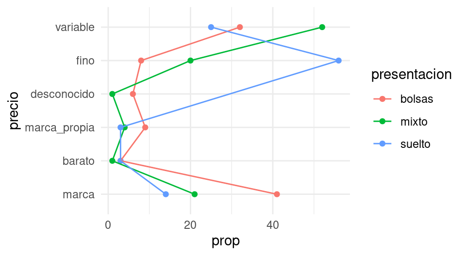

En lugar de eso, calcularemos *perfiles columna*. Esto es, comparamos
cada una de las columnas con la columna marginal (en la tabla de tipo de
estilo de té):


``` r
num_grupos <- n_distinct(te |> select(presentacion))
tabla <- te |>
  count(presentacion, precio) |>
  group_by(presentacion) |>
  mutate(prop_precio = (100 * n / sum(n))) |>
  group_by(precio) |>
  mutate(prom_prop = sum(prop_precio)/num_grupos) |>
  mutate(perfil = 100 * (prop_precio / prom_prop - 1))
tabla
```

```
## # A tibble: 17 × 6
## # Groups:   precio [6]
##    presentacion precio           n prop_precio prom_prop perfil
##    <fct>        <fct>        <int>       <dbl>     <dbl>  <dbl>
##  1 bolsas       marca           70       41.2      25.4    61.8
##  2 bolsas       barato           5        2.94      2.26   30.1
##  3 bolsas       marca_propia    16        9.41      5.48   71.7
##  4 bolsas       desconocido     11        6.47      2.51  158. 
##  5 bolsas       fino            14        8.24     28.0   -70.6
##  6 bolsas       variable        54       31.8      36.3   -12.5
##  7 mixto        marca           20       21.3      25.4   -16.4
##  8 mixto        barato           1        1.06      2.26  -52.9
##  9 mixto        marca_propia     4        4.26      5.48  -22.4
## 10 mixto        desconocido      1        1.06      2.51  -57.6
## 11 mixto        fino            19       20.2      28.0   -27.8
## 12 mixto        variable        49       52.1      36.3    43.6
## 13 suelto       marca            5       13.9      25.4   -45.4
## 14 suelto       barato           1        2.78      2.26   22.9
## 15 suelto       marca_propia     1        2.78      5.48  -49.3
## 16 suelto       fino            20       55.6      28.0    98.4
## 17 suelto       variable         9       25        36.3   -31.1
```


``` r
tabla_perfil <- tabla |>
  select(presentacion, precio, perfil, pct = prom_prop) |>
  pivot_wider(names_from = presentacion, values_from = perfil,
              values_fill = list(perfil = -100.0))
if_profile <- function(x){
  any(x < 0) & any(x > 0)
}
marcar <- marcar_tabla_fun(25, "red", "black")
tab_out <- tabla_perfil |>
  arrange(desc(bolsas)) |>
  select(-pct, everything()) |>
  mutate(across(where(is.numeric), \(x) round(x, 0))) |>
  mutate(across(where(if_profile), \(x) marcar(x))) |>
  knitr::kable(format_table_salida(), escape = FALSE, digits = 0, booktabs = T) |>
  kableExtra::kable_styling(latex_options = c("striped", "scale_down"),
                            bootstrap_options = c( "hover", "condensed"),
                            full_width = FALSE)

tab_out
```

<table class="table table-hover table-condensed" style="width: auto !important; margin-left: auto; margin-right: auto;">
 <thead>
  <tr>
   <th style="text-align:left;"> precio </th>
   <th style="text-align:left;"> bolsas </th>
   <th style="text-align:left;"> mixto </th>
   <th style="text-align:left;"> suelto </th>
   <th style="text-align:right;"> pct </th>
  </tr>
 </thead>
<tbody>
  <tr>
   <td style="text-align:left;"> desconocido </td>
   <td style="text-align:left;"> <span style="     color: black !important;">158</span> </td>
   <td style="text-align:left;"> <span style="     color: red !important;">-58</span> </td>
   <td style="text-align:left;"> <span style="     color: red !important;">-100</span> </td>
   <td style="text-align:right;"> 3 </td>
  </tr>
  <tr>
   <td style="text-align:left;"> marca_propia </td>
   <td style="text-align:left;"> <span style="     color: black !important;">72</span> </td>
   <td style="text-align:left;"> <span style="     color: lightgray !important;">-22</span> </td>
   <td style="text-align:left;"> <span style="     color: red !important;">-49</span> </td>
   <td style="text-align:right;"> 5 </td>
  </tr>
  <tr>
   <td style="text-align:left;"> marca </td>
   <td style="text-align:left;"> <span style="     color: black !important;">62</span> </td>
   <td style="text-align:left;"> <span style="     color: lightgray !important;">-16</span> </td>
   <td style="text-align:left;"> <span style="     color: red !important;">-45</span> </td>
   <td style="text-align:right;"> 25 </td>
  </tr>
  <tr>
   <td style="text-align:left;"> barato </td>
   <td style="text-align:left;"> <span style="     color: black !important;">30</span> </td>
   <td style="text-align:left;"> <span style="     color: red !important;">-53</span> </td>
   <td style="text-align:left;"> <span style="     color: lightgray !important;">23</span> </td>
   <td style="text-align:right;"> 2 </td>
  </tr>
  <tr>
   <td style="text-align:left;"> variable </td>
   <td style="text-align:left;"> <span style="     color: lightgray !important;">-12</span> </td>
   <td style="text-align:left;"> <span style="     color: black !important;">44</span> </td>
   <td style="text-align:left;"> <span style="     color: red !important;">-31</span> </td>
   <td style="text-align:right;"> 36 </td>
  </tr>
  <tr>
   <td style="text-align:left;"> fino </td>
   <td style="text-align:left;"> <span style="     color: red !important;">-71</span> </td>
   <td style="text-align:left;"> <span style="     color: red !important;">-28</span> </td>
   <td style="text-align:left;"> <span style="     color: black !important;">98</span> </td>
   <td style="text-align:right;"> 28 </td>
  </tr>
</tbody>
</table>

Leemos esta tabla como sigue: por ejemplo, los compradores de té suelto
compran té *fino* a una tasa casi el doble (98%) que el promedio.

También podemos graficar como:


``` r
tabla_graf <- tabla_perfil |>
  ungroup() |>
  mutate(precio = fct_reorder(precio, bolsas)) |>
  select(-pct) |>
  pivot_longer(cols = -precio, names_to = "presentacion", values_to = "perfil")
g_perfil <- ggplot(tabla_graf,
                   aes(x = precio, xend = precio, y = perfil, yend = 0, group = presentacion)) +
  geom_point() + geom_segment() + facet_wrap(~presentacion) +
  geom_hline(yintercept = 0 , colour = "gray")+ coord_flip()
g_perfil
```

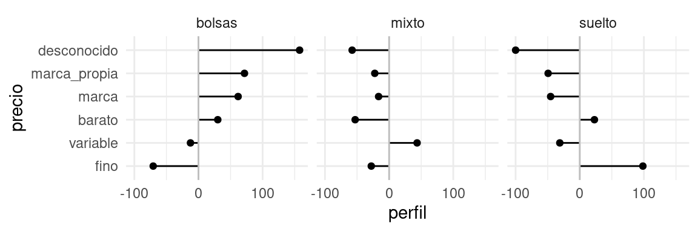

**Observación**: hay dos maneras de construir la columna promedio:
tomando los porcentajes sobre todos los datos, o promediando los
porcentajes de las columnas. Si los grupos de las columnas están
desbalanceados, estos promedios son diferentes.

-   Cuando usamos porcentajes sobre la población, perfiles columna y
    renglón dan el mismo resultado
-   Sin embargo, cuando hay un grupo considerablemente más grande que
    otros, las comparaciones se vuelven vs este grupo particular. No
    siempre queremos hacer esto.

#### Interpretación {.unnumbered}

En el último ejemplo de tomadores de té utilizamos una muestra de
personas, no toda la población de tomadores de té. Eso quiere decir que
tenemos cierta incertidumbre de cómo se generalizan o no los resultados
que obtuvimos en nuestro análisis a la población general.

Nuestra respuesta depende de cómo se extrajo la muestra que estamos
considerando. Si el mecanismo de extracción incluye algún proceso
probabilístico, entonces es posible en principio entender qué tan bien
generalizan los resultados de nuestro análisis a la población general, y
entender esto depende de entender qué tanta variación hay de muestra a
muestra, de todas las posibles muestras que pudimos haber extraido.

En las siguientes secciones discutiremos estos aspectos, en los cuales
pasamos del trabajo de "detective" al trabajo de "juez" en nuestro
trabajo analítico.

## Suavizamiento loess {.unnumbered}

Las gráficas de dispersión son la herramienta básica para describir la
relación entre dos variables cuantitativas, y como vimos en ejemplo
anteriores, muchas veces podemos apreciar mejor la relación entre ellas
si agregamos una curva `loess`.

Veamos un ejemplo, los siguientes datos muestran los premios ofrecidos y las ventas totales
de una lotería a lo largo de 53 sorteos (las unidades son cantidades de
dinero indexadas). Graficamos en escalas logarítmicas y agregamos una
curva `loess`.


``` r
# cargamos los datos
load(here::here("data", "ventas_sorteo.Rdata"))

ggplot(ventas.sorteo, aes(x = premio, y = ventas.tot.1)) +
  geom_point() +
  geom_smooth(method = "loess", span = 0.6, method.args = list(degree = 1), 
              se = FALSE) +
  scale_x_log10(breaks = c(20000, 40000, 80000)) +
  scale_y_log10(breaks = c(10000, 15000, 22000, 33000))
```

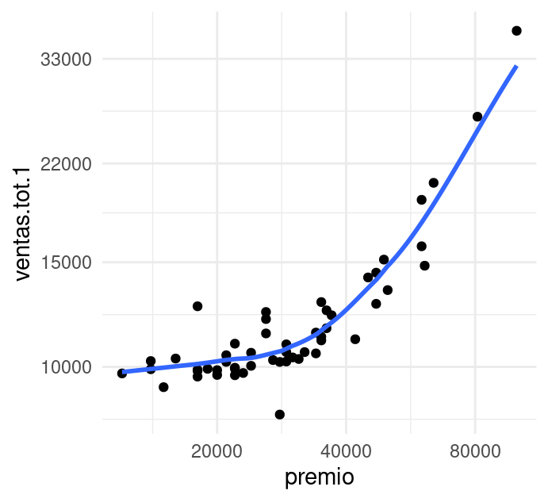


El patrón no era difícil de ver en los datos originales, sin embargo, la
curva lo hace más claro, el logaritmo de las ventas tiene una relación
no lineal con el logaritmo del premio: para premios no muy grandes no
parece haber gran diferencia, pero cuando los premios empiezan a crecer
por encima de 20,000, las ventas crecen más rápidamente que para premios
menores. Este efecto se conoce como *bola de nieve*, y es frecuente en
este tipo de loterías.

Antes de adentrarnos a los modelos `loess` comenzamos explicando cómo se
ajustan familias paramétricas de curvas a conjuntos de datos dados. El
modelo de *regresion lineal* ajusta una recta a un conjunto de datos.
Por ejemplo, consideremos la familia $$f_{a,b}(x) = a x + b,$$ para un
conjunto de datos bivariados $\{ (x_1, y_1), \ldots, (x_N, y_N)\}$.
Buscamos encontrar $a$ y $b$ tales que $f_{a,b}$ de un ajuste *óptimo* a
los datos. Para esto, se minimiza la suma de errores cuadráticos

$$\frac1N \sum_{n = 1}^N ( y_n - a x_n - b)^2.$$

En este caso, las constantes $a$ y $b$ se pueden encontrar diferenciando
la función de mínimos cuadrados. Nótese que podemos repetir el argumento
con otras familias de funciones (por ejemplo cuadráticas).


``` r
ggplot(ventas.sorteo, aes(x = premio, y = ventas.tot.1)) +
  geom_point() +
  geom_smooth(method = "lm", se = FALSE) +
  scale_x_log10(breaks = c(20000, 40000, 80000)) +
  scale_y_log10(breaks = c(10000, 15000, 22000, 33000))
```

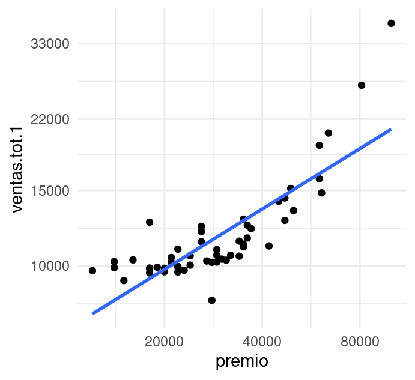

Si observamos la gráfica notamos que este modelo lineal (en los
logaritmos) no resumen adecuadamente estos datos. Podríamos experimentar
con otras familias (por ejemplo, una cuadrática o cúbica, potencias,
exponenciales, etc.); sin embargo, en la etapa exploratoria es mejor
tomar una ruta de ajuste más flexible y robusta. Regresión local nos
provee de un método con estas características:

**Curvas loess (regresión local):** Una manera de mejorar la
flexibilidad de los modelos lineales es considerar rectas de manera
local. Es decir, en cada $x$ posible consideramos cuál es la recta
que mejor ajusta a los datos, considerando solamente valores de $x_n$
que están cercanos a $x$.

La siguiente gráfica muestra qué recta se ajusta alrededor de cada
punto, y cómo queda el suavizador completo, con distintos valores de
suavizamiento. El tono de los puntos indican en cada paso que ventana de datos es 
considerada:


**Escogiendo de los parámetros.** El parámetro de suavizamiento se
encuentra por ensayo y error. La idea general es que debemos encontrar
una curva que explique patrones importantes en los datos (que *ajuste*
los datos) pero que no muestre variaciones a escalas más chicas
difíciles de explicar (que pueden ser el resultado de influencias de
otras variables, variación muestral, ruido o errores de redondeo, por
ejemplo). En el proceso de prueba y error iteramos el ajuste y en cada
paso hacemos análisis de residuales, con el fin de seleccionar un
suavizamiento adecuado.

En lugar de usar ajustes locales lineales, podemos usar ajustes locales
cuadráticos que nos permiten capturar formas locales cuadráticas sin
tener que suavizar demasiado poco:


### Opcional: cálculo del suavizador {.unnumbered}

La idea es producir ajustes locales de rectas o funciones lineales o
cuadráticas. Consideremos especificar dos parámetros:

-   Parámetro de suavizamiento $\alpha$: toma valores en $(0,1)$, cuando $\alpha$ es más grande,
    la curva ajustada es más suave.

-   Grado de los polinomios locales que ajustamos $\lambda$:
    generalmente se toma $\lambda=1,2$.

Entonces, supongamos que los datos están dados por
$(x_1,y_1), \ldots, (x_N, y_N)$, y sean $\alpha$ un parámetro de
suavizamiento fijo, y $\lambda=1$. Denotamos como $\hat{g}(x)$ la curva
`loess` ajustada, y como $w_n(x)$ a una función de peso (que depende de
x) para la observación $(x_n, y_n)$.

Para poder calcular $w_n(x)$ debemos comenzar calculando
$q=\lfloor{N\alpha}\rfloor$ que suponemos mayor que uno, esta $q$ es el número 
de puntos que se utilizan en cada ajuste local. Ahora definimos
la función *tricubo*: \begin{align}
T(u)=\begin{cases}
(1-|u|^3)^3, & \text{para $|u| < 1$}.\\
0, & \text{en otro caso}.
\end{cases}
\end{align}

entonces, para el punto $x$ definimos el peso correspondiente al dato
$(x_n,y_n)$, denotado por $w_n(x)$ como:

$$w_n(x)=T\bigg(\frac{|x-x_n|}{d_q(x)}\bigg)$$

donde $d_q(x)$ es el valor de la $q$-ésima distancia más chica (la más
grande entre las $q$ más chicas) entre los valores $|x-x_j|$,
$j=1,\ldots,N$. De esta forma, las observaciones $x_n$ reciben más peso
cuanto más cerca estén de $x$.

En palabras, de $x_1,...,x_N$ tomamos los $q$ datos más cercanos a $x$,
que denotamos $x_{i_1}(x) \leq x_{i_2}(x) \leq \cdots \leq x_{i_q}(x)$.
Los re-escalamos a $[0,1]$ haciendo corresponder $x$ a $0$ y el punto
más alejado de $x$ (que es $x_{i_q}$) a 1.

Aplicamos el tricubo (gráfica de abajo), para encontrar los pesos de
cada punto. Los puntos que están a una distancia mayor a $d_q(x)$
reciben un peso de cero, y los más cercanos un peso que depende de que
tan cercanos están a $x$. Nótese que $x$ es el punto ancla en dónde
estamos ajustando la regresión local.


``` r
tricubo <- function(x) {
  ifelse(abs(x) < 1, (1 - abs(x) ^ 3) ^ 3, 0)
}
curve(tricubo, from = -1.5, to = 1.5)
```


Finalmente, para cada valor de $x_k$ que está en el conjunto de datos
$\{x_1,...,x_n\}$, ajustamos una recta de mínimos cuadrados ponderados
por los pesos $w_n(x)$, es decir, minimizamos (en el caso lineal):

$$\sum_{i=1}^nw_n(x_k)(y_i-ax_n-b)^2.$$

**Observaciones:**

1.  Cualquier función (continua y quizás diferenciable) con la forma de
    flan del tricubo que se desvanece fuera de $(-1,1),$ es creciente en
    $(-1,0)$ y decreciente en $(0, 1)$ es un buen candidato para usarse
    en lugar del tricubo. La razón por la que escogemos precisamente
    esta forma algebráica no tiene que ver con el análisis exploratorio,
    sino con las ventajas teóricas adicionales que tiene en la
    inferencia.

2.  El caso $\lambda=2$ es similar. La única diferencia es en el paso de
    ajuste, donde usamos funciones cuadráticas, y obtendríamos entonces
    tres familias de parámetros $a(x_k), b_1(x_k), b_2(x_k),$ para cada
    $k \in \{1, \ldots, N\}$.

## Caso de estudio: nacimientos en México {.unnumbered}

Podemos usar el suavizamiento `loess` para entender y describir el
comportamiento de series de tiempo, en las cuáles intentamos entender la
dependencia de una serie de mediciones indexadas por el tiempo.
Típicamente es necesario utilizar distintas componentes para describir
exitosamente una serie de tiempo, y para esto usamos distintos tipos de
suavizamientos. Veremos que distintas componentes varían en distintas
escalas de tiempo (unas muy lentas, como la tendencia, otras más
rapidamente, como variación quincenal, etc.).

Este caso de estudio esta basado en un análisis propuesto por [A.
Vehtari y A.
Gelman](https://statmodeling.stat.columbia.edu/2016/05/18/birthday-analysis-friday-the-13th-update/),
junto con un análisis de serie de tiempo de @cleveland93.

En nuestro caso, usaremos los datos de nacimientos registrados por día
en México desde 1999. Los usaremos para contestar las preguntas: ¿cuáles
son los cumpleaños más frecuentes? y ¿en qué mes del año hay más
nacimientos?

Podríamos utilizar una gráfica popular (ver por ejemplo [esta
visualización](http://thedailyviz.com/2016/09/17/how-common-is-your-birthday-dailyviz/))
como:

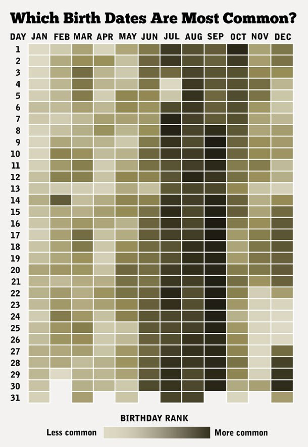

Sin embargo, ¿cómo criticarías este análisis desde el punto de vista de
los tres primeros principios del diseño analítico? ¿Las comparaciones
son útiles? ¿Hay aspectos multivariados? ¿Qué tan bien explica o sugiere
estructura, mecanismos o causalidad?

### Datos de natalidad para México {.unnumbered}


``` r
library(lubridate)
library(ggthemes)
theme_set(theme_minimal(base_size = 14))
natalidad <- read_rds("./data/nacimientos/natalidad.rds") |>
  mutate(dia_semana = weekdays(fecha)) |>
  mutate(dia_año = yday(fecha)) |>
  mutate(año = year(fecha)) |>
  mutate(mes = month(fecha)) |>
  ungroup() |>
  mutate(dia_semana = recode(dia_semana, Monday = "Lunes", Tuesday = "Martes", 
                             Wednesday = "Miércoles", Thursday = "Jueves", 
                             Friday = "Viernes", Saturday = "Sábado", 
                             Sunday = "Domingo")) |>
  #necesario pues el LOCALE puede cambiar
  mutate(dia_semana = recode(dia_semana, lunes = "Lunes", martes = "Martes", 
                             miércoles = "Miércoles", jueves = "Jueves", 
                             viernes = "Viernes", sábado = "Sábado", 
                             domingo = "Domingo")) |>
  mutate(dia_semana = fct_relevel(dia_semana, c("Lunes", "Martes", "Miércoles",
                                                "Jueves", "Viernes", "Sábado",
                                                "Domingo")))
```

Consideremos los *datos agregados* del número de nacimientos
(registrados) por día desde 1999 hasta 2016. Un primer intento podría
ser hacer una gráfica de la serie de tiempo. Sin embargo, vemos que no
es muy útil:

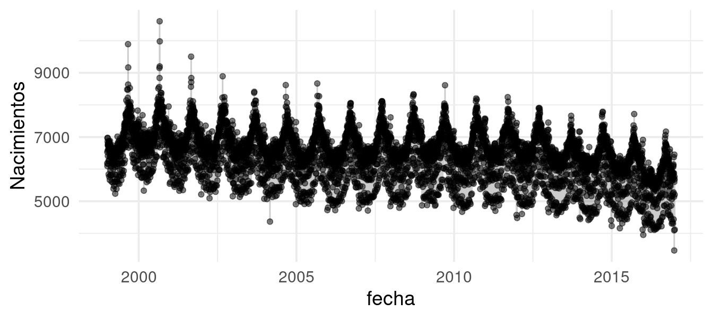

Hay varias características que notamos. Primero, parece haber una
tendencia ligeramente decreciente del número de nacimientos a lo largo
de los años. Segundo, la gráfica sugiere un patrón anual. Y por último,
encontramos que hay dispersión producida por los días de la semana.

Sólo estas características hacen que la comparación entre días sea
difícil de realizar. Supongamos que comparamos el número de nacimientos
de dos miércoles dados. Esa comparación será diferente dependiendo: del
año donde ocurrieron, el mes donde ocurrieron, si semana santa ocurrió
en algunos de los miércoles, y así sucesivamente.

Como en nuestros ejemplos anteriores, la idea del siguiente análisis es
aislar las componentes que observamos en la serie de tiempo: extraemos
componentes ajustadas, y luego examinamos los residuales.

En este caso particular, asumiremos una **descomposición aditiva** de la
serie de tiempo [@cleveland93].

<div class="mathblock">
<p>En el estudio de <strong>series de tiempo</strong> una estructura
común es considerar el efecto de diversos factores como tendencia,
estacionalidad, ciclicidad e irregularidades de manera aditiva. Esto es,
consideramos la descomposición <span
class="math display">\[\begin{align}
y(t) = f_{t}(t) + f_{e}(t) + f_{c}(t) + \varepsilon.
\end{align}\]</span> Una estrategia de ajuste, como veremos más
adelante, es proceder de manera <em>modular.</em> Es decir, se ajustan
los componentes de manera secuencial considerando los residuales de los
anteriores.</p>
</div>

### Tendencia {.unnumbered}

Comenzamos por extraer la tendencia, haciendo promedios `loess`
[@cleveland1979robust] con vecindades relativamente grandes. Quizá
preferiríamos suavizar menos para capturar más variación lenta, pero si
hacemos esto en este punto empezamos a absorber parte de la componente
anual:


``` r
mod_1 <- loess(n ~ as.numeric(fecha), data = natalidad, span = 0.2, degree = 1)
datos_dia <- natalidad |> 
  mutate(ajuste_1 = fitted(mod_1)) |>
  mutate(res_1 = n - ajuste_1)
```

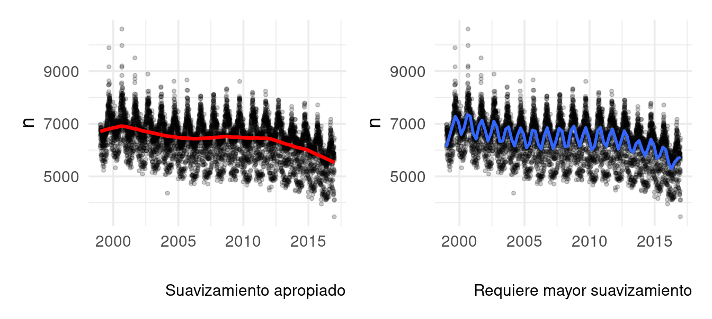

Notemos que a principios de 2000 el suavizador está en niveles de
alrededor de 7000 nacimientos diarios, hacia 2015 ese número es más
cercano a unos 6000.

### Componente anual {.unnumbered}

Al obtener la tendencia podemos aislar el efecto a largo plazo y
proceder a realizar mejores comparaciones (por ejemplo, comparar un día
de 2000 y de 2015 tendria más sentido). Ahora, ajustamos **los
residuales del suavizado anterior**, pero con menos suavizamiento. Así
evitamos capturar tendencia:


``` r
mod_anual <- loess(res_1 ~ as.numeric(fecha), data = datos_dia, degree = 2, span = 0.005)
datos_dia <- datos_dia |> mutate(ajuste_2 = fitted(mod_anual)) |>
  mutate(res_2 = res_1 - ajuste_2)
```


### Día de la semana {.unnumbered}

Hasta ahora, hemos aislado los efectos por plazos largos de tiempo
(tendencia) y hemos incorporado las variaciones estacionales (componente
anual) de nuestra serie de tiempo. Ahora, veremos cómo capturar el
efecto por día de la semana. En este caso, podemos hacer suavizamiento
`loess` para cada serie de manera independiente


``` r
datos_dia <- datos_dia |>
  group_by(dia_semana) |>
  nest() |>
  mutate(ajuste_mod =
           map(data, ~ loess(res_2 ~ as.numeric(fecha), data = .x, span = 0.1, 
                             degree = 1))) |>
  mutate(ajuste_3 =  map(ajuste_mod, fitted)) |>
  select(-ajuste_mod) |>
  unnest(cols = c(data, ajuste_3)) |>
  mutate(res_3 = res_2 - ajuste_3) |>
  ungroup()
```

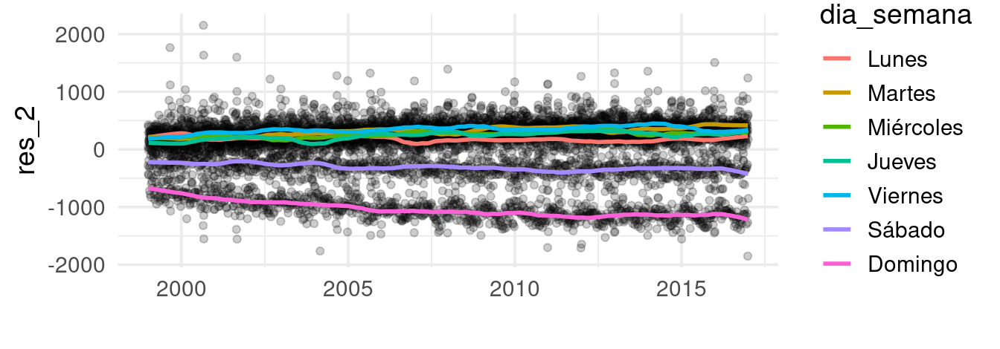

### Residuales {.unnumbered}

Por último, examinamos los residuales finales quitando los efectos
ajustados:


```
## `geom_smooth()` using formula = 'y ~ x'
```


**Observación**: nótese que la distribución de estos residuales presenta
irregularidades interesantes. La distribución es de *colas largas*, y no
se debe a unos cuantos datos atípicos. Esto generalmente es indicación
que hay factores importantes que hay que examinar mas a detalle en los
residuales:


### Reestimación {.unnumbered}

Cuando hacemos este proceso secuencial de llevar el ajuste a los
residual, a veces conviene iterarlo. La razón es que en una segunda o
tercera pasada podemos hacer mejores estimaciones de cada componente, y
es posible suavizar menos sin capturar *componentes de más alta
frecuencia.*

Así que podemos regresar a la serie original para hacer mejores
estimaciones, más suavizadas:


``` r
# Quitamos componente anual y efecto de día de la semana
datos_dia <- datos_dia |> mutate(n_1 = n - ajuste_2 - ajuste_3)
# Reajustamos
mod_1 <- loess(n_1 ~ as.numeric(fecha), data = datos_dia, span = 0.02, degree = 2,
               family = "symmetric")
```

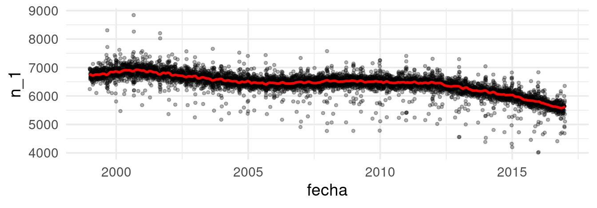


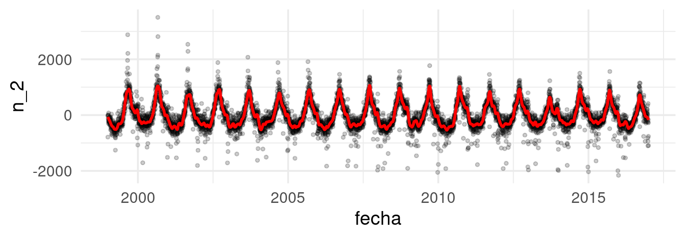

Y ahora repetimos con la componente de día de la semana:

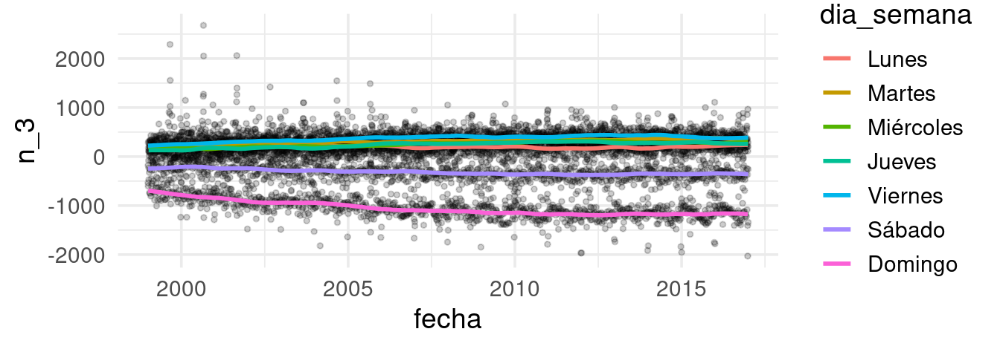

### Análisis de componentes {.unnumbered}

Ahora comparamos las componentes estimadas y los residuales en una misma
gráfica. Por definición, la suma de todas estas componentes da los datos
originales.

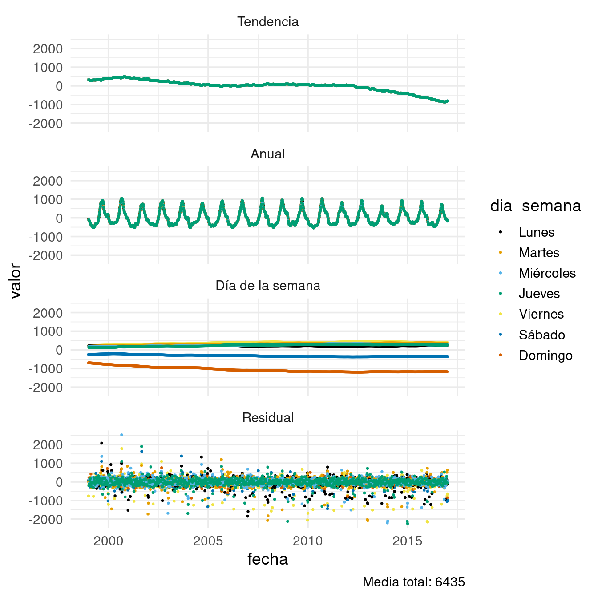

Este último paso nos permite diversas comparaciones que explican la
variación que vimos en los datos. Una gran parte de los residuales está
entre $\pm 250$ nacimientos por día. Sin embargo, vemos que las colas
tienen una dispersión mucho mayor:


``` r
quantile(datos_dia$res_6, c(00, .01,0.05, 0.10, 0.90, 0.95, 0.99, 1)) |> round()
```

```
##    0%    1%    5%   10%   90%   95%   99%  100% 
## -2238 -1134  -315  -202   188   268   516  2521
```

¿A qué se deben estas colas tan largas?


#### Viernes 13? {.unnumbered}

Podemos empezar con una curosidad. Los días Viernes o Martes 13, ¿nacen
menos niños?

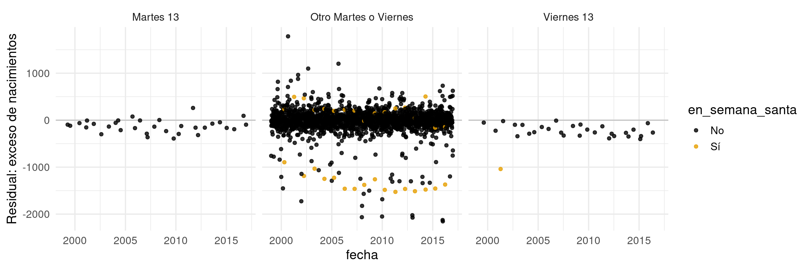

Nótese que fue útil agregar el indicador de Semana santa por el Viernes
13 de Semana Santa que se ve como un atípico en el panel de los viernes
13.

### Residuales: antes y después de 2006 {.unnumbered}

Veamos primero una agregación sobre los años de los residuales. Lo
primero es observar un cambio que sucedió repentinamente en 2006:


La razón es un cambio en la ley acerca de cuándo pueden entrar los niños
a la primaria. Antes era por edad y había poco margen. Ese exceso de
nacimientos son reportes falsos para que los niños no tuvieran que
esperar un año completo por haber nacido unos cuantos días después de la
fecha límite.

Otras características que debemos investigar:

-   Efectos de Año Nuevo, Navidad, Septiembre 16 y otros días feriados
    como Febrero 14.
-   Semana santa: como la fecha cambia, vemos que los residuales
    negativos tienden a ocurrir dispersos alrededor del día 100 del año.

### Otros días especiales: más de residuales {.unnumbered}

Ahora promediamos residuales (es posible agregar barras para indicar
dispersión a lo largo de los años) para cada día del año. Podemos
identificar ahora los residuales más grandes: se deben, por ejemplo, a
días feriados, con consecuencias adicionales que tienen en días ajuntos
(excesos de nacimientos):

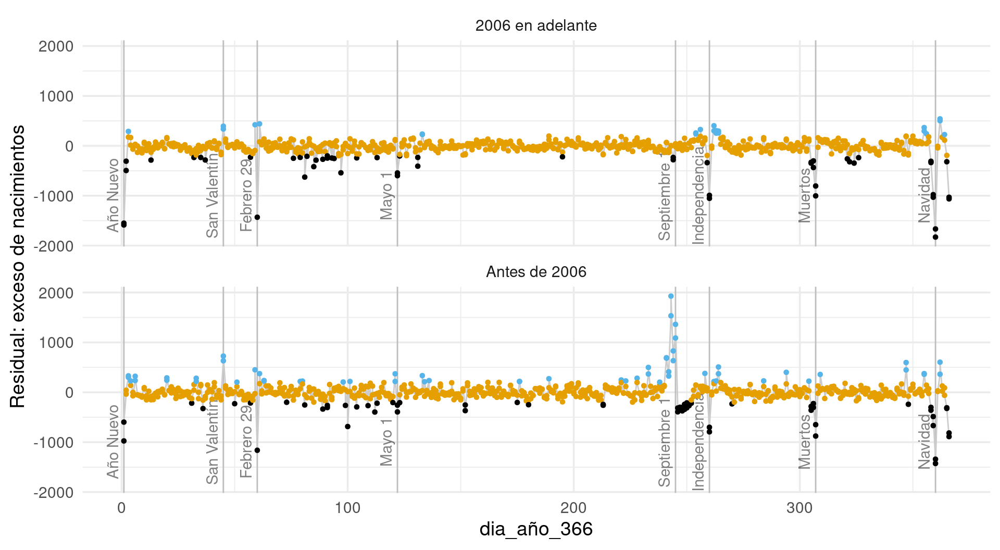

### Semana santa {.unnumbered}

Para Semana Santa tenemos que hacer unos cálculos. Si alineamos los
datos por días antes de Domingo de Pascua, obtenemos un patrón de caída
fuerte de nacimientos el Viernes de Semana Santa, y la característica
forma de "valle con hombros" en días anteriores y posteriores estos
Viernes. ¿Por qué ocurre este patrón?

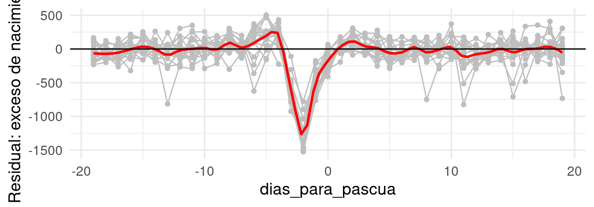

Nótese un defecto de nuestro modelo: el patrón de "hombros" alrededor
del Viernes Santo no es suficientemente fuerte para equilibrar los
nacimientos faltantes. ¿Cómo podríamos mejorar nuestra descomposición?
