# Estimación y distribución de muestreo 


En esta sección discutiremos cuál el objetivo general del proceso de estimación,
y cómo entender y manejar la variabilidad que se produce cuando aleatorizamos
la selección de las muestras que utilizamos para hacer análisis.

A diferencia de las pruebas de permutación, donde evaluábamos como cambiaría una 
estadísitica si un tratamiento o grupo se hubiera asignado de forma distinta, en la
siguiente sección nos preguntamos como varía una estadística entre muestras. Por ejemplo, 
pasaremos de preguntar si una vacuna reduce el riesgo de una enfermedad a evaluar 
en que magnitud se reduce el riesgo de contraer la enfermedad.

<!-- 
Unlike randomization tests (which modeled how the statistic would change if the treatment had been allocated differently), the bootstrap will model how a statistic varies from one sample to another taken from the population.  Mine https://openintro-ims.netlify.app/foundations-bootstrapping.html-->

## Ejemplo: precios de casas {-}

Supongamos que queremos conocer el valor total de las casas
que se vendieron recientemente en una zona
particular. Supondremos que tenemos un listado de las casas que se han
vendido recientemente, pero en ese listado no se encuentra el precio de venta.
Decidimos entonces tomar una muestra aleatoria de 100 de esas casas. Para esas
casas hacemos trabajo de campo para averiguar el precio de venta.


``` r
marco_casas <- read_csv("data/casas.csv")
set.seed(841)
muestra_casas <- sample_n(marco_casas, 100) |>
  select(id, nombre_zona, area_habitable_sup_m2, precio_miles)
sprintf("Hay %0.0f casas en total, tomamos muestra de %0.0f",
        nrow(marco_casas), nrow(muestra_casas))
```

```
## [1] "Hay 1144 casas en total, tomamos muestra de 100"
```

``` r
head(muestra_casas)
```

```
## # A tibble: 6 × 4
##      id nombre_zona area_habitable_sup_m2 precio_miles
##   <dbl> <chr>                       <dbl>        <dbl>
## 1   287 NAmes                       161.          159 
## 2   755 NAmes                        95.3         156 
## 3  1190 Gilbert                     168.          189 
## 4    36 NridgHt                     228.          309 
## 5    32 Sawyer                      114.          149.
## 6   538 NAmes                        80.3         111.
```

Como tomamos una muestra aleatoria, intentamos estimar el valor
total de las casas que se vendieron expandiendo el total muestral, es decir
nuestro estimador $\hat{t} = t(X_1,\ldots X_{100})$ del total
poblacional $t$ es

$$\hat{t} = \frac{N}{n} \sum_{i=1}^{100} X_i = N\bar{x}$$

Esta función implementa el estimador:


``` r
n <- nrow(muestra_casas) # tamaño muestra
N <- nrow(marco_casas) # tamaño población
estimar_total <- function(muestra_casas, N){
  total_muestral <- sum(muestra_casas$precio_miles)
  n <- nrow(muestra_casas)
  # cada unidad de la muestra representa a N/n
  f_exp <- N / n
  # estimador total es la expansión del total muestral
  estimador_total <- f_exp * total_muestral
  res <- tibble(total_muestra = total_muestral,
         factor_exp = f_exp,
         est_total_millones = estimador_total / 1000)
  res
}
estimar_total(muestra_casas, N) |>
  mutate(across(where(is.numeric), \(x) round(x, 2)))
```

```
## # A tibble: 1 × 3
##   total_muestra factor_exp est_total_millones
##           <dbl>      <dbl>              <dbl>
## 1        18444.       11.4                211
```

Sin embargo, si hubiéramos obtenido otra muestra, hubiéramos obtenido otra
estimación diferente. Por ejemplo:


``` r
estimar_total(sample_n(marco_casas, 100), N) |>
  mutate(across(where(is.numeric), \(x) round(x, 2)))
```

```
## # A tibble: 1 × 3
##   total_muestra factor_exp est_total_millones
##           <dbl>      <dbl>              <dbl>
## 1        17916.       11.4               205.
```

El valor poblacional que buscamos estimar (nótese que en la práctica este no lo conocemos)
es:


``` r
# multiplicar por 1000 para que sea en millones de dólares
total_pob <- sum(marco_casas |> pull(precio_miles)) / 1000
total_pob
```

```
## [1] 209.7633
```

Así que:

- Para algunas muestras esta estadística puede estar muy cercana al valor poblacional,
pero para otras puede estar más lejana.
- Para entender qué tan buena es una estimación
particular, entonces, tenemos que entender *cuánta variabilidad hay de muestra a muestra*
debida a la aleatorización. Esto depende del diseño de la muestra y
de la población de precios de casas (que no conocemos).

## Distribución de muestreo {-}

La distribución de muestreo de una estadística enumera los posibles resultados
que puede tomar esa estadística sobre todas las muestras posibles. Este es el concepto
básico para poder entender qué tan bien o mal estima un parámetro poblacional dado.

En nuestro ejemplo anterior de precio de casas, no podemos calcular todas las posibles
estimaciones bajo todas las posibles muestras, pero podemos aproximar
repitiendo una gran cantidad de veces el proceso de muestreo, como hicimos
al aproximar la distribución de permutaciones de estadísticas de prueba de las
secciones anteriores.

Empezamos repitiendo 10 veces y examinamos cómo varía nuestra estadística:


``` r
replicar_muestreo <- function(marco_casas, m = 500, n){
  # n es el tamaño de muestra que se saca de marco_casas
  # m es el número de veces que repetimos el muestro de tamaño n
  resultados <- map_df(1:m,
      function(id) {
        sample_n(marco_casas, n) |>
          estimar_total(N) 
      }, .id = "id_muestra")
}
replicar_muestreo(marco_casas, m = 10, n = 100) |>
  mutate(across(where(is.numeric), round, 1)) |>
  formatear_tabla()
```

<table class="table table-striped table-hover table-condensed table-responsive" style="width: auto !important; margin-left: auto; margin-right: auto;">
 <thead>
  <tr>
   <th style="text-align:left;position: sticky; top:0; background-color: #FFFFFF;"> id_muestra </th>
   <th style="text-align:right;position: sticky; top:0; background-color: #FFFFFF;"> total_muestra </th>
   <th style="text-align:right;position: sticky; top:0; background-color: #FFFFFF;"> factor_exp </th>
   <th style="text-align:right;position: sticky; top:0; background-color: #FFFFFF;"> est_total_millones </th>
  </tr>
 </thead>
<tbody>
  <tr>
   <td style="text-align:left;"> 1 </td>
   <td style="text-align:right;"> 17594.8 </td>
   <td style="text-align:right;"> 11.4 </td>
   <td style="text-align:right;"> 201.3 </td>
  </tr>
  <tr>
   <td style="text-align:left;"> 2 </td>
   <td style="text-align:right;"> 17423.9 </td>
   <td style="text-align:right;"> 11.4 </td>
   <td style="text-align:right;"> 199.3 </td>
  </tr>
  <tr>
   <td style="text-align:left;"> 3 </td>
   <td style="text-align:right;"> 18444.3 </td>
   <td style="text-align:right;"> 11.4 </td>
   <td style="text-align:right;"> 211.0 </td>
  </tr>
  <tr>
   <td style="text-align:left;"> 4 </td>
   <td style="text-align:right;"> 17696.6 </td>
   <td style="text-align:right;"> 11.4 </td>
   <td style="text-align:right;"> 202.4 </td>
  </tr>
  <tr>
   <td style="text-align:left;"> 5 </td>
   <td style="text-align:right;"> 17275.8 </td>
   <td style="text-align:right;"> 11.4 </td>
   <td style="text-align:right;"> 197.6 </td>
  </tr>
  <tr>
   <td style="text-align:left;"> 6 </td>
   <td style="text-align:right;"> 17867.6 </td>
   <td style="text-align:right;"> 11.4 </td>
   <td style="text-align:right;"> 204.4 </td>
  </tr>
  <tr>
   <td style="text-align:left;"> 7 </td>
   <td style="text-align:right;"> 18450.8 </td>
   <td style="text-align:right;"> 11.4 </td>
   <td style="text-align:right;"> 211.1 </td>
  </tr>
  <tr>
   <td style="text-align:left;"> 8 </td>
   <td style="text-align:right;"> 18187.2 </td>
   <td style="text-align:right;"> 11.4 </td>
   <td style="text-align:right;"> 208.1 </td>
  </tr>
  <tr>
   <td style="text-align:left;"> 9 </td>
   <td style="text-align:right;"> 18604.2 </td>
   <td style="text-align:right;"> 11.4 </td>
   <td style="text-align:right;"> 212.8 </td>
  </tr>
  <tr>
   <td style="text-align:left;"> 10 </td>
   <td style="text-align:right;"> 19144.4 </td>
   <td style="text-align:right;"> 11.4 </td>
   <td style="text-align:right;"> 219.0 </td>
  </tr>
</tbody>
</table>

Como vemos, hay variación considerable en nuestro estimador del total, pero
la estimación que haríamos con cualquiera de estas muestras no es muy mala. Ahora
examinamos un número más grande de simulaciones:


``` r
replicaciones_1 <- replicar_muestreo(marco_casas, m = 1500, n = 100)
```

Y el siguiente histograma nos dice qué podemos esperar de la variación de
nuestras estimaciones, y donde es más probable que una estimación particular caiga:


``` r
graf_1 <- ggplot(replicaciones_1, aes(x = est_total_millones)) +
  geom_histogram() +
  geom_vline(xintercept = total_pob, colour = "red") +
  xlab("Millones de dólares") +
  scale_x_continuous(breaks = seq(180, 240, 10), limits = c(180, 240))
graf_1
```

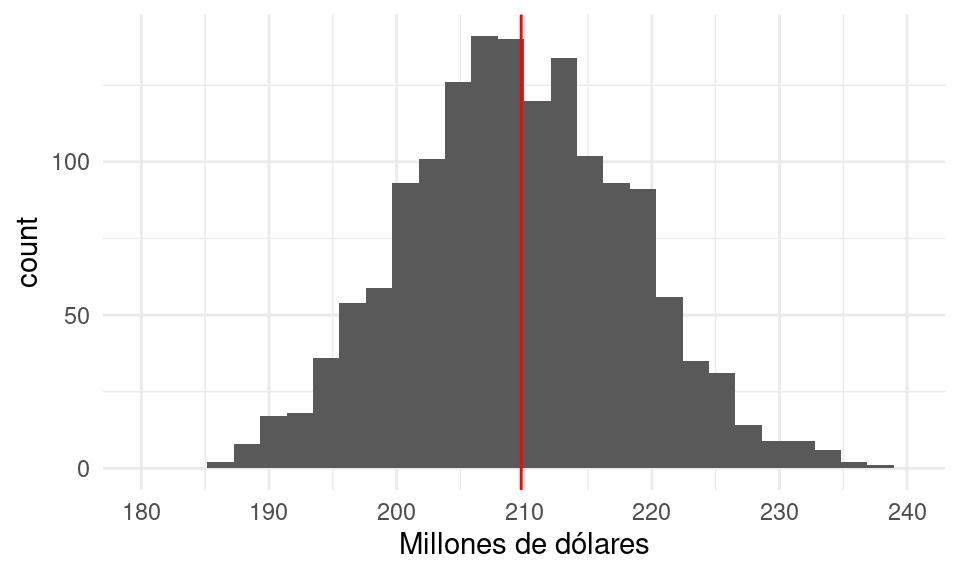

Con muy alta probabilidad  el error no será de más de unos 30 millones de dólares
(o no más de 20% del valor poblacional).


<div class="mathblock">
<p><strong>Definición</strong> Sea <span class="math inline">\(X_1, X_2,
\ldots X_n\)</span> una muestra, y <span class="math inline">\(T =
t(X_1, X_2, \ldots, X_n)\)</span> una estadística.</p>
<p>La <strong>distribución de muestreo</strong> de <span
class="math inline">\(T\)</span> es la función de distribución de <span
class="math inline">\(T\)</span>. Esta distribución es sobre todas las
posibles muestras que se pueden obtener.</p>
<p>Cuando usamos <span class="math inline">\(T\)</span> para estimar
algún parámetro poblacional <span class="math inline">\(\theta\)</span>,
decimos informalmente que el estimador es <strong>preciso</strong> si su
distribución de muestreo está muy concentrada alrededor del valor <span
class="math inline">\(\theta\)</span> que queremos estimar.</p>
</div>

Si la distribución de muestreo está concentrada en un conjunto muy grande
o muy disperso, quiere decir que con alta probabilidad cuando obtengamos
nuestra muestra y calculemos nuestra estimación, el resultado estará lejano
del valor poblacional que nos interesa estimar.

Veamos qué pasa cuando hacemos la muestra más grande en nuestro ejemplo:


``` r
replicaciones_2 <- replicar_muestreo(marco_casas, m = 1500, n = 250)
```

Graficamos las dos distribuciones de muestreo juntas, y vemos cómo
con mayor muestra obtenemos un estimador más preciso, y sin considerar el costo,
preferimos el estimador **mejor concentrado alrededor del valor que buscamos estimar**.


``` r
library(patchwork)
graf_2 <- ggplot(replicaciones_2, aes(x = est_total_millones)) +
  geom_histogram() +
  geom_vline(xintercept = total_pob, colour = "red") +
  xlab("Millones de dólares") +
  scale_x_continuous(breaks = seq(180, 240, 10), limits = c(180, 240))
graf_1 + graf_2
```

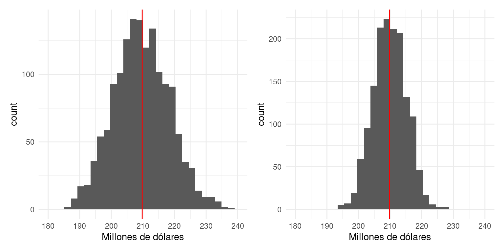

<div class="comentario">
<p><strong>Observación</strong>: a veces este concepto se confunde la
distribución poblacional de las <span
class="math inline">\(X_i\)</span>. Esto es muy diferente.</p>
</div>

Por ejemplo, en nuestro caso, el histograma de la distribución de valores poblacionales es


``` r
ggplot(marco_casas, aes(x = precio_miles)) + geom_histogram()
```

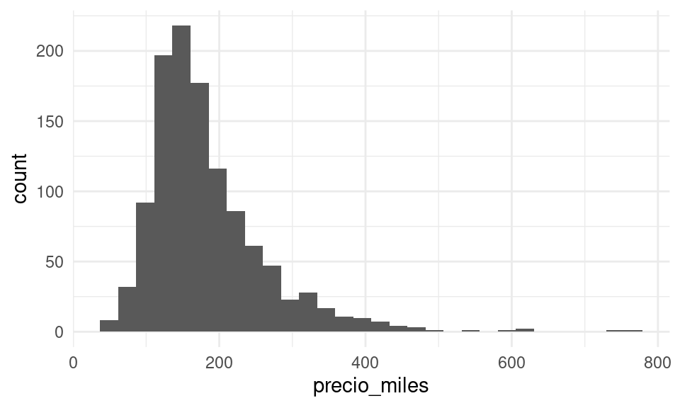
que en general no tiene ver mucho en escala o forma con la distribución de muestreo
de nuestro estimador del total.

## Más ejemplos {-}

Podemos también considerar muestrear de poblaciones sintéticas o modelos
probabilísticos que usamos para modelar poblaciones reales.

Por ejemplo, supongamos que tomamos una muestra de tamaño 15 de la distribución
uniforme en $[0,1]$. Es decir, cada $X_i$ es un valor uniformemente distribuido
en $[0,1]$, y las $X_i$ se extraen independientemente unas de otras. Consideramos
dos estadísticas de interés:

1. La media muestral $T_1(X) = \frac{1}{15}\sum_{i = 1}^{15} X_i$
2. El cuantil 0.75 de la muestra $T_2(X) = q_{0.75}(X)$

\BeginKnitrBlock{ejercicio}<div class="ejercicio">¿Cómo crees que se vean las distribuciones muestrales de estas estadísticas?
  ¿Alrededor de qué valores crees que concentren? ¿Crees que tendrán mucha o poca
dispersión? ¿Qué forma crees que tengan?</div>\EndKnitrBlock{ejercicio}

Para el primer caso hacemos:


``` r
# simular
replicar_muestreo_unif <- function(est = mean, m, n = 15){
  valores_est <- map_dbl(1:m, ~ est(runif(n)))
  tibble(id_muestra = 1:m, estimacion = valores_est)
}
sim_estimador_1 <- replicar_muestreo_unif(mean, 4000, 15)
# graficar aprox de distribución de muestreo
ggplot(sim_estimador_1, aes(x = estimacion)) +
  geom_histogram(bins = 40) +
  xlim(c(0, 1))
```

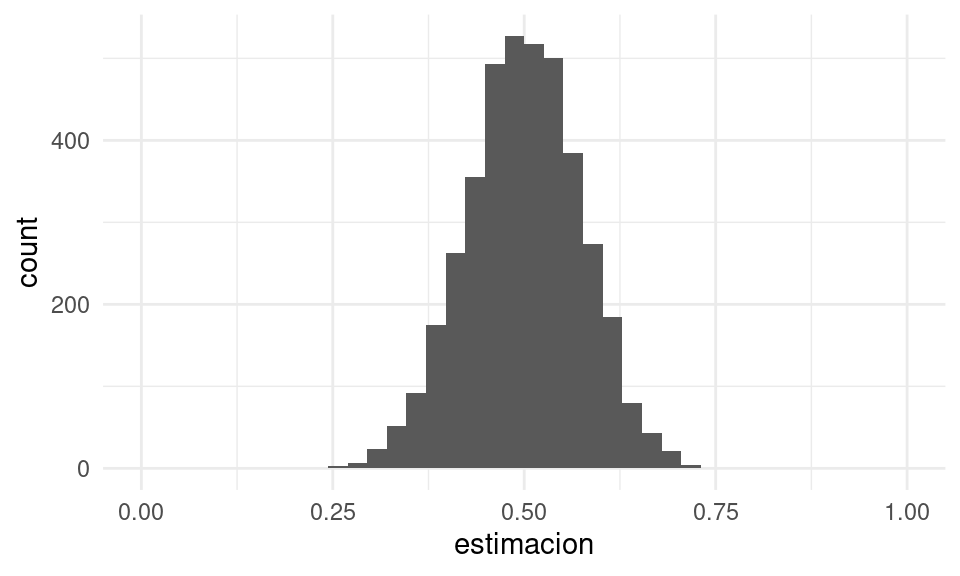


``` r
# simular para el máximo
cuantil_75 <- function(x) quantile(x, 0.75)
sim_estimador_2 <- replicar_muestreo_unif(cuantil_75, 4000, 15)
# graficar distribución de muestreo
ggplot(sim_estimador_2, aes(x = estimacion)) +
  geom_histogram(breaks = seq(0, 1, 0.02)) +
  xlim(c(0, 1))
```

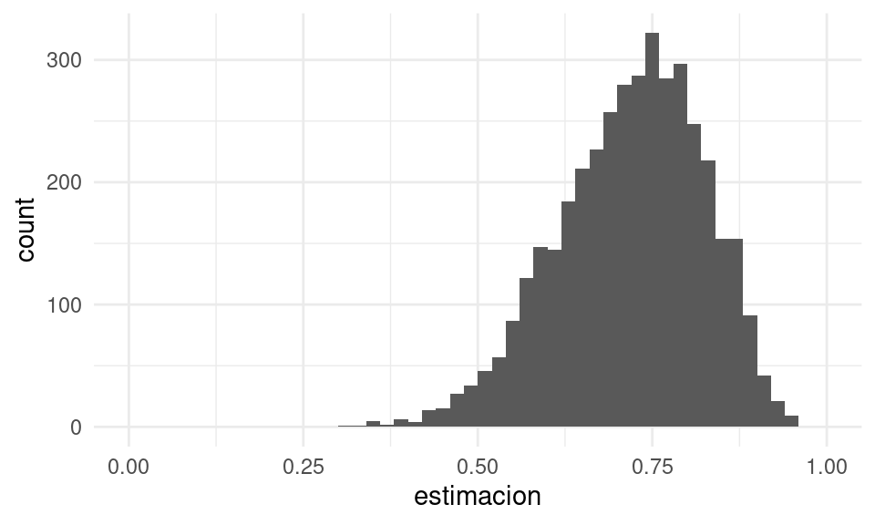


\BeginKnitrBlock{ejercicio}<div class="ejercicio">Supón que tenemos una muestra de 30 observaciones de una distribución
uniforme $[0,b]$.

- ¿Qué tan buen estimador de $b/2$ es la media muestral? ¿Cómo lo cuantificarías?
- ¿Qué tan buen estimador del cuantil 0.8 de la distribución uniforme es
el cuantil 0.8 muestral? ¿Qué desventajas notas en este estimador?
</div>\EndKnitrBlock{ejercicio}

## El error estándar {-}

Una primera medida útil de la dispersión de la distribución de muestreo
es su desviación estándar: la razón específica tiene qué ver
con un resultado importante, el teorema central del límite, que veremos
más adelante. En este caso particular, a esta desviación estándar
se le llama error estándar:

<div class="mathblock">
<p><strong>Definición</strong> A la desviación estándar de una
estadística <span class="math inline">\(T\)</span> le llamamos su
<strong>error estándar</strong>, y la denotamos por <span
class="math inline">\(\text{ee}(T)\)</span>. A cualquier estimador de
este error estándar lo denotamos como <span
class="math inline">\(\hat{\text{ee}}(T)\)</span>.</p>
</div>

Este error estándar mide qué tanto varía el estimador $T$ de muestra a muestra.

**Observación**: es importante no confundir el error estándar con
la desviación estándar de una muestra (o de la población).


En nuestro ejemplo
de las uniformes, la desviación estándar de las muestras varía como:


``` r
map_dbl(1:10000, ~ sd(runif(15))) |> quantile() |> round(2)
```

```
##   0%  25%  50%  75% 100% 
## 0.11 0.26 0.29 0.31 0.41
```

Mientras que el error estándar de la media es aproximadamente


``` r
map_dbl(1:10000, ~ mean(runif(15))) |> sd()
```

```
## [1] 0.07439575
```

y el error estándar del máximo es aproximadamente


``` r
map_dbl(1:10000, ~ max(runif(15))) |> sd()
```

```
## [1] 0.05928675
```

\BeginKnitrBlock{ejercicio}<div class="ejercicio">Como ejercicio para contrastar estos conceptos,
puedes considerar: ¿Qué pasa con la desviación estándar de una muestra muy 
grande de uniformes? ¿Qué pasa con el error estándar de la media muestral de una muestra muy grande de uniformes?</div>\EndKnitrBlock{ejercicio}


### Ejemplo: valor de casas {-}

Consideramos el error estándar del estimador del total del inventario vendido, usando
una muestra de 250 con el estimador del total que describimos arriba. Como aproximamos con
simulación la distribución de muestreo, podemos hacer:


``` r
ee_2 <- replicaciones_2 |> pull(est_total_millones) |> sd()
round(ee_2, 1)
```

```
## [1] 5.2
```

que está en millones de pesos y cuantifica la dispersión de la distribución de
muestreo del estimador del total.

Para tamaño de muestra 100, obtenemos más dispersión:


``` r
ee_1 <- replicaciones_1 |> pull(est_total_millones) |> sd()
round(ee_1, 1)
```

```
## [1] 8.9
```

Nótese que esto es muy diferente, por ejemplo, a la desviación estándar
poblacional o de una muestra. Estas dos cantidades miden la variabilidad del
estimador del total.

## Calculando la distribución de muestreo {-}

En los ejemplos anteriores usamos simulación para obtener aproximaciones
de la distribución de muestreo de algunos estimadores. También
es posible:

- Hacer cálculos exactos a partir de modelos
probabilísticos.
- Hacer aproximaciones asintóticas para muestras grandes (de las cuales
la más importante es la que da el teorema central del límite).

En los ejemplos de arriba, cuando muestreamos de la poblaciones,
extrajimos las muestras de manera aproximadamente independiente. Cada
observación $X_i$ tiene la misma distribución y las $X_i$'s son
independientes. Este tipo de diseños aleatorizados es de los más
simples, y  se llama **muestreo aleatorio simple**.

En general, en esta parte haremos siempre este supuesto: Una **muestra**
es iid (independiente e idénticamente distribuida) si es
es un conjunto de observaciones $X_1,X_2, \ldots X_n$ independientes,
y cada una con la misma distribución.

En términos de poblaciones, esto lo logramos obteniendo cada observación
de manera aleatoria con el mismo procedimiento. En términos de modelos
probabilísticos, cada $X_i$ se extrae de la misma distribución fija $F$
(que pensamos como la "población") de manera independiente. Esto lo denotamos
por $X_i \overset{iid}{\sim} F.$

### Ejemplo {-}

Si $X_1, X_2, \ldots X_n$ es una muestra de uniformes independientes en $[0,1]$, ¿cómo
calcularíamos la distribución de muestreo del máximo muestra $T_2 = \max$? En este
caso, es fácil calcular su función de distribución acumulada de manera exacta:

$$F_{\max}(x) = P(\max\{X_1,X_2,\ldots X_n\} \leq x)$$
El máximo es menor o igual a $x$ si y sólo si todas las $X_i$ son menores
o iguales a $x$, así que
$$F_{\max} (x) = P(X_1\leq x, X_2\leq x, \cdots, X_n\leq x)$$
como las $X_i$'s son independientes entonces
$$F_{\max}(x) = P(X_1\leq x)P(X_2\leq x)\cdots P(X_n\leq x) = x^n$$
para $x\in [0,1]$, pues para cada $X_i$ tenemos $P(X_i\leq x) = x$.
Así que no es necesario usar simulación para conocer esta distribución de muestreo.
Derivando esta distribución acumulada obtenemos su densidad, que es

$$f(x) = nx^{n-1}$$

para $x\in [0,1]$, y es cero en otro caso.

Si comparamos con nuestra simulación:


``` r
teorica <- tibble(x = seq(0, 1 ,0.001)) |>
  mutate(f_dens = 15 * x^14)
sim_estimador_3 <- replicar_muestreo_unif(max, 4000, 15)
ggplot(sim_estimador_3) +
  geom_histogram(aes(x = estimacion), breaks = seq(0, 1, 0.02)) +
  xlim(c(0.5, 1)) +
  # el histograma es de ancho 0.02 y el número de simulaciones 4000  
  geom_line(data = teorica, aes(x = x, y = (4000 * 0.02) * f_dens),
            colour = "red", linewidth = 1.3)
```

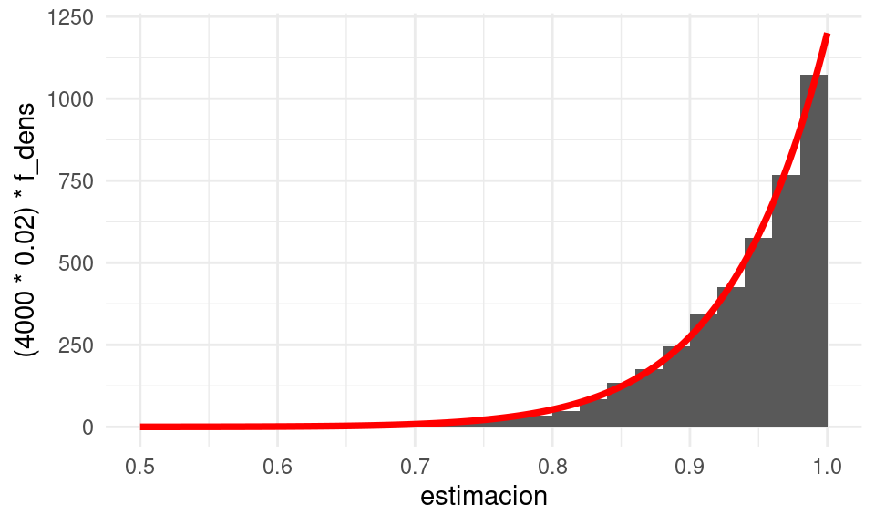

Y vemos que con la simulación obtuvimos una buena aproximación


**Nota**: ¿cómo se relaciona un histograma con la función de densidad
que genera los datos? Supón que $f(x)$ es una función de densidad, y
obtenemos un número $n$ de simulaciones independientes. Si escogemos
un histograma de ancho $\Delta$, ¿cuántas observaciones esperamos
que caigan en un intervalo $I = [a - \Delta/2, a + \Delta/2]$?. La probabilidad
de que una observación caiga en $I$ es igual a

$$P(X\in I) = \int_I f(x)\,dx = \int_{a - \Delta/2}^{a + \Delta/2} f(x)\,dx \approx f(a) \text{long}(I) = f(a) \Delta$$
para $\Delta$ chica. Si nuestra muestra es de tamaño $n$, el número esperado
de observaciones que caen en $I$ es entonces $nf(a)\Delta$. Eso explica
el ajuste que hicimos en la gráfica de arriba. Otra manera de hacer es
ajustando el histograma: si en un intervalo el histograma alcanza el valor $y$,
$$f(a) = \frac{y}{n\Delta}$$


``` r
teorica <- tibble(x = seq(0, 1 ,0.001)) |>
  mutate(f_dens = 15*x^{14})
ggplot(sim_estimador_3) +
  geom_histogram(aes(x = estimacion, y = after_stat(density)), breaks = seq(0, 1, 0.02)) +
  xlim(c(0.5, 1)) +
  # el histograma es de ancho 0.02 y el número de simulaciones 4000  
  geom_line(data = teorica, aes(x = x, y = f_dens),
            colour = "red", size = 1.3)
```

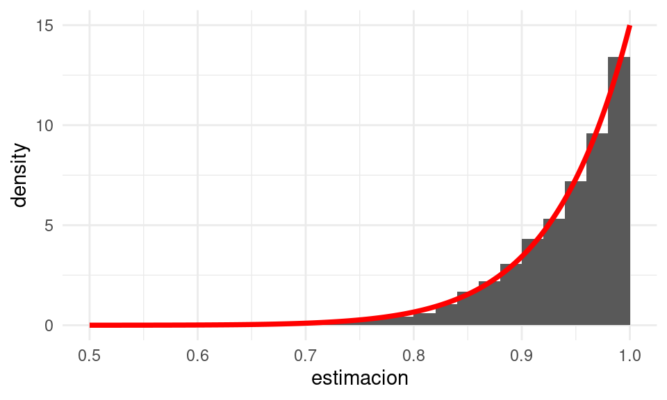

### Ejemplo {-}

Supongamos que las $X_i$'s son independientes y exponenciales con tasa $\lambda > 0$.
¿Cuál es la distribución de muestreo de la suma $S = X_1 + \cdots + X_n$? Sabemos que la suma
de exponenciales independientes es una distribución gamma con parámetros $(n, \lambda)$,
y esta es la distribución de muestreo de nuestra estadística $S$ bajo las hipótesis
que hicimos.

Podemos checar este resultado con simulación, por ejemplo para una
muestra de tamaño $n=15$ con $\lambda = 1$:


``` r
replicar_muestreo_exp <- function(est = mean, m, n = 150, lambda = 1){
  valores_est <- map_dbl(1:m, ~ est(rexp(n, lambda)))
  tibble(id_muestra = 1:m, estimacion = valores_est)
}
sim_estimador_1 <- replicar_muestreo_exp(sum, 4000, n = 15)
teorica <- tibble(x = seq(0, 35, 0.001)) |>
  mutate(f_dens = dgamma(x, shape = 15, rate = 1))
# graficar aprox de distribución de muestreo
ggplot(sim_estimador_1) +
  geom_histogram(aes(x = estimacion, y = after_stat(density)), bins = 35) +
  geom_line(data = teorica, aes(x = x, y = f_dens), colour = "red", linewidth = 1.2)
```

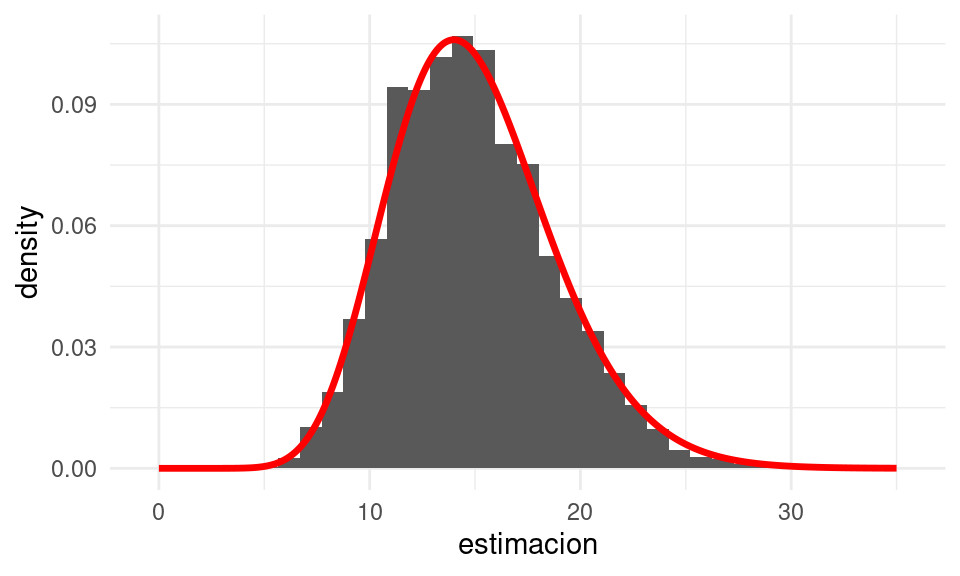


## Teorema central del límite {-}

Si consideramos los ejemplos de arriba donde tratamos con estimadores
basados en una suma, total o una media ---y en menor medida cuantiles muestrales---,
vimos que las distribución de
muestreo de las estadísticas que usamos tienden a tener una forma común.
Estas son manifestaciones de una regularidad estadística importante que
se conoce como el **teorema central del límite**: las distribuciones de muestreo
de sumas y promedios son aproximadamente normales cuando el tamaño de muestra
es suficientemente grande.

\BeginKnitrBlock{mathblock}<div class="mathblock">**Teorema central del límite**
 
  Si $X_1,X_2, \ldots, X_n$ son independientes e idénticamente distribuidas con
media $\mu$ y desviación estándar $\sigma$ finitas.

Si el tamaño de muestra $n$ es grande,  entonces la distribución de muestreo de la media 

$$\bar{X} = \frac{X_1 + X_2 +\cdots + X_n}{n}$$ 
  
  es aproximadamente normal con media $\mu$ y desviación estándar $\sigma/\sqrt{n}$,
que escribimos como

$$\bar{X} \xrightarrow{} \mathsf{N}\left( \mu, \frac{\sigma}{\sqrt{n}} \right)$$

Adicionalmente, la distribución de la
media estandarizada converge a una distribución normal
estándar cuando $n$ es grande:
$$\sqrt{n} \, \left( \frac{\bar{X}-\mu}{\sigma} \right) \xrightarrow{}  \mathsf{N}(0, 1)$$
</div>\EndKnitrBlock{mathblock}

- El error estándar de $\bar{X}$ es
$\text{ee}(\bar{X}) = \frac{\sigma}{\sqrt{n}}$. Si tenemos una muestra, podemos
estimar $\sigma$ con de la siguiente forma:
$$\hat{\sigma} =\sqrt{\frac{1}{n}\sum_{i=1}^n (X_i - \bar{X})^2}$$
o el más común (que explicaremos más adelante)
$$\hat{s} = \sqrt{\frac{1}{n-1}\sum_{i=1}^n (X_i - \bar{X})^2}$$

- Este hecho junto con el teorema del límite central nos dice cuál es la dispersión,
y cómo se distribuyen las posibles desviaciones de la media muestral alrededor
de la verdadera media poblacional.

- ¿Qué tan grande debe ser $n$. Depende de cómo es la población. Cuando la población
tiene una distribución muy sesgada, por ejemplo, $n$ típicamente
necesita ser más grande que cuando la población es simétrica si queremos
obtener una aproximación "buena".

- En algunos textos se afirma que $n\geq 30$ es suficiente para que la
aproximación del Teorema central del límite (TCL) sea buena siempre y cuando
la distribución poblacional no sea muy sesgada. Esta regla es más o menos arbitraria
y es mejor no confiarse, pues fácilmente puede fallar. En la práctica es importante
checar este supuesto, por ejemplo usando remuestreo (que veremos más adelante)

<div class="ejercicio">
<p>Revisa los ejemplos que hemos visto hasta ahora (precios de casas,
simulaciones de uniformes y exponenciales según las distintas
estadísticas que consideramos). ¿Qué distribuciones de muestreo parecen
tener una distribución normal? ¿Cómo juzgamos si estas distribuciones
están cerca o lejos de una distribución normal?</p>
</div>

## Normalidad y gráficas de cuantiles normales {-}

Para checar si una distribución de datos dada es similar a la normal, la herramienta
mas común en estádística es la gráfica de cuantiles teóricos, que es una generalización
de la gráfica de cuantiles que vimos anteriormente. 

En primer lugar, definimos la función de cuantiles de una distribución teórica,
que es análoga a la que definimos para conjuntos de datos:

Supongamos que tenemos una distribución acumulada teórica $\Phi$. Podemos
definir el cuantil-$f$ $q(f)$ de $\Phi$  como
el valor $q(f)$ tal que
$$q(f) = \text{argmin}\{x \,| \, \Phi(x)\geq f \}$$

En el caso de que $\Phi$ tiene densidad $\phi$, y su soporte es un intervalo (que puede
ser de longitud infinita), entonces podemos también escribir $q(f)$
como el valor único donde acumulamos $f$ de la probabilidad

$$\int_{-\infty}^{q(f)} \phi(x)\,dx= f$$
Por ejemplo, para una densidad normal, abajo mostramos los cuantiles $f=0.5$ (mediana)
y $f=0.95$


``` r
densidad_tbl <- tibble(x = seq(0, 10, 0.01)) |> 
  mutate(densidad = dnorm(x, 5, 1)) 
```


``` r
# qnorm es la función de cuantiles de una normal
cuantil_50 <- qnorm(0.50, 5, 1)
cuantil_90 <- qnorm(0.95, 5, 1)
# graficamos
densidad_tbl <- densidad_tbl |> 
  mutate(menor_50 = x >= cuantil_50) |> 
  mutate(menor_90 = x >= cuantil_90)
g_normal_50 <- ggplot(densidad_tbl, aes(y = densidad)) + 
  ylab('f(x)') + 
  geom_area(aes(x = x, fill = menor_50)) + 
  geom_line(aes(x = x), alpha = 0.1) +
  geom_vline(xintercept = cuantil_50) + theme(legend.position = "none") +
  annotate("text", 4.3, 0.2, label = "50%") +
  labs(subtitle = paste0("q(0.5)=", round(cuantil_50,1)))
g_normal_90 <- ggplot(densidad_tbl, aes(y = densidad)) + 
  ylab('f(x)') + 
  geom_area(aes(x = x, fill = menor_90)) + 
  geom_line(aes(x = x), alpha = 0.1) +
  geom_vline(xintercept = cuantil_90) + theme(legend.position = "none") +
  annotate("text", 5.0, 0.2, label = "95%") +
  labs(subtitle = paste0("q(0.95)=", round(cuantil_90,1)))
g_normal_50 + g_normal_90
```

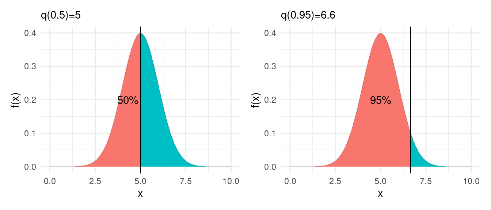

Como todas las distribuciones normales tienen la misma forma, y para obtener una de otra
solo basta reescalar y desplazar, para calcular los cuantiles de una 
variable con distribución normal $\mathsf{N}(\mu, \sigma)$
sólo tenemos que saber los cuantiles de la distribución normal estándar $\mathsf{N}(0,1)$ y escalarlos
apropiadamente por su media y desviación estándar

$$q(f, \mu, \sigma) = \mu + \sigma q(f, 0, 1)$$ 
Puedes demostrar esto sin mucha dificultad empezando con $P(X\leq q) = f$ y estandarizando:

$$P(X\leq q(f, \mu, \sigma)) = f \implies P\left (Z\leq \frac{q(f,\mu,\sigma) - \mu}{\sigma}\right)=f$$
y esto implica que
$$q(f, 0, 1) =  \frac{q(f,\mu,\sigma) - \mu}{\sigma} \implies q(f, \mu, \sigma) = \mu + \sigma q(f, 0, 1)$$

De modo que si graficáramos los cuantiles de una distribución $\mathsf{N}(\mu, \sigma)$ contra
los cuantiles de una distribución $\mathsf{N}(0,1)$, estos cuantiles aparecen en una línea recta:


``` r
comparacion_tbl <- tibble(f = seq(0.01, 0.99, 0.01)) |> 
  mutate(cuantiles_normal = qnorm(f, 5, 3),
         cuantiles_norm_estandar = qnorm(f, 0, 1))
ggplot(comparacion_tbl, aes(cuantiles_norm_estandar, cuantiles_normal)) + 
  geom_point()
```

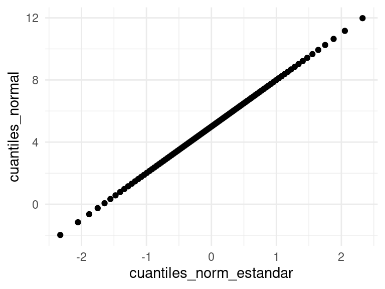

Ahora supongamos que tenemos una muestra $X_1, \ldots, X_n$. ¿Cómo podemos
checar si estos datos tienen una distribución aproximadamente normal? 

- Si la muestra tiene una distribución aproximadamente $\mathsf{N}(\mu, \sigma)$, entonces
sus cuantiles muestrales y los cuantiles respectivos de la normal estándar están aproximadamente
en una línea recta.

Primero veamos un ejemplo donde los datos son generados según una normal. 


``` r
set.seed(21)
muestra <- tibble(x_1 = rnorm(60, 10, 3), x_2 = rgamma(60, 2, 5))
graf_1 <- ggplot(muestra, aes(sample = x_1)) +
  geom_qq(distribution = stats::qnorm) +
  geom_qq_line(colour = "red")
graf_2 <- ggplot(muestra, aes(sample = x_2)) +
  geom_qq(distribution = stats::qnorm) +
  geom_qq_line(colour = "red")
graf_1 + graf_2
```

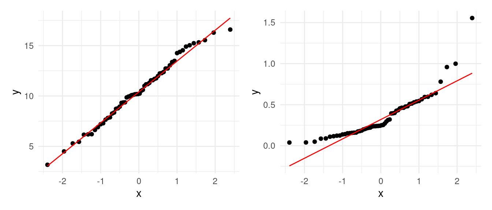
¿Cuáles son los datos aproximadamente normales? ¿Cómo interpretas las desviaciones de 
la segunda gráfica en términos de la forma de la distribución normal?

## Prueba de hipótesis de normalidad {-}

Para interpretar las gráficas de cuantiles normales se requiere práctica, 
pues claramente los datos, aún cuando provengan de una distribución normal, no
van a caer justo sobre una línea recta y observaremos variabilidad. Esto no descarta
necesariamente que los datos sean aproximadamente normales. Con la práctica, generalmente
esta gráfica nos da una buena indicación si el supuesto de normalidad es apropiado.

Sin embargo, podemos hacer una prueba de hipótesis formal de normalidad si 
quisiéramos. La hipótesis nula es la siguiente:

- Los datos provienen de una distribución normal, y las desviaciones que observamos
de una línea recta se deben a variación muestral.
- Podemos generar datos nulos tomando la media y desviación estándar muestrales, y
generando muestras normales $\mathsf{N}(\bar{x}, s)$.
- Usamos el *lineup*, produciendo datos bajo la hipótesis nula y viendo si
podemos distinguir los datos. Por ejemplo:


``` r
library(nullabor)
lineup_normal <- lineup(null_dist("x_2", dist = "normal"), muestra)
ggplot(lineup_normal, aes(sample = x_2)) +
  geom_qq(distribution = stats::qnorm) +
  geom_qq_line(colour = "red") +
  facet_wrap(~ .sample)
```

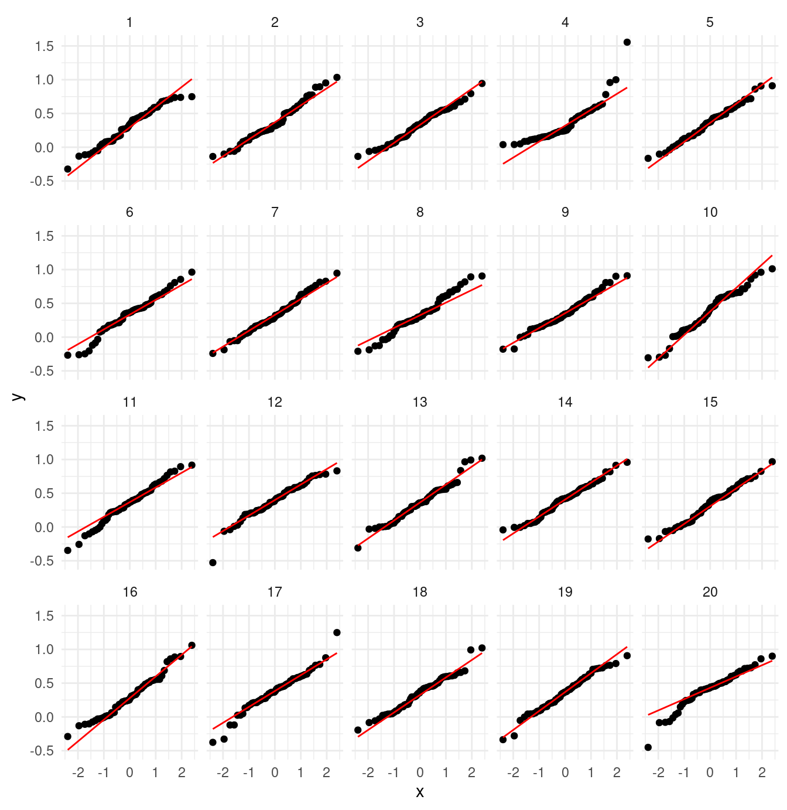

En esta gráfica claramente rechazaríamos la hipótesis de normalidad. Sin embargo, para
la primera muestra, obtenemos:


``` r
lineup_normal <- lineup(null_dist("x_1", dist = "normal"), muestra)
ggplot(lineup_normal, aes(sample = x_1)) +
  geom_qq(distribution = stats::qnorm) +
  geom_qq_line(colour = "red") +
  facet_wrap(~ .sample)
```

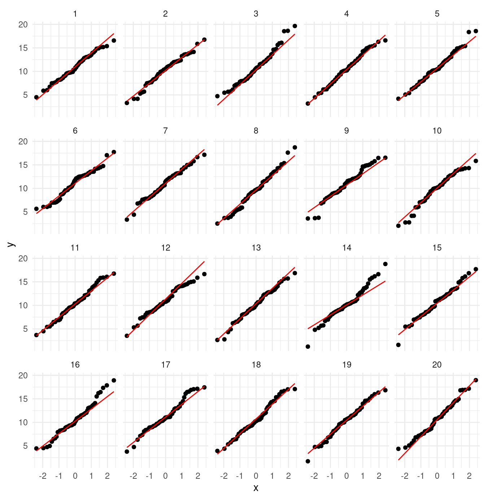
Los datos verdaderos están en


``` r
attr(lineup_normal, "pos")
```

```
## [1] 4
```

### Ejemplo {-}

Consideremos el problema de estimar el total poblacional de los precios de las casas
que se vendieron. El estimador que usamos fue la suma muestral expandida por un 
factor. Vamos a checar qué tan cerca de la normalidad está la distribución de
meustreo de esta estadística ($n=250$):


``` r
replicaciones_2
```

```
## # A tibble: 1,500 × 4
##    id_muestra total_muestra factor_exp est_total_millones
##    <chr>              <dbl>      <dbl>              <dbl>
##  1 1                 47089.       4.58               215.
##  2 2                 45654.       4.58               209.
##  3 3                 43973.       4.58               201.
##  4 4                 45665.       4.58               209.
##  5 5                 43551.       4.58               199.
##  6 6                 46066.       4.58               211.
##  7 7                 46626.       4.58               213.
##  8 8                 47944.       4.58               219.
##  9 9                 45381.       4.58               208.
## 10 10                46519.       4.58               213.
## # ℹ 1,490 more rows
```


``` r
ggplot(replicaciones_2, aes(sample = est_total_millones)) +
  geom_qq(alpha = 0.3) + 
  geom_qq_line(colour = "red")
```

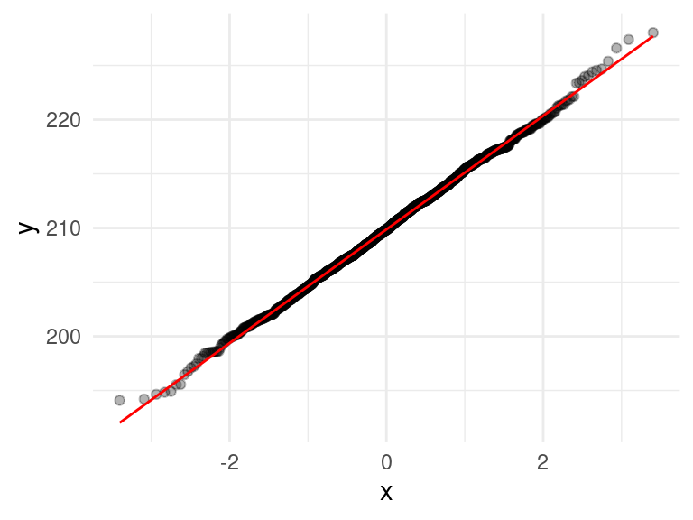


Y vemos que en efecto el TCL aplica en este ejemplo, y la aproximación es buena.
Aunque la población original es sesgada, la descripción de la distribución de
muestreo es sorprendemente compacta:

- La distribución de muestreo de nuestro estimador del total $\hat{t}$ es
aproximadamente normal con media $\bar{x}$ y desviación estándar $s$, donde:


``` r
mu <- mean(replicaciones_2$est_total_millones)
s <- sd(replicaciones_2$est_total_millones)
c(mu = mu, s = s) |> round(2)
```

```
##     mu      s 
## 209.90   5.24
```
Estas cantidades están en millones de dólares.

### Ejemplo {-}

Supongamos que queremos calcular la probabilidad que la suma de 30 variables
uniformes en $[0,1]$ independientes sea mayor que 18. Podríamos aproximar esta
cantidad usando simulación. Otra manera de aproximar esta cantidad es con
el TCL, de la siguiente forma:

Si $S=X_1 + X_2 + X_{30}$, entonces la media de $S$ es 15 (¿cómo se calcula?)
y su desviación estándar es $\sqrt{\frac{30}{12}}$. La suma es entonces
aproximadamente $\mathsf{N}\left(15, \sqrt{\frac{30}{12}}\right)$. Entonces

$$P(S > 18) = P \left (\frac{S - 15}{\sqrt{\frac{30}{12}}}  > \frac{18 - 15}{\sqrt{\frac{30}{12}}}\right) \approx P(Z > 1.897)$$

donde $Z$ es normal estándar. Esta última cantidad la calculamos
usando la función de distribución de la normal estándar, y nuestra aproximación es


``` r
1 - pnorm(1.897)
```

```
## [1] 0.02891397
```

Podemos checar nuestro cálculo usando simulación:


``` r
tibble(n_sim = 1:100000) |> 
  mutate(suma = map_dbl(n_sim, ~ sum(runif(30)))) |> 
  summarise(prob_may_18 = mean(suma > 18), .groups = "drop")
```

```
## # A tibble: 1 × 1
##   prob_may_18
##         <dbl>
## 1      0.0280
```
Y vemos que la aproximación normal es buena para fines prácticos.

<div class="ejercicio">
<p>Usando simulaciones haz un histograma que aproxime la distribución de
muestreo de <span class="math inline">\(S\)</span>. Haz una gráfica de
cuantiles normales para checar la normalidad de esta distribución.</p>
</div>

## Ejemplo {-}
Cuando el sesgo de la distribución poblacional es grande, puede ser necesario
que $n$ sea muy grande para que la aproximación normal sea aceptable para el 
promedio o la suma. Por ejemplo, si tomamos una gamma con parámetro de forma chico,
$n = 30$ no es suficientemente bueno, especialmente si quisiéramos 
aproximar probabilidades en las colas de la distribución:


``` r
sims_gamma <- map_df(1:2000, ~ tibble(suma = sum(rgamma(30, 0.1, 1))), 
                     .id = "n_sim")
ggplot(sims_gamma, aes(x = suma)) + geom_histogram()
```

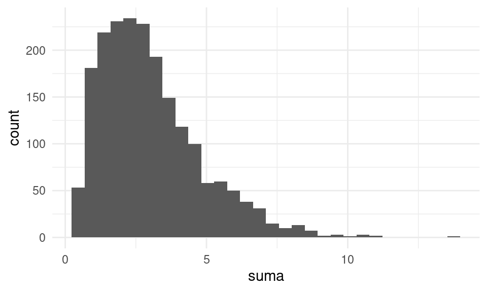

## Más del Teorema central del límite {-}

- El teorema central del límite aplica a situaciones más generales que
las del enunciado del teorema básico. Por ejemplo, 
  + aplica a poblaciones finitas (como vimos en el ejemplo de las casas), en 1960
  Jaroslav Hajek demostró una versión del TCL bajo muestreo sin
reemplazo.
  + Mas allá de la media muestral, el TCL se puede utilizar para más estadísticas ya que muchas
 pueden verse como promedios, como totales o errores estándar. El TLC se ha generalizado incluso para cuantiles muestrales.
 
 <!-- Loosely speaking, a consequence of the CLT for sample quantiles is that the 100𝑝% sample quantile of a large number of identically distributed random variables, each with probability density function 𝑓 -->
 <!-- and 100𝑝% quantile 𝜉(𝑝), has approximately a normal distribution. See, for example, Lehmann (1999) for a precise statement and conditions. -->

- Es importante notar que la calidad de la aproximación del TCL depende de características
de la población y también del tamaño de muestra $n$. Para ver si el TCL aplica, podemos hacer ejercicios de simulación bajo diferentes supuestos acerca de la población. 
También veremos más adelante, con remuestreo, maneras de checar si es factible el TCL dependiendo del análisis de una muestra dada que tengamos.

- El TCL era particularmente importante en la práctica antes de que pudiéramos
hacer simulación por computadora. Era la única manera de aproximar y entender la distribución muestral fuera de cálculos analíticos (como los que hicimos para
el máximo de un conjunto de uniformes, por ejemplo). 

- Hoy en día, veremos que podemos hacer simulación para obtener respuestas más
exactas, particularmente en la construcción de intervalos de confianza, por ejemplo. Dependemos menos de **resultados asintóticos**, como el TCL.

- Cuando aproximamos una distribución discreta mediante la distribución normal,
conviene hacer *correcciones de continuidad*, como se explica en [@Chihara], 4.3.2.

<!-- Hayek: https://www.kybernetika.cz/content/1995/3/251/paper.pdf -->
<!-- Lehman: https://www.datascienceassn.org/sites/default/files/Elements%20of%20Large-Sample%20Theory%20-%20Lehmann.pdf -->


